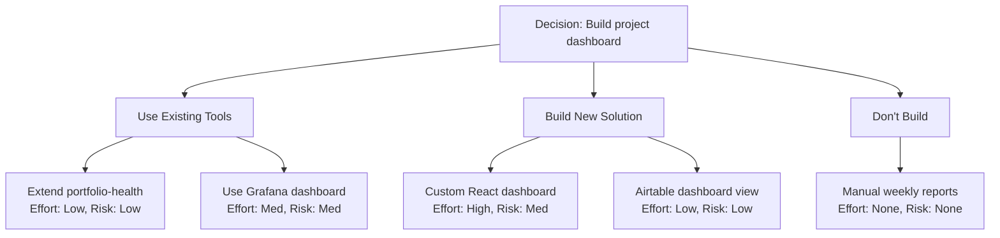

# Probability Storm -- Execution Logic

## Step 0: Parse Arguments

Parse `$ARGUMENTS` to determine the execution path:

```
ARGUMENTS parsing rules:
1. If ARGUMENTS is empty or missing -> show help text (see Help Output below)
2. If ARGUMENTS starts with "history" -> execute History sub-command
3. If ARGUMENTS starts with "compare" -> execute Compare sub-command (L4 Portfolio Comparator)
4. If ARGUMENTS contains "--gate" -> execute Gate mode
5. If ARGUMENTS contains "--deep" -> set mode = deep, extract decision text (remainder after --deep)
6. If ARGUMENTS contains "--simulate" -> set mode = simulate (L3 only, Spec 03)
7. If ARGUMENTS contains "--strategies" -> extract N (next token after --strategies), use as strategy count for L2
8. If ARGUMENTS contains "--sims" -> extract N (next token after --sims), validate N is a positive integer (default: 1000)
9. If ARGUMENTS contains "--stress-test" -> set stress_test = true (can combine with --deep or --simulate)
10. If ARGUMENTS contains "--global" -> set scope = global (cross-project)
11. Otherwise -> decision text is the full ARGUMENTS string, mode = default (L1 + L2)
```

Modifiers `--strategies`, `--sims`, `--stress-test`, and `--global` can combine with any mode.

### Help Output

If no arguments provided:

```
Probability Storm -- Probability Field Scanner

Usage:
  /probability-storm <decision text>           L1 + L2 strategic scan
  /probability-storm --deep <decision>         Full 4-layer analysis
  /probability-storm --gate                    Workflow gate (reads last /brainstorm)
  /probability-storm --simulate <scenario>     Monte Carlo simulation
  /probability-storm --stress-test             Deep test winning strategy (100K iterations)
  /probability-storm compare <A> <B> [C...]    Portfolio comparison (keep/merge/scrap)
  /probability-storm history                   List past reports

Modifiers:
  --strategies N   Set strategy count for L2 (default: adaptive ~10)
  --sims N         Set iterations per strategy (default: 1000)
  --stress-test    Run 100K iterations on winner for edge case discovery
  --global         Cross-project scope
```

## Step 1: Resolve Decision Text

### For `--gate` mode:
1. Query Cortex: `cortex_list_memories` with `tags_filter: ["brainstorm", "active"]`, `sort_by: "created_at"`, `sort_order: "desc"`, `limit: 1`
2. If found: extract the `BRAIN_DUMP` or `BRAINSTORM` content from the memory as decision text
3. If not found: check for recently completed brainstorms with `tags_filter: ["brainstorm", "completed"]`
4. If still nothing: report "No active brainstorm found. Run /brainstorm first or provide decision text directly."

### For all other modes:
Decision text comes directly from the parsed arguments.

## Step 2: L1 Field Scan

### 2a: Classify Decision

Match the decision text against these category signal keywords:

| Category | Signal Keywords |
|----------|----------------|
| architecture | "system", "pattern", "structure", "database", "schema", "migrate", "redesign" |
| feature | "add", "build", "create", "new", "implement", "feature", "functionality" |
| integration | "connect", "API", "webhook", "sync", "third-party", "integrate", "MCP" |
| tooling | "skill", "command", "automation", "workflow", "script", "tool", "CLI" |
| refactor | "clean", "reorganize", "simplify", "split", "merge", "refactor", "consolidate" |
| infrastructure | "deploy", "server", "hosting", "CI/CD", "scaling", "Vercel", "Render" |
| design | "UI", "UX", "layout", "component", "theme", "style", "responsive" |

Assign the category with the most keyword matches. If tied, pick the first match. If no keywords match, classify as "general".

### 2b: Score Strategic Viability (0-100%)

Start with a base score of 60% and apply modifiers. The score reflects "Is this idea strategically sound?" — NOT "Will the user follow through?"

**Specificity Bonus (+10 to +20%):**
- Decision mentions specific files, APIs, or technologies: +15%
- Decision includes clear scope boundaries (IN/OUT): +20%
- Decision is vague or aspirational ("make it better"): +0%
- Decision mentions a specific pattern or precedent: +10%

**Problem Severity Bonus (+5 to +15%):**
- Decision describes a specific pain point with clear symptoms: +15% (e.g., "users can't upload files larger than 5MB, causing data loss")
- Decision mentions a measurable impact (time wasted, errors per day, etc.): +10%
- Decision addresses a known blocker or recurring issue: +10%
- Decision is a nice-to-have without clear pain: +0%
- Decision describes a vague improvement ("make it better", "optimize"): +0%

**Complexity Penalty (-5% per integration point):**
- Count integration points mentioned: APIs, external services, databases, third-party tools
- Deduct -5% per integration point (max -25%)

**Duplicate Penalty (-20 to -40%):**
- Run duplicate detection (see Step 3)
- If match > 60%: -40% ("Existing capability covers this")
- If match 30-60%: -20% ("Partial overlap with existing capability")
- If no match: -0%

**Saturation Penalty (-5 to -15%):**
- Count existing tools in the same category as the decision (from duplicate detection scan)
- Classify each matched tool by the L1 category
- If 4+ tools in same category: -5% per tool beyond 3 (cap at -15%)
- If 3 or fewer: -0%
- This reflects diminishing returns in crowded categories

**Category Risk Modifier:**
- architecture/infrastructure: -10% (inherently higher risk, more unknowns)
- integration: -5% (external dependency risk)
- feature/design/tooling/refactor: +0% (standard risk)

**Clamp the final score to 0-100%.**

### 2c: Determine Confidence Level

Query Cortex to count similar past decisions:

```
cortex_recall: query = "<decision category> decision" (limit: 10)
```

Count how many relevant results returned:
- `n < 3` similar past decisions: **Low** ("exploratory, limited comparable data")
- `n = 3-7`: **Medium** ("well-understood, reasonable data")
- `n > 7`: **High** ("extensively explored category")

If Cortex is unavailable or empty: confidence = **Low**.

### 2d: Identify Fork Points

Analyze the decision text for branching choices. Look for:
- "or" / "vs" / "versus" / "either...or" patterns
- Multiple options mentioned (e.g., "Redis vs in-memory vs file-based")
- Trade-off language ("faster but more complex", "simpler but less scalable")
- Implicit branches (any architecture decision has at least 2 forks: "do it" vs "don't do it")

List 2-5 fork points as brief descriptions. Always include the implicit "build vs don't build" fork.

## Step 3: Duplicate Detection

Read `references/duplicate-detection.md` and follow the scanning steps:

1. Glob `~/.claude/skills/*/SKILL.md` -- read frontmatter only (name + description)
2. Glob `~/.claude/commands/*.md` -- read first 10 lines (name + description)
3. Query Cortex for past builds (optional, skip if slow)
4. Tokenize decision text and each skill/command, calculate keyword overlap
5. Report matches > 30% in a table

Performance note: User has 50+ skills. Read only frontmatter (first `---` to second `---`), not full file contents. If globbing is slow, limit to first 30 results.

## Step 3.5: L2 Strategy Explorer

**Runs when:** mode is `default`, `deep`, or `gate`. Skip for L3-only modes (`simulate`).

Read `references/strategy-explorer.md` for the full search patterns and scoring dimensions.

### 3.5a: Determine Strategy Count

1. If `--strategies N` was specified: use N directly
2. Otherwise, suggest an adaptive count based on L1 signals:

| Signal | Suggested Count | Reason |
|--------|----------------|--------|
| Duplicate overlap > 60% | 5 | Clear existing solution |
| Low complexity, clear scope | 5-7 | Straightforward decision |
| Medium complexity (default) | 10 | Standard exploration |
| High complexity, multiple unknowns | 15-25 | Broad exploration |
| Very uncertain, new domain | 25-50 | Maximum exploration |

Display: "This looks [simple/complex]. Exploring [N] strategies."

### 3.5b: Source 1 -- Internal Tool Search

Scan existing skills and commands for capabilities that address the decision:

1. Glob `~/.claude/skills/*/SKILL.md` -- read YAML frontmatter only (name + description)
2. Glob `~/.claude/commands/*.md` -- read first 10 lines (name + purpose)
3. Tokenize decision text (lowercase, remove stop words from duplicate-detection.md)
4. Tokenize each tool's name + description
5. Calculate keyword overlap: `matching_keywords / total_decision_keywords`
6. Keep matches with overlap > 20%
7. For each match, generate a strategy entry:
   - Name: "Extend {tool_name}" or "Use {tool_name}"
   - Source: "existing tool"
   - Effort: Low | Risk: Low
   - Differentiation: what it adds vs what's missing

**Performance:** User has 50+ skills. Read ONLY frontmatter. If 50+ results, process first 40.

### 3.5c: Source 2 -- Web Search

Discover external tools and approaches:

1. Generate 2-3 search queries from decision context:
   - `"{main_keyword} {category} tool solution"`
   - `"{problem_description} automation alternative"`
   - `"best {category} tools 2026"`
2. Execute each using the WebSearch tool
3. Parse results: extract tool names, descriptions, URLs
4. Filter: keep actual tools/products, discard blog posts and tutorials
5. For each valid result, generate a strategy entry:
   - Name: tool/product name
   - Source: "web discovery"
   - Effort: Medium | Risk: Medium
   - URL: included for reference

**Error handling:** If WebSearch fails or returns nothing useful, skip Source 2. Note: "Web search unavailable -- using internal and AI sources only." Never block the strategy list.

### 3.5d: Source 3 -- AI-Proposed Alternatives

Generate creative approaches the user hasn't considered. Must include:

1. **At least 1 contrarian option:** What if you DON'T do this? What happens if you actively choose not to build/implement?
2. **At least 1 hybrid option:** Combine 2+ existing tools in a new way to achieve the goal without building from scratch.
3. **At least 1 "off-label" option:** Use an existing tool/service for a purpose it wasn't designed for but could serve.
4. **At least 1 novel approach:** The ideal solution if you could design anything from scratch.
5. **Context-aware proposals:** Use L1 fork points + category to generate relevant alternatives.

For each proposal:
- Source: "AI-proposed"
- Effort: Low/Medium/High (estimated from complexity)
- Risk: Low/Medium/High (number of unknowns)
- Differentiation: what makes this unique vs other strategies

### 3.5e: Deduplicate and Score

1. **Deduplicate:** If web search finds something that matches an existing tool, merge into one entry with combined source label (e.g., "existing tool + web discovery")
2. **Score each strategy** on three dimensions:
   - **Effort:** Low (exists/trivial), Medium (hours of work), High (days+)
   - **Risk:** Low (proven, no external deps), Medium (some unknowns), High (unproven)
   - **Differentiation:** How different this approach is from others in the list
3. **Trim to N:** Keep top N strategies by score diversity (ensure representation from all 3 sources)
4. **Rank:** Sort by diversity of sources first, then effort (low first), then risk (low first)

### 3.5f: Generate Mermaid Strategy Diagram

Build a Mermaid flowchart from STRATEGIES (not behavioral data):

1. Central decision node: `D[Decision: {brief summary, max 40 chars}]`
2. Group strategies by approach type into branches:
   - "Use existing" strategies -> one branch
   - "Build new" strategies -> one branch
   - "Don't build" / contrarian -> one branch
   - Additional branches for distinct approach families
3. Each strategy node shows: name, effort level, risk level
4. Use `graph TD` direction

Example:



### 3.5g: Calculate L2 Score

L2 score is derived from the strategy landscape quality:

```
base = 50
+ source_diversity_bonus: +15 if all 3 sources contributed, +8 if 2 sources, +0 if 1
+ strong_existing_match: +15 if any internal tool has >60% overlap (solution exists)
+ web_alternatives_found: +10 if 2+ external alternatives discovered
- low_differentiation: -10 if most strategies are too similar (low diversity)
- no_contrarian: -5 if no contrarian/don't-build option was generated
```

Clamp to 0-100.

**Note:** L2 score now reflects "How well-explored is the strategy space?" rather than "How predictable is the user's behavior?"

### 3.5h: Update Composite Score

When L2 is active (L3/L4 still pending):
- Available weight: L1 (30%) + L2 (25%) = 55%
- Normalize: `composite = (L1_score * 0.30 + L2_score * 0.25) / 0.55`

When L2 returns no strategies (e.g., all sources failed):
- Fall back to L1-only: `composite = L1_score`

## Step 3.7: L3 Multi-Strategy Simulation Engine

**Runs when:** mode is `deep`, `simulate`, or ARGUMENTS contains `--simulate`. Skip for default/gate modes (unless `--deep`).

### 3.7a: Gather Strategies

Read `references/simulation-engine.md` for the full Python script template, parameter mapping tables, and stress test logic.

**Strategy sources (in priority order):**

1. **From L2 (default/deep mode):** Use the strategy list generated by L2 Strategy Explorer (Step 3.5). Each strategy has: name, source (existing_tool/web_discovery/ai_proposed), effort, risk, description.

2. **From user (simulate-only mode):** If user runs `--simulate "strategy1; strategy2; strategy3"`, parse the semicolon-separated list. Create basic strategies with:
   - Name: the text between semicolons
   - Source: "ai_proposed" (default for user-specified)
   - Effort/Risk: Medium/Medium (default)

3. **Minimum:** If fewer than 2 strategies available, add a "Do nothing" contrarian strategy as baseline.

### 3.7b: Map Parameters Per Strategy

For each strategy, build a simulation parameter set:

1. **Start with source-based defaults** from simulation-engine.md "Source-Based Default Parameters" table:
   - `existing_tool` → high value, low cost, low uniqueness, low maintenance, low integration risk
   - `web_discovery` → medium value, medium cost, balanced uniqueness, higher integration risk
   - `ai_proposed` → variable value, variable cost, high uniqueness, variable integration

2. **Apply L1 context adjustments** from simulation-engine.md "L1 Context Adjustments" table:
   - duplicate_overlap from L1 affects existing_tool value and ai_proposed uniqueness
   - L1 category affects cost_mu for all strategies
   - Strategy descriptions mentioning "API" increase integration risk

3. **Apply L2 effort/risk overrides:**
   - Strategy effort = "High" → cost_mu += 0.4
   - Strategy effort = "Low" → cost_mu -= 0.3
   - Strategy risk = "High" → value_sigma += 0.05, cost_sigma += 0.1
   - Strategy risk = "Low" → value_sigma -= 0.05 (min 0.05)

4. **Contrarian strategy** (if present): Use the special contrarian parameters from simulation-engine.md (near-zero cost, near-zero maintenance, uncertain value)

### 3.7c: Build Batch Input JSON

Construct a JSON array of strategy objects:

```json
[
  {
    "strategy_name": "Extend time-report",
    "strategy_source": "existing_tool",
    "n_sims": 1000,
    "seed": 5046,
    "params": { ... mapped parameters ... }
  },
  ...
]
```

- **n_sims:** From `--sims N` flag (default: 1000)
- **seed:** `base_seed + strategy_index * 10000` where `base_seed = report_number * 1000 + day_of_year`
- Each strategy gets a unique seed for reproducible but independent random sequences

### 3.7d: Execute Simulation

1. Write the Python simulation script from `references/simulation-engine.md` to `/tmp/ps_simulation.py`
2. Write the batch strategies JSON to `/tmp/ps_strategies.json`
3. Execute via bash:
```bash
python /tmp/ps_simulation.py /tmp/ps_strategies.json > /tmp/ps_results.json 2>/tmp/ps_errors.log
```
4. Read `/tmp/ps_results.json` and parse the JSON array output
5. Clean up temp files: `rm -f /tmp/ps_simulation.py /tmp/ps_strategies.json /tmp/ps_results.json /tmp/ps_errors.log`

**IMPORTANT:** Write to temp files. Do NOT use inline `python -c "..."` -- nested quotes cause errors on Windows.

**Error handling:** If the script fails (non-zero exit, no output, or JSON parse error):
- Read `/tmp/ps_errors.log` for error details
- Set L3 score = N/A
- Note error in report: "L3 simulation failed: {error message}"
- Clean up temp files
- Continue with remaining layers

### 3.7e: Process Results

The simulation returns a ranked JSON array. For each strategy result:

1. **Rank** — already assigned by the script (sorted by composite_score descending)
2. **Verdict** — assign based on composite score:
   - >= 65: "Optimal"
   - 40-64: "Viable"
   - 20-39: "Suboptimal"
   - < 20: "Wasteful"
3. **Top risk** — the highest entry in `variance_contributions`
4. **Confidence interval** — `p5` to `p95` range (tighter = more predictable)

**Winner selection:**
- Primary: highest composite_score
- Tiebreaker (within 2% of each other): tightest p5-p95 range wins
- If tied on both: mark both as "Optimal" candidates

### 3.7f: Generate Comparison Table

Build the strategy comparison table for the report:

```
## Strategy Comparison -- {N} strategies x {M} iterations each

| Rank | Strategy | Source | Score | p5-p95 | Top Risk | Verdict |
|------|----------|--------|-------|--------|----------|---------|
| 1 *  | {name} | {source} | {score}% | {p5}-{p95}% | {risk} ({pct}%) | Optimal |
| 2    | {name} | {source} | {score}% | {p5}-{p95}% | {risk} ({pct}%) | Viable |
| ...  | ... | ... | ... | ... | ... | ... |

Winner: "{winner_name}" ({score}% composite, {p5-p95 range description})
```

Mark the winner with `*` after the rank number.

### 3.7g: Stress Test (Optional)

**Runs when:** `--stress-test` flag is present, or as a follow-up suggestion after a normal simulation run.

1. Take the winning strategy's full parameter set (from Step 3.7b)
2. Write the stress test Python script from `references/simulation-engine.md` (includes both `simulate_strategy` and `stress_test_strategy` functions) to `/tmp/ps_stress_test.py`
3. Write the winner's strategy JSON (single object, not array) with seed = `base_seed + 999999` to `/tmp/ps_stress_params.json`
4. Execute via bash:
```bash
python /tmp/ps_stress_test.py /tmp/ps_stress_params.json > /tmp/ps_stress_results.json 2>/tmp/ps_stress_errors.log
```
5. Parse stress test results: p1, p5, CVaR-5%, top risk variable, risk drivers
6. Clean up temp files

**Stress test output in report:**

```
### Stress Test -- "{winner_name}" x 100,000 iterations

| Metric | Value |
|--------|-------|
| Composite Score | {score}% |
| Worst 1% (p1) | {p1}% |
| Worst 5% (p5) | {p5}% |
| CVaR-5% (mean of worst 5%) | {cvar}% |

**Top Risk Factor:** {variable_name} -- If this strategy fails, it will most likely be because of {human_readable_variable_name}.

Risk Drivers (deviation from mean in worst 5%):
| Variable | Deviation | Direction |
|----------|-----------|-----------|
| {var1} | {dev1} | {higher/lower than expected} |
| {var2} | {dev2} | ... |
| ... | ... | ... |

Mitigation: To reduce the top risk ({variable}), consider: {actionable_advice}
```

**Variable name mapping for human readability:**
- `value_score` → "the idea not solving the actual problem"
- `cost` → "higher-than-expected implementation cost"
- `uniqueness` → "insufficient differentiation from existing tools"
- `maintenance_burden` → "unsustainable ongoing maintenance"
- `opportunity_cost` → "better alternatives for the same time investment"
- `integration_risk` → "difficulty integrating with the existing ecosystem"

### 3.7h: Calculate L3 Score

L3 layer score = **winner's composite score** (rank #1 strategy's p50).

This represents the best available strategic outcome for the decision. Store the full simulation output (all strategy results + optional stress test) for the report section.

## Step 3.8: L4 Portfolio Comparator

**Runs when:** mode is `deep` (automatic portfolio context), or ARGUMENTS starts with `compare` (standalone comparison). Skip for default/gate/simulate-only modes.

Read `references/portfolio-comparator.md` for the full comparison engine logic, scoring formulas, and report format.

### 3.8a: Resolve Items

**For standalone `compare` mode:**

Parse item names from ARGUMENTS (everything after "compare"). Items are space-separated. Quoted strings count as one item (e.g., `compare "build from scratch" "use existing API"`).

Minimum: 2 items. Maximum: 10 items. If fewer than 2: error "Compare requires at least 2 items."

For each item name, resolve using the resolution order in portfolio-comparator.md:
1. Check `~/.claude/skills/{name}/SKILL.md` — read YAML frontmatter
2. Check `~/.claude/commands/{name}.md` — read first 10 lines
3. Check `{cwd}/.claude/skills/{name}/SKILL.md`
4. Check MCP servers in settings files
5. If not found: treat as abstract idea (use the name as description)

**For `deep` mode (automatic):**

Extract items from L2 strategy list:
1. Take all L2 strategies with source = "existing_tool"
2. Resolve each strategy's referenced tool to its SKILL.md/command.md
3. If fewer than 2 existing tools found: L4 score = 50 (neutral), add note "Insufficient existing tools for portfolio comparison"
4. If 2+ existing tools: proceed with comparison

### 3.8b: Gather Item Data

For each resolved item, collect (per portfolio-comparator.md "Item Data Structure"):

1. **Description + capabilities:** Read description, tokenize into capability keywords (lowercase, remove stop words)
2. **File count + line count:** Glob the item's directory, count files and lines
3. **Usage frequency:** Parse `~/.claude/stats/command-history.jsonl`:
   - Count invocations in last 30 days and all-time
   - Calculate trend (increasing/stable/declining/unused)
   - If file doesn't exist: usage = "N/A"
4. **External dependencies:** Grep item files for MCP, API key, WebSearch, curl patterns
5. **Integration depth (reference count):** Grep across `~/.claude/skills/` and `~/.claude/commands/` for mentions of the item name

For abstract items: file_count = 0, line_count = 0, usage = "N/A", ext_deps = [], refs = 0

### 3.8c: Overlap Analysis

Calculate pairwise Jaccard similarity between all items:

1. For each pair (A, B):
   - `tokens_A` = capability tokens from item A
   - `tokens_B` = capability tokens from item B
   - `overlap_pct = |intersection| / |union| * 100`
2. Build overlap matrix (N x N)
3. For 8+ items: only show pairs with >30% overlap
4. Flag consolidation candidates: 3+ items with >50% pairwise overlap

### 3.8d: Score and Recommend

For each item, calculate keep_score (0-100) per portfolio-comparator.md "Scoring Formula":

```
Usage (40%):     40 if 30d>10, 30 if 30d>3, 15 if 30d>0, 5 if all>0, else 0
Uniqueness (30%): 30 if max_overlap<20%, 20 if <50%, 10 if <70%, else 0
Integration (20%): 20 if refs>5, 15 if refs>2, 10 if refs>0, else 0
Maintenance (10%): 10 if lines<500, 5 if lines<2000, else 0
```

Apply recommendation rules:

| Keep Score | Max Overlap | Recommendation |
|-----------|-------------|----------------|
| >= 60 | any | **KEEP** |
| 40-59 | > 60% | **MERGE** into highest-scored overlapping item |
| 40-59 | <= 60% | **KEEP (review)** |
| < 40 | > 60% | **SCRAP** |
| < 40 | <= 60% | **SCRAP** |

### 3.8e: Identify Unique Capabilities

For each item, list capability tokens NOT found in ANY other item's token set. These are the capabilities that would be lost if the item were scrapped.

### 3.8f: Calculate L4 Score

**For standalone `compare` mode:** L4 score = average keep_score of all items. This represents overall portfolio health for the compared items.

**For `deep` mode:** L4 score = average keep_score of existing tools referenced in L2 strategies. If no existing tools: L4 score = 50 (neutral).

### Compare Sub-Command

When `$ARGUMENTS` starts with "compare":

1. Run Steps 3.8a through 3.8e
2. Generate comparison report number:
   - Glob `reports/probability-storm/cmp-*.md`
   - Extract NNN from filenames (pattern: cmp-NNN-YYYY-MM-DD-{slug}.md)
   - Next number = max(existing, 0) + 1, zero-padded to 3 digits
   - `mkdir -p reports/probability-storm/`
3. **Description slug generation for cmp- reports:**
   - Derive from the items being compared:
     - E.g., comparing "portfolio-health" and "ecosystem-tracker" -> `"portfolio-vs-ecosystem"`
     - For 3+ items, use first two item names: `"item1-vs-item2-and-more"`
   - Follow slug rules from `~/.claude/skills/REPORT-CONVENTION.md`
4. Write report to `reports/probability-storm/cmp-NNN-YYYY-MM-DD-{slug}.md` with:
   - YAML frontmatter (report_number, date, mode: "compare", items_compared, recommendation_summary)
   - Overlap matrix
   - Item analysis table
   - Unique capabilities per item
   - Recommendations with reasoning
4. Display terminal output:

```
PROBABILITY STORM -- Portfolio Comparison

Items Compared: {N}
Overlap Range:  {min}% - {max}%

| Item | Type | Usage (30d) | Keep Score | Verdict |
|------|------|-------------|------------|---------|
| {name} | {type} | {count} | {score} | KEEP |
| {name} | {type} | {count} | {score} | MERGE -> {target} |
| {name} | {type} | {count} | {score} | SCRAP |

{If consolidation candidates:}
Consolidation: {items} share >50% overlap -- consider merging

Report: reports/probability-storm/cmp-NNN-YYYY-MM-DD-{slug}.md
```

5. Do NOT generate a ps-* probability storm report for the compare sub-command (it produces cmp-* reports only)

## Step 3.9: Deep Mode -- Parallel Sub-Agents

**Runs when:** mode is `deep` (ARGUMENTS contains `--deep`).

After L1 + L2 complete inline, spawn L3 and L4 as **parallel Task sub-agents** in a single message:

### Sub-Agent 1: L3 Multi-Strategy Simulation Engine

```
Task sub-agent (subagent_type: general-purpose):
  Prompt: "Run L3 Multi-Strategy Monte Carlo simulation for probability-storm.
    Decision: {decision_text}
    L1 Category: {category}
    L1 Score: {l1_score}
    L1 Duplicate Overlap: {duplicate_overlap_pct}
    L2 Strategies (JSON): {JSON array of L2 strategies with name, source, effort, risk, description}
    Sims per strategy: {n_sims}
    Stress test: {true/false}
    Report Number: {report_number}

    Steps:
    1. Read references/simulation-engine.md from ~/.claude/skills/probability-storm/
    2. For each L2 strategy, map to simulation parameters:
       a. Start with source-based defaults (existing_tool / web_discovery / ai_proposed)
       b. Apply L1 context adjustments (duplicate_overlap, category risk)
       c. Apply L2 effort/risk overrides
       d. Use contrarian parameters for 'Don't build' strategies
    3. Build batch JSON array with per-strategy seeds (base_seed + index * 10000)
    4. Write Python simulation script + strategies JSON to temp files
    5. Execute via bash, parse JSON array output
    6. Build comparison table (ranked by composite score)
    7. If stress_test=true: run stress_test_strategy on winner (100K iterations)
    8. Calculate L3 score = winner's composite score

    Return ONLY a JSON object with these fields:
    - l3_score: number (0-100, winner's composite score)
    - simulation_results: array (full ranked results for all strategies)
    - comparison_table: string (markdown table)
    - winner: object (name, score, source, verdict)
    - stress_test: object or null (p1, p5, cvar_5, top_risk_variable, risk_drivers)
    - error: string or null"
```

### Sub-Agent 2: L4 Portfolio Comparator

```
Task sub-agent (subagent_type: general-purpose):
  Prompt: "Run L4 portfolio comparison for probability-storm deep mode.
    L2 Strategies (JSON): {JSON array of L2 strategies with name, source, effort, risk, description}

    Steps:
    1. Read references/portfolio-comparator.md from ~/.claude/skills/probability-storm/
    2. Extract strategies with source = 'existing_tool' from the L2 strategies
    3. If fewer than 2 existing tools: return l4_score = 50, note 'Insufficient existing tools'
    4. Resolve each existing tool:
       - Check ~/.claude/skills/{name}/SKILL.md (read YAML frontmatter)
       - Check ~/.claude/commands/{name}.md (read first 10 lines)
    5. For each resolved item, gather:
       - Description + capability tokens (lowercase, remove stop words)
       - File count and line count (Glob the directory)
       - Usage frequency from ~/.claude/stats/command-history.jsonl (30d + all-time)
       - Integration depth (Grep for item name across skills/commands)
    6. Calculate pairwise Jaccard overlap between all items
    7. Calculate keep_score per item (usage 40%, uniqueness 30%, integration 20%, maintenance 10%)
    8. Generate recommendations (keep/merge/scrap) based on keep_score + overlap
    9. Identify unique capabilities per item

    Return ONLY a JSON object with these fields:
    - l4_score: number (0-100, average keep_score of compared items)
    - items: array of {name, type, keep_score, recommendation, unique_capabilities}
    - overlap_matrix: object mapping 'itemA-itemB' to overlap percentage
    - consolidation_candidates: array of item name groups with >50% pairwise overlap, or empty array
    - note: string (e.g., 'Insufficient existing tools') or null
    - error: string or null"
```

### Combining Results

After both sub-agents return:
1. Extract `l3_score` and `l4_score` from their responses
2. If either returned an error or null score: treat as N/A, redistribute weight
3. For L4: if items array is non-empty, include Portfolio Context section in the deep report
4. Calculate full composite score using all available layers (see Composite Score Calculation)
5. Assemble the complete report with all layer sections

## Step 4: Generate Report

### 4a: Determine Report Number

```
1. Glob reports/probability-storm/ps-*.md
2. Extract NNN from each filename (pattern: ps-NNN-YYYY-MM-DD-{slug}.md)
3. Next number = max(existing numbers, default=0) + 1
4. Zero-pad to 3 digits
5. Create directory if it doesn't exist: mkdir -p reports/probability-storm/
```

### 4b: Select Catchphrase

Read `references/catchphrases.md` for the phrase lists and selection rule:

```
If score > 75: select from High Probability phrases
If score 40-75: select from Medium Probability phrases
If score < 40: select from Low Probability phrases

index = (report_number * 7 + day_of_year) % phrase_count
```

### 4c: Determine Trend

Read previous report (if exists) to calculate score delta:
- If no previous report: trend = "first_run"
- If only 1 previous: trend = "improving" / "declining" / "stable" based on delta
- If 2+ previous: check direction of last 3 composites

### 4d: Write Report File

**Description slug generation for ps- reports:**
- Derive from the decision text being analyzed:
  - Use the first ~50 chars of decision text, kebab-cased
  - E.g., "Build a brainstorm skill" -> `"build-brainstorm-skill"`
  - If decision text is very long, truncate at word boundaries
- Follow slug rules from `~/.claude/skills/REPORT-CONVENTION.md`

Write the report to `reports/probability-storm/ps-NNN-YYYY-MM-DD-{slug}.md`:

```markdown
---
report_number: NNN
date: "YYYY-MM-DD"
mode: "default"
decision: "brief 1-line summary of what was scanned"
verdict: "The selected catchphrase"
layer_1_score: NN
layer_2_score: NN
layer_3_score: NN or "N/A"
layer_4_score: NN or "N/A"
simulation_strategies: NN or null
simulation_iterations_per_strategy: NN or null
winning_strategy: "strategy name" or null
winning_score: NN or null
stress_test: true or false
composite_score: NN
confidence: "low|medium|high"
previous_composite: NN or null
score_delta: "+/-N" or "---"
trend: "first_run|improving|declining|stable"
---

# Probability Storm Report #NNN

> "[Catchphrase]"

**Date:** YYYY-MM-DD
**Mode:** Default (L1 + L2)
**Decision:** [Full decision text]

## L1: Field Scan -- NN%

**Category:** [architecture|feature|integration|tooling|refactor|infrastructure|design|general]
**Probability:** NN%
**Confidence:** [Low|Medium|High] ([reason])

### Score Breakdown

| Factor | Impact |
|--------|--------|
| Base score | 60% |
| Specificity | +N% |
| Problem severity | +N% |
| Complexity (N integrations) | -N% |
| Duplicate overlap | -N% |
| Saturation (N tools in category) | -N% |
| Category risk | -N% |
| **Final** | **NN%** |

### Fork Points

1. [Fork point 1 -- e.g., "Build vs don't build"]
2. [Fork point 2]
3. [Fork point 3]

### Duplicate Detection

[Table of matches if any, or "No overlapping capabilities detected."]

## L2: Strategy Explorer -- {L2_SCORE}%

**Strategies Explored:** {total_count} ({existing_count} existing tools, {web_count} web discoveries, {ai_count} AI-proposed)
**Strategy Count:** {N} (adaptive / user-specified)

### Strategy Comparison

| # | Strategy Name | Source | Effort | Risk | Differentiation |
|---|--------------|--------|--------|------|-----------------|
| 1 | {name} | {existing tool / web discovery / AI-proposed} | {Low/Med/High} | {Low/Med/High} | {brief differentiation} |
| 2 | {name} | {source} | {effort} | {risk} | {differentiation} |
| ... |

### Score Breakdown

| Factor | Impact |
|--------|--------|
| Base | 50 |
| Source diversity (3/3 sources) | +15 |
| Strong existing match (>60%) | +15 |
| Web alternatives found (2+) | +10 |
| Low differentiation | -10 |
| No contrarian option | -5 |
| **L2 Score** | **{L2_score}%** |

### Strategy Diagram

```mermaid
{Generated Mermaid strategy diagram from Step 3.5f}
```

## L3: Multi-Strategy Simulator -- {L3_SCORE}%

{If L3 ran (deep or simulate mode):}

### Strategy Comparison -- {N} strategies x {M} iterations each

| Rank | Strategy | Source | Score | p5-p95 | Top Risk | Verdict |
|------|----------|--------|-------|--------|----------|---------|
| 1 *  | {name} | {source} | {score}% | {p5}-{p95}% | {risk} ({pct}%) | Optimal |
| 2    | {name} | {source} | {score}% | {p5}-{p95}% | {risk} ({pct}%) | Viable |
| ...  | ... | ... | ... | ... | ... | ... |

**Winner:** "{winner_name}" ({score}% composite, {confidence_interval_description})

### Winner Variance Decomposition

| Variable | Contribution |
|----------|-------------|
| {var_1} | {pct_1}% |
| {var_2} | {pct_2}% |
| {var_3} | {pct_3}% |
| {var_4} | {pct_4}% |
| {var_5} | {pct_5}% |
| {var_6} | {pct_6}% |

### Top 3 Strategy Details

{For each of the top 3 strategies, show:}

**#{rank}: {strategy_name}** ({source}) -- {verdict}
- Score: {composite_score}% (p5: {p5}%, p95: {p95}%)
- Outcomes: Optimal {opt}%, Viable {via}%, Suboptimal {sub}%, Wasteful {was}%
- Top risk: {variable} ({pct}% of variance)

{If stress test ran:}

### Stress Test -- "{winner_name}" x 100,000 iterations

| Metric | Value |
|--------|-------|
| Composite Score | {score}% |
| Worst 1% (p1) | {p1}% |
| Worst 5% (p5) | {p5}% |
| CVaR-5% | {cvar}% |

**Top Risk Factor:** {variable} -- {human_readable_explanation}

| Risk Driver | Deviation | Direction |
|-------------|-----------|-----------|
| {var} | {dev} | {direction} |
| ... | ... | ... |

**Mitigation:** {actionable_advice}

{End stress test section}

Next: `/probability-storm --stress-test` to deep-test the winner

{If L3 did not run (default/gate mode):}

Run with `--deep` or `--simulate` for multi-strategy Monte Carlo simulation.

{If L3 error:}

L3 simulation failed: {error_message}

## L4: Portfolio Comparator -- {L4_SCORE}%

{If L4 ran (deep mode):}

### Portfolio Context

Existing tools referenced in strategies: {N}

| Item | Type | Keep Score | Max Overlap | Verdict |
|------|------|-----------|-------------|---------|
| {name} | {type} | {score} | {overlap}% | {KEEP/MERGE/SCRAP} |
| ... | ... | ... | ... | ... |

{If unique capabilities found:}
**Unique capabilities at risk:** {list of unique caps that would be lost if item scrapped}

{If consolidation candidates found:}
**Consolidation opportunity:** {items} share >50% overlap -- consider merging

{If L4 did not run (default/gate/simulate-only mode):}

Run with `--deep` for automatic portfolio analysis, or `compare <A> <B>` for explicit tool comparison.

{If insufficient existing tools in strategies:}

Insufficient existing tools for portfolio comparison (need 2+, found {N}).

## Recommendations

[2-4 actionable recommendations based on the score and findings]
```

## Step 5: Terminal Output

After saving the report, display a concise inline summary:

```
PROBABILITY STORM -- Strategic Scan + Strategy Explorer

> "[Catchphrase]"

Decision:    [brief summary, max 80 chars]
Category:    [category]
Viability:   NN%  |  Confidence: [level]
Strategies:  N explored (N existing, N web, N AI-proposed)
Top Pick:    [#1 strategy name] (Effort: [level], Risk: [level])
Fork Points: N identified (see diagram in report)

Duplicates:  None detected
             (or: N potential match(es) -- see report)

Report: reports/probability-storm/ps-NNN-YYYY-MM-DD-{slug}.md
Next:   Run /probability-storm --deep for full 4-layer analysis
```

**If deep mode (all 4 layers ran):**

```
PROBABILITY STORM -- Full Analysis (4 Layers)

> "[Catchphrase]"

Decision:    [brief summary, max 80 chars]
Category:    [category]
Viability:   NN%  |  Confidence: [level]
Strategies:  N explored (N existing, N web, N AI-proposed)
Top Pick:    [#1 strategy name] (Effort: [level], Risk: [level])
Fork Points: N identified (see diagram in report)

Simulation:  {N} strategies x {M} iterations
  Winner:    "{winner_name}" ({score}%, {verdict})
  Runner-up: "{#2 name}" ({score}%)
  Worst:     "{last name}" ({score}%, {verdict})

{If stress test ran:}
Stress Test: 100K iterations on winner
  Edge Case: p1={p1}%, p5={p5}%, CVaR-5%={cvar}%
  Top Risk:  {variable} ({human_readable_explanation})
{End stress test}

Portfolio:   {N} existing tools analyzed
  Overlap:   {min}%-{max}% pairwise | {recommendations summary}

Duplicates:  None detected

Report: reports/probability-storm/ps-NNN-YYYY-MM-DD-{slug}.md
```

**If simulate-only mode (L3 only):**

```
PROBABILITY STORM -- Multi-Strategy Simulation Results

> "[Catchphrase]"

Decision:    [brief summary, max 80 chars]
Simulation:  {N} strategies x {M} iterations

  Winner:    "{winner_name}" ({score}%, {verdict})
  Runner-up: "{#2 name}" ({score}%)
  Worst:     "{last name}" ({score}%, {verdict})

{If stress test ran:}
Stress Test: 100K iterations on winner
  Edge Case: p1={p1}%, p5={p5}%, CVaR-5%={cvar}%
  Top Risk:  {variable} ({human_readable_explanation})
{End stress test}

Re-run: /probability-storm --simulate --sims 5000 for deeper analysis
Stress: /probability-storm --stress-test to deep-test the winner
Report: reports/probability-storm/ps-NNN-YYYY-MM-DD-{slug}.md
```

**If L2 returned no strategies** (all sources failed), fall back to L1-only output:

```
PROBABILITY STORM -- Field Scan Complete

> "[Catchphrase]"

Decision:    [brief summary, max 80 chars]
Category:    [category]
Viability:   NN%  |  Confidence: [level]
Fork Points: N identified
Strategies:  None generated (all sources unavailable)

Duplicates:  None detected

Report: reports/probability-storm/ps-NNN-YYYY-MM-DD-{slug}.md
Next:   Run /probability-storm --deep for full analysis
```

## History Sub-command

When `$ARGUMENTS` is "history":

1. Glob `reports/probability-storm/ps-*.md` AND `reports/probability-storm/cmp-*.md`
2. If no reports found: "No probability storm reports yet. Run /probability-storm <decision> to create one."
3. For each ps-* report: read YAML frontmatter, extract report_number, date, decision, composite_score, verdict, confidence
4. For each cmp-* report: read YAML frontmatter, extract report_number, date, items_compared, recommendation_summary
5. Display as two tables sorted by date (most recent first):

```
Probability Storm -- Report History

## Probability Scans

| # | Date | Score | Conf. | Verdict | Decision |
|---|------|-------|-------|---------|----------|
| 003 | 2026-02-14 | 73% | Medium | "Sim it." | Build a brainstorm skill |
| 002 | 2026-02-13 | 45% | Low | "Field's wobbly..." | Add real-time sync |
| 001 | 2026-02-12 | 82% | High | "Fate-locked..." | SCORM skill scaffold |

## Portfolio Comparisons

| # | Date | Items | Summary |
|---|------|-------|---------|
| 001 | 2026-02-15 | time-report, activity-report, timeline | Keep time-report, merge activity-report |

{N} scan reports + {M} comparison reports found.
```

If no comparison reports exist: show only the scan table. If no scan reports exist: show only the comparison table.

## Active Layers

### L2 (Active)
L2 Strategy Explorer runs automatically in default and deep modes. See Step 3.5 for full logic.
Generates strategies from 3 sources: internal tools, web search, AI-proposed alternatives.
If all sources fail, L2 returns N/A and its weight is redistributed.

### L3 (Active)
L3 Multi-Strategy Simulator runs in deep and simulate modes. See Step 3.7 for full logic.
Takes strategies from L2 (or user-specified), simulates each independently with 6 strategic variables.
Produces side-by-side comparison table with ranking and winner recommendation.
Optional `--stress-test` runs 100K iterations on winner for edge case discovery.
In deep mode, L3 runs as a parallel Task sub-agent (Step 3.9).
In simulate-only mode, L3 runs inline.
If simulation script fails, L3 returns N/A and its weight is redistributed.

### L4 (Active)
L4 Portfolio Comparator runs in deep mode (automatic portfolio context) and as the standalone `compare` sub-command. See Step 3.8 for full logic.
In deep mode, L4 runs as a parallel Task sub-agent (Step 3.9), analyzing existing tools referenced in L2 strategies.
As standalone `compare`: analyzes user-specified items with overlap matrix, usage data, and keep/merge/scrap recommendations.
Comparison reports saved as `cmp-NNN-YYYY-MM-DD-{slug}.md` (separate from ps-* scan reports).

## Composite Score Calculation

**All 4 layers are active.** The composite formula adapts based on which layers ran successfully.

### Full composite (all 4 layers available):
```
composite = (L1 * 0.30) + (L2 * 0.25) + (L3 * 0.25) + (L4 * 0.20)
```

### Default mode (L1 + L2 only):
- Available weight: L1 (30%) + L2 (25%) = 55%
- Normalize: `composite = (L1_score * 0.30 + L2_score * 0.25) / 0.55`

### Simulate-only mode (L3 only):
- `composite = L3_score` (L3 is the only layer)

### N/A Redistribution:
If any layer returns N/A, redistribute its weight equally among available layers:
- Example: L4 = N/A → remaining weights become L1 (30% + 6.67%), L2 (25% + 6.67%), L3 (25% + 6.67%)
- If only L1 available: `composite = L1_score`
- Note in report which layers returned N/A and why

### Mode-Layer Mapping:

| Mode | L1 | L2 | L3 | L4 | Composite |
|------|----|----|----|----|-----------|
| default | Active | Active | Skip | Skip | (L1*0.30 + L2*0.25) / 0.55 |
| deep | Active | Active | Sub-agent | Sub-agent | Full 4-layer |
| simulate | Skip | Skip | Active | Skip | L3 only |
| gate | Active | Active | Skip | Skip | (L1*0.30 + L2*0.25) / 0.55 |
| compare | Skip | Skip | Skip | Active | L4 only (comparison report) |
