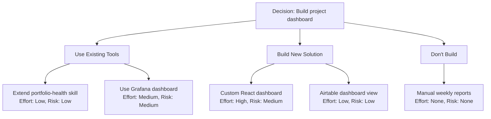

# Probability Storm -- Strategy Explorer (L2)

Multi-source search engine that generates alternative strategies for any decision. Replaces the v1 Pattern Predictor.

## Three-Source Search Pattern

### Source 1: Internal Tool Search

Scan existing skills and commands for capabilities that partially or fully address the decision.

**Steps:**

1. Glob `~/.claude/skills/*/SKILL.md` -- read YAML frontmatter only (first `---` to second `---`)
   - Extract: `name`, `description`
   - Store as `{name, description, path, type: "skill"}`

2. Glob `~/.claude/commands/*.md` -- read first 10 lines
   - Extract filename as name (e.g., `pickup.md` -> `pickup`)
   - Extract first non-frontmatter line as description
   - Store as `{name, description, path, type: "command"}`

3. Match against decision keywords:
   - Tokenize decision text (lowercase, remove stop words from duplicate-detection.md)
   - Tokenize each tool's name + description
   - Calculate overlap: `matching_keywords / total_decision_keywords`
   - Keep matches with overlap > 20%

4. For each match, generate a strategy entry:
   - Name: "Extend {tool_name}" or "Use {tool_name}" (depending on overlap)
   - Source: "existing tool"
   - Description: How this existing tool could address the decision
   - Effort: Low (already built)
   - Risk: Low (proven, tested)
   - Differentiation: Based on what it adds vs what's missing

**Performance:** User has 50+ skills. Read ONLY frontmatter, not full files. If Glob returns 50+ results, process first 40 (sorted by modification time).

### Source 2: Web Search

Discover external tools, packages, APIs, and approaches.

**Steps:**

1. Generate 2-3 search queries from decision context:
   - Primary: `"{main_keyword} {category} tool solution"`
   - Alternative: `"{problem_description} automation alternative"`
   - Trending: `"best {category} tools 2026"`

2. Execute each query using the WebSearch tool

3. Parse results:
   - Extract tool/product names, descriptions, URLs
   - Filter: Keep entries that describe actual tools, products, or approaches
   - Discard: Pure blog posts, tutorials, documentation pages (unless they describe a tool)

4. For each valid result, generate a strategy entry:
   - Name: The tool/product name or approach described
   - Source: "web discovery"
   - Description: What it does, from the search result
   - Effort: Medium (requires integration/setup)
   - Risk: Medium (external dependency, learning curve)
   - Differentiation: Based on unique capabilities vs internal tools
   - URL: Include for reference

**Error handling:** If WebSearch fails or returns nothing useful, skip Source 2 entirely. Note in output: "Web search unavailable -- using internal and AI sources only." Never block the strategy list because of web search failure.

### Source 3: AI-Proposed Alternatives

Claude generates creative approaches the user hasn't considered.

**Instructions for generating proposals:**

Given the decision text and L1 analysis (category, fork points, duplicate matches), propose approaches that include:

1. **At least 1 contrarian option:** What if you DON'T do this at all? What happens if you actively choose NOT to build/implement this?

2. **At least 1 hybrid option:** Combine 2+ existing tools in a new way to achieve the goal without building from scratch.

3. **At least 1 "off-label" option:** Use an existing tool/service for a purpose it wasn't designed for but could serve.

4. **At least 1 novel approach:** A creative solution that doesn't exist yet -- what would the ideal solution look like if you could design anything?

5. **Context-aware proposals:** Use L1 fork points to generate approaches for each major branch.

For each proposal:
- Name: Short descriptive name
- Source: "AI-proposed"
- Description: What this approach entails
- Effort: Low/Medium/High (estimated from complexity)
- Risk: Low/Medium/High (number of unknowns)
- Differentiation: What makes this unique from other strategies

## Strategy Scoring Dimensions

After gathering strategies from all 3 sources, score each on:

| Dimension | How to Assess |
|-----------|---------------|
| Effort | Low = already exists or trivial. Medium = hours of work, some unknowns. High = days+, significant complexity. |
| Risk | Low = proven approach, no external deps. Medium = some unknowns, 1-2 external deps. High = unproven, many unknowns. |
| Differentiation | How different is this from the OTHER strategies in the list? High = unique angle. Low = similar to another entry. |

## Deduplication

Before finalizing the list:
1. Check for overlap between sources (e.g., web search finds tool X, internal search also found tool X)
2. Merge duplicates: keep the richer description, combine source labels (e.g., "existing tool + web discovery")
3. If two AI-proposed strategies are too similar, merge or drop the weaker one

## Adaptive Strategy Count

The skill should suggest a count based on complexity signals from L1:

| Signal | Suggested Count | Reason |
|--------|----------------|--------|
| Duplicate overlap > 60% | 5 | Clear existing solution, fewer alternatives needed |
| Low complexity, clear scope | 5-7 | Straightforward, focused exploration |
| Medium complexity, some uncertainty | 10 (default) | Standard exploration depth |
| High complexity, multiple unknowns | 15-25 | Broad exploration before narrowing |
| Very uncertain, new domain | 25-50 | Maximum exploration |

**Present suggestion:** "This looks [simple/complex]. I'd suggest exploring [N] strategies. Want more or fewer?"

If user specified `--strategies N`, use that value directly (no suggestion).

## Mermaid Diagram Generation

Generate a fork diagram from STRATEGIES (not behavioral data):

1. Central decision node: `D[Decision: {brief summary, max 40 chars}]`
2. Group strategies by approach type:
   - "Use existing" strategies -> one branch
   - "Build new" strategies -> one branch
   - "Don't build" / contrarian -> one branch
   - Additional branches for distinct approach families
3. Each branch shows:
   - Strategy name
   - Effort level
   - Risk level
4. Use `graph TD` direction

Example:


## Output Format

Return strategies as a structured list for the report. Each entry:

```
{
  "rank": 1,
  "name": "Strategy name",
  "source": "existing tool | web discovery | AI-proposed",
  "description": "What this approach entails",
  "effort": "Low | Medium | High",
  "risk": "Low | Medium | High",
  "differentiation": "What makes this unique",
  "url": "https://..." (optional, web discoveries only)
}
```

Sort by: diversity of sources first (ensure all 3 sources represented), then by effort (low first), then by risk (low first).
