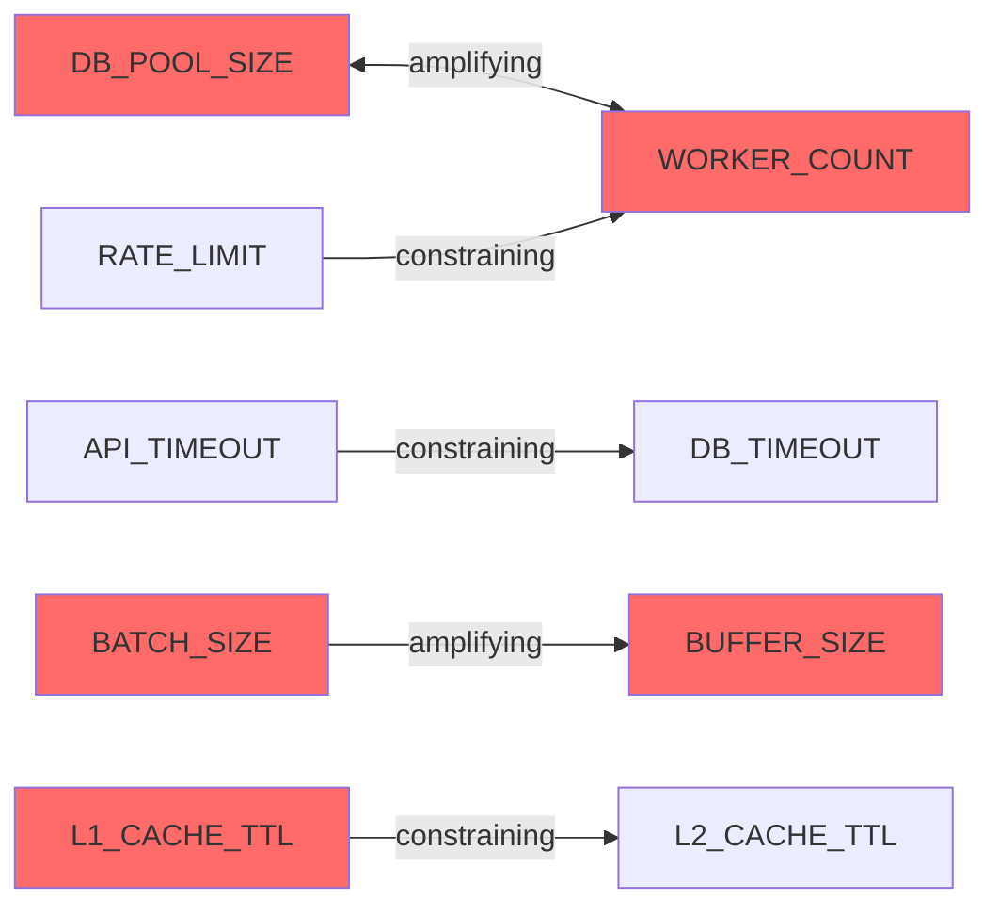

# L4: Harmonic Analysis Guide

This reference defines the protocol for analyzing parameter interactions -- how changing one parameter affects the optimal value of others, and where combinations of parameter values create "resonance points" for optimal system behavior. Execute the 5 steps below in order.

---

## Step 1: Identify Parameter Pairs

From the L1 inventory, identify parameters that are structurally coupled -- they share a resource, consumer, or constraint. Scan all parameters and check each pair against the 5 coupling types below.

### Coupling Types

| Coupling Type | Pattern | How to Detect | Example |
|--------------|---------|---------------|---------|
| **Resource sharing** | Two params compete for the same resource (memory, CPU, connections, file handles) | Both parameters affect allocation of a finite resource. Increasing one reduces availability for the other. | Connection pool size + worker count (both consume DB connections). Buffer size + cache size (both consume memory). |
| **Producer-consumer** | One param's output feeds another's input. The producer rate must not exceed consumer capacity. | Param A controls throughput/batch size of data production. Param B controls the capacity to receive/process that data. | Batch size + buffer size (batch produces what buffer must hold). Rate limit + worker count (rate limit controls inflow, workers control processing). |
| **Timeout chain** | Sequential timeouts that must nest correctly. Inner operations must complete within outer timeout. | Multiple timeout parameters exist for operations that call each other. Outer timeout must exceed inner timeout + overhead. | API timeout > DB timeout > connection timeout. Gateway timeout > service timeout > downstream timeout. |
| **Capacity cascade** | One limit constrains another. The downstream capacity caps the effective value of the upstream parameter. | Param A sets a rate or count, Param B sets the capacity to handle that rate. A is meaningless if it exceeds B. | Rate limit > worker count * per-worker throughput. Max connections > pool size * instances. |
| **Cache interaction** | Multiple caches with interdependent TTLs or sizes. Cache hierarchy must maintain consistency. | Multiple cache layers exist (L1/L2, client/server, in-memory/distributed). TTLs and sizes must be ordered correctly. | L1 cache TTL < L2 cache TTL (otherwise L1 serves staler data). CDN TTL < origin TTL. App cache size < distributed cache size. |

### Detection Method

1. Group parameters by the resource they affect (database, memory, network, CPU, storage)
2. Within each resource group, check every pair against the 5 coupling types
3. Also check across groups: a database timeout and an API timeout may be in different resource groups but form a timeout chain
4. Record each coupled pair with its coupling type

### Output Format

```markdown
### Coupled Parameter Pairs

| # | Param A | Param B | Coupling Type | Detection Basis |
|---|---------|---------|---------------|-----------------|
| 1 | DB_POOL_SIZE | WORKER_COUNT | Resource sharing | Both consume database connections |
| 2 | BATCH_SIZE | BUFFER_SIZE | Producer-consumer | Batch output feeds buffer input |
| 3 | API_TIMEOUT | DB_TIMEOUT | Timeout chain | API calls DB, must allow DB to complete |
| 4 | RATE_LIMIT | WORKER_COUNT | Capacity cascade | Workers must handle the allowed rate |
| 5 | L1_CACHE_TTL | L2_CACHE_TTL | Cache interaction | L1 must expire before L2 to avoid stale reads |
```

---

## Step 2: Build Interaction Graph

For each coupled pair from Step 1, document the nature and direction of the interaction.

### Interaction Properties

| Property | Options | Description |
|----------|---------|-------------|
| **Direction** | A -> B, B -> A, A <-> B | Which parameter's change affects the other. Bidirectional means both affect each other. |
| **Interaction type** | Amplifying, Dampening, Constraining | Amplifying: increasing A requires increasing B. Dampening: increasing A allows decreasing B. Constraining: A sets a hard limit on B's effective range. |
| **Current status** | Harmony, Conflict, Unknown | Harmony: values are compatible. Conflict: values create a bottleneck, waste, or error condition. Unknown: cannot determine from static analysis. |

### How to Assess Status

- **Harmony**: The parameter values are proportional, ordered correctly, or within expected ratios for the coupling type
- **Conflict**: One of the following conditions is true:
  - Resource sharing: consumers exceed the resource pool (e.g., workers > pool size)
  - Producer-consumer: producer output exceeds consumer capacity (e.g., batch size > buffer size)
  - Timeout chain: inner timeout >= outer timeout
  - Capacity cascade: upstream rate exceeds downstream capacity
  - Cache interaction: inner cache TTL >= outer cache TTL
- **Unknown**: Cannot determine actual values or runtime behavior from static analysis

### Output Format

```markdown
### Parameter Interactions

| Param A | Param B | Coupling | Direction | Interaction | Status |
|---------|---------|----------|-----------|-------------|--------|
| DB_POOL_SIZE | WORKER_COUNT | Resource sharing | Bidirectional | Amplifying (more workers need more connections) | Conflict: 20 workers but 10 connections |
| API_TIMEOUT | DB_TIMEOUT | Timeout chain | A > B required | Constraining (API must exceed DB) | Harmony: 30s > 10s |
| BATCH_SIZE | BUFFER_SIZE | Producer-consumer | A feeds B | Amplifying (bigger batch needs bigger buffer) | Conflict: batch=1000, buffer=500 |
| RATE_LIMIT | WORKER_COUNT | Capacity cascade | A constrained by B | Constraining (rate limited by worker throughput) | Harmony: 100 RPS, 20 workers * 10 RPS each |
| L1_CACHE_TTL | L2_CACHE_TTL | Cache interaction | A < B required | Constraining (L1 must expire before L2) | Conflict: L1=600s, L2=300s |
```

### Interaction Diagram

Generate a Mermaid flowchart showing all parameter interactions:

```markdown

```

Use red fill (`#ff6b6b`) for parameters in Conflict status, green (`#51cf66`) for Harmony, gray (`#adb5bd`) for Unknown.

---

## Step 3: Harmonic Groups

Cluster interacting parameters into groups that should be tuned together. A harmonic group is a set of parameters where changing any one member affects the optimal value of at least one other member.

### Group Formation Rules

1. **Start with pairs**: Each coupled pair from Step 2 is a seed group
2. **Merge overlapping groups**: If Param B appears in Group 1 (with Param A) and Group 2 (with Param C), merge into one group: {A, B, C}
3. **Transitive closure**: If A couples with B and B couples with C, all three are in the same group (even if A and C are not directly coupled)
4. **Independent parameters**: Parameters that appear in no coupled pairs are not in any harmonic group. They can be tuned independently.

### Group Documentation

For each harmonic group, document:

- **Group name**: A descriptive name for the concern (e.g., "Database Throughput", "Cache Hierarchy", "Request Pipeline")
- **Members**: All parameters in the group
- **Internal couplings**: The pairs and coupling types within this group
- **Tuning constraint**: The rule that must hold when tuning this group (e.g., "pool >= workers * 1.5")
- **Current state**: Whether the group is in harmony or has conflicts

### Output Format

```markdown
### Harmonic Groups

**Group 1: Database Throughput** (tune together)
- Members: DB_POOL_SIZE, WORKER_COUNT, DB_TIMEOUT
- Couplings: pool <-> workers (resource sharing), timeout -> pool (constraining)
- Constraint: pool >= workers * 1.5, timeout = P99 * 2
- Current state: CONFLICT -- pool starvation (20 workers, 10 connections)

**Group 2: Cache Hierarchy** (tune together)
- Members: L1_CACHE_TTL, L2_CACHE_TTL, CACHE_MAX_SIZE
- Couplings: L1_TTL < L2_TTL (cache interaction), size proportional to TTL
- Constraint: L1_TTL < L2_TTL, size = throughput * TTL
- Current state: CONFLICT -- L1 TTL exceeds L2 TTL

**Group 3: Request Pipeline** (tune together)
- Members: RATE_LIMIT, BATCH_SIZE, BUFFER_SIZE, API_TIMEOUT
- Couplings: rate -> workers (capacity cascade), batch -> buffer (producer-consumer), timeout > batch_processing
- Constraint: buffer >= batch, timeout > batch_time, rate <= worker_capacity
- Current state: HARMONY -- all constraints satisfied

**Independent Parameters** (tune individually)
- LOG_LEVEL, PAGE_SIZE, CORS_MAX_AGE
- No coupling detected -- these can be adjusted without affecting other parameters
```

---

## Step 4: Anti-Pattern Detection

Scan all parameter pairs and groups for known harmful configurations. These are combinations where parameter values cancel each other out, create hidden conflicts, or produce failure modes that are hard to diagnose.

### Anti-Pattern Catalog

| Anti-Pattern | Description | Detection Rule | Severity | Example |
|-------------|-------------|----------------|----------|---------|
| **Timeout inversion** | Inner timeout exceeds outer timeout. The outer operation always times out before the inner operation completes. | For each timeout chain pair: check if inner_timeout >= outer_timeout | Critical | DB timeout 60s but API timeout 30s -- API always times out first, masking the actual DB performance |
| **Pool starvation** | More consumers than the pool can serve. Under load, consumers wait indefinitely for pool resources. | For each resource-sharing pair: check if consumers > pool_size | High | 50 workers sharing 10 DB connections -- 40 workers blocked waiting at peak load |
| **Buffer overflow chain** | Producer outpaces consumer capacity. Data is lost or back-pressure causes cascading failures. | For each producer-consumer pair: check if producer_output > consumer_capacity | High | Batch size 10000 into buffer of 1000 -- 9000 items lost or cause OOM |
| **Cache thrashing** | TTL too short relative to the cost of populating the cache entry. The cache spends more time rebuilding than serving. | For each cache parameter: check if TTL < populate_time * 3 (heuristic: cache should serve at least 3x more than it costs to build) | Medium | 5s TTL on query that takes 3s to execute -- cache rebuilds 40% of the time, worse than no cache |
| **Rate limit bypass** | Internal rate limit is lower than what downstream allows. The system self-throttles unnecessarily, leaving capacity unused. | For each rate limit: compare against known downstream capacity | Low | Internal service limit 100 RPS but external API allows 1000 RPS -- 90% of available capacity wasted |

### Detection Method

1. For each anti-pattern, check every relevant parameter pair or group
2. Use the detection rule to evaluate whether the anti-pattern is present
3. If detected, record the specific parameters, current values, and why they constitute the anti-pattern
4. Assign severity based on the catalog above

### Output Format

```markdown
### Anti-Patterns Detected

| # | Anti-Pattern | Parameters | Current Values | Severity | Impact | Fix |
|---|-------------|------------|----------------|----------|--------|-----|
| 1 | Timeout inversion | API_TIMEOUT, DB_TIMEOUT | API=30s, DB=60s | Critical | API times out before DB completes, hiding real DB issues | Set DB_TIMEOUT < API_TIMEOUT (e.g., DB=10s, API=30s) |
| 2 | Pool starvation | DB_POOL_SIZE, WORKER_COUNT | Pool=10, Workers=50 | High | 40 workers blocked at peak, causing request queuing | Increase pool to workers * 1.5 = 75, or reduce workers |
| 3 | Buffer overflow chain | BATCH_SIZE, BUFFER_SIZE | Batch=10000, Buffer=1000 | High | Data loss or OOM under load | Buffer >= Batch, or add backpressure mechanism |
```

If no anti-patterns are detected, output: "No anti-patterns detected. All parameter combinations are properly configured."

---

## Step 5: Resonance Points

For each harmonic group, determine the parameter combination where the group operates at peak efficiency. This is the "resonance point" -- the values where parameters amplify rather than conflict with each other.

### Resonance Calculation Method

1. **Start with L3 recommendations**: If L3 has computed optimal values for individual parameters, use those as starting points
2. **Apply group constraints**: Adjust individual optima to satisfy the group's coupling constraints
3. **Resolve conflicts**: When individual optima conflict within a group, prioritize the higher-sensitivity parameter (from L2) and adjust the lower-sensitivity one
4. **Calculate expected improvement**: Compare the resonant values to current values and estimate the combined improvement

### Resonance Point Properties

- **Current state**: The current parameter values and their combined effect
- **Resonant state**: The recommended parameter values that satisfy all constraints
- **Expected improvement**: Quantitative estimate of the improvement from moving to resonant values
- **Tuning order**: The sequence in which parameters should be changed (to avoid transient failures during migration)

### Output Format

```markdown
### Resonance Points

**Group 1: Database Throughput**
- Current: pool=10, workers=20, timeout=30s
  - Status: CONFLICT -- pool starvation, timeout too generous
- Resonant: pool=30, workers=20, timeout=5s
  - Rationale: pool = workers * 1.5 (eliminates starvation), timeout = P99 * 2 (tighter, reduces connection hold time)
- Expected improvement: -65% query wait time, -80% timeout errors
- Tuning order: (1) Increase pool to 30, (2) reduce timeout to 5s
  - Reason: increase pool first to eliminate starvation, then tighten timeout

**Group 2: Cache Hierarchy**
- Current: L1_TTL=600s, L2_TTL=300s
  - Status: CONFLICT -- L1 serves staler data than L2 provides
- Resonant: L1_TTL=120s, L2_TTL=600s
  - Rationale: L1 = hot cache (short TTL, fast invalidation), L2 = warm cache (longer TTL, fewer rebuilds)
- Expected improvement: -90% stale data served, +20% cache hit rate
- Tuning order: (1) Increase L2_TTL to 600s, (2) decrease L1_TTL to 120s
  - Reason: extend L2 first so L1 reduction doesn't cause cache miss storm

**Independent Parameters**
- These parameters have no harmonic interactions and can be tuned independently
- Apply L3 individual recommendations directly
- No resonance analysis needed
```

### Resonance Quality Criteria

- **Strong resonance**: All group constraints satisfied, no conflicts, expected improvement >30%
- **Moderate resonance**: Most constraints satisfied, minor conflicts remain, improvement 10-30%
- **Weak resonance**: Constraints partially satisfied, significant conflicts remain, improvement <10%

---

## Edge Cases

- **Single parameter in project**: Return "No interactions possible -- single parameter cannot form pairs." L4 score = N/A.
- **All parameters independent (no coupling detected)**: Return "No harmonic groups -- all parameters can be tuned independently." L4 score = 80 (this is a good state: no harmful interactions).
- **Circular dependencies**: If A -> B -> C -> A, treat the entire cycle as one harmonic group. Note the circular dependency explicitly.
- **Unknown coupling direction**: If you cannot determine which parameter affects the other, mark direction as "Unknown" and interaction as "Unknown". Include in the harmonic group but note uncertainty.
- **Parameters from different services**: If parameters are in different deployment units (e.g., API service vs worker service), note that tuning requires coordinated deployment.

---

## L4 Scoring Rubric

| Criterion | Points | How to Score |
|-----------|--------|-------------|
| **Pair identification** | 0-25 | Percentage of plausible parameter pairs identified: (found_pairs / estimated_total_pairs) * 25. Estimated total = parameter pairs sharing a resource, timeout chain, or data flow. |
| **Interaction accuracy** | 0-25 | Coupling type, direction, and status correctly assessed for each pair: all correct = 25, mostly correct = 18, some correct = 12, few correct = 5 |
| **Group formation** | 0-25 | Harmonic groups are logically coherent (no unrelated params grouped, no related params split): perfect grouping = 25, minor issues = 18, significant gaps = 10 |
| **Anti-pattern detection** | 0-15 | Known anti-patterns flagged with evidence: all detected = 15, most detected = 10, some detected = 5, none checked = 0 |
| **Resonance points** | 0-10 | Actionable resonance recommendations per group: all groups have resonance points = 10, most groups = 7, some groups = 4, none = 0 |

**Total: 0-100**
