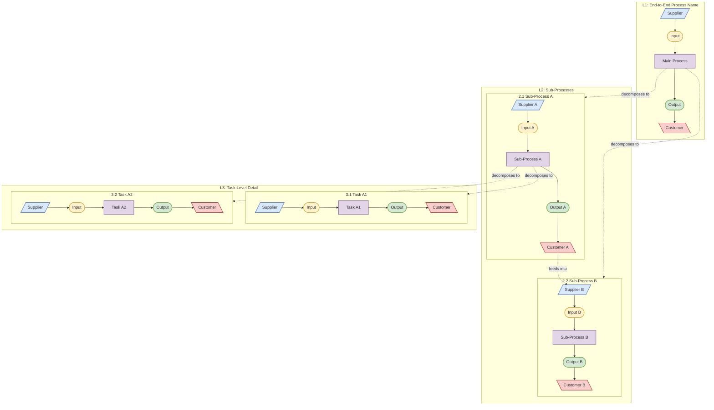
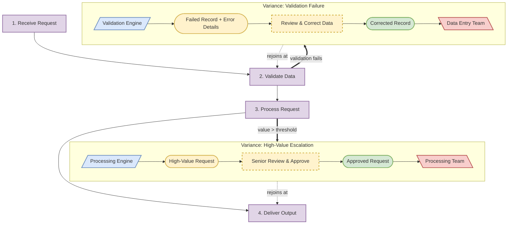
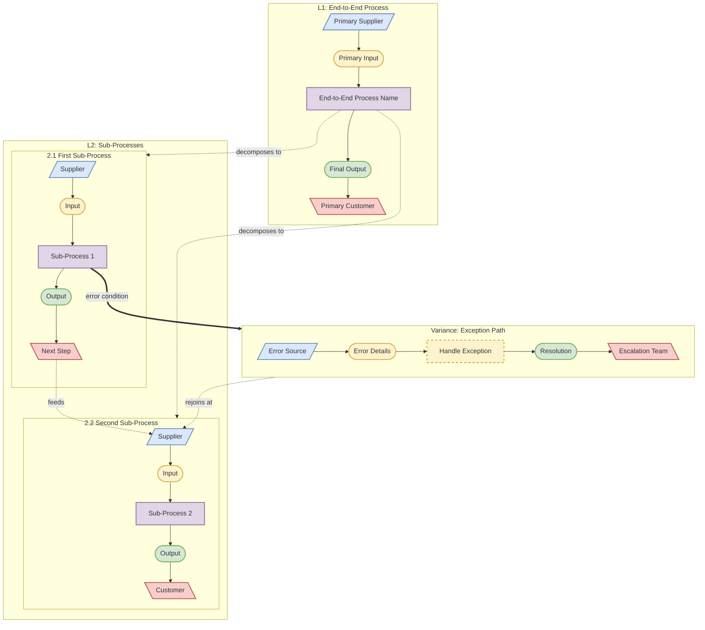

# Hierarchy SIPOC — Mermaid Diagram Templates

Mermaid flowchart templates for generating SIPOC hierarchy diagrams: node shapes, edge styles, color coding, single-level, multi-level decomposition, and variance paths.

---

## Node Shape Reference

Each SIPOC element uses a distinct Mermaid node shape for visual differentiation:

| Element | Shape | Mermaid Syntax | Color |
|---------|-------|---------------|-------|
| Supplier | Parallelogram | `S1[/"Supplier Name"/]` | Blue `#dae8fc` |
| Input | Stadium (rounded) | `I1(["Input Name"])` | Orange `#fff2cc` |
| Process | Rectangle | `P1["Process Step Name"]` | Purple `#e1d5e7` |
| Output | Stadium (rounded) | `O1(["Output Name"])` | Green `#d5e8d4` |
| Customer | Reverse parallelogram | `C1[\"Customer Name"\]` | Pink `#f8cecc` |
| Variance | Rectangle (dashed border) | `V1["Variance: Description"]` | Yellow `#fff3cd` |
| Start/End | Circle | `START(("Start"))` / `END(("End"))` | Gray `#f5f5f5` |

## Edge Style Reference

| Flow Type | Mermaid Syntax | Use Case |
|-----------|---------------|----------|
| Normal flow | `-->` | Standard S→I→P→O→C progression |
| Labeled handoff | `-->\|"handoff label"\|` | Cross-boundary transfers with mechanism noted |
| Decomposition link | `-.->` | Connecting L1 step to L2 subgraph (or L2→L3) |
| Labeled decomposition | `-.->\|"decomposes to"\|` | Explicit decomposition annotation |
| Variance branch | `==>` | Thick arrow from main flow to variance path |
| Labeled variance | `==>\|"trigger condition"\|` | Thick arrow with trigger label |
| Variance rejoin | `-.->` | Dotted arrow from variance back to main flow |
| Labeled rejoin | `-.->\|"rejoins at"\|` | Dotted arrow with rejoin annotation |

## Style Definitions

Apply these styles at the end of every generated Mermaid diagram:

```mermaid
%% Standard SIPOC styles
classDef supplier fill:#dae8fc,stroke:#6c8ebf,stroke-width:2px,color:#333
classDef input fill:#fff2cc,stroke:#d6b656,stroke-width:2px,color:#333
classDef process fill:#e1d5e7,stroke:#9673a6,stroke-width:2px,color:#333
classDef output fill:#d5e8d4,stroke:#82b366,stroke-width:2px,color:#333
classDef customer fill:#f8cecc,stroke:#b85450,stroke-width:2px,color:#333
classDef variance fill:#fff3cd,stroke:#c9a227,stroke-width:2px,stroke-dasharray:5 5,color:#333
classDef startend fill:#f5f5f5,stroke:#666,stroke-width:2px,color:#333
```

Apply classes to nodes after defining the graph:

```mermaid
class S1,S2 supplier
class I1,I2 input
class P1,P2 process
class O1,O2 output
class C1,C2 customer
class V1,V2 variance
```

---

## Template 1: Single-Level SIPOC Flow

A single process decomposed into its SIPOC elements in one horizontal flow.

```mermaid
flowchart LR
    %% Suppliers
    S1[/"Supplier A"/]
    S2[/"Supplier B"/]

    %% Inputs
    I1(["Input 1"])
    I2(["Input 2"])

    %% Process
    P1["1. Process Step One"]
    P2["2. Process Step Two"]
    P3["3. Process Step Three"]

    %% Outputs
    O1(["Output 1"])
    O2(["Output 2"])

    %% Customers
    C1[\"Customer A"\]
    C2[\"Customer B"\]

    %% Flow
    S1 --> I1
    S2 --> I2
    I1 --> P1
    I2 --> P1
    P1 -->|"handoff: email"| P2
    P2 -->|"handoff: API"| P3
    P3 --> O1
    P3 --> O2
    O1 --> C1
    O2 --> C2

    %% Styles
    classDef supplier fill:#dae8fc,stroke:#6c8ebf,stroke-width:2px,color:#333
    classDef input fill:#fff2cc,stroke:#d6b656,stroke-width:2px,color:#333
    classDef process fill:#e1d5e7,stroke:#9673a6,stroke-width:2px,color:#333
    classDef output fill:#d5e8d4,stroke:#82b366,stroke-width:2px,color:#333
    classDef customer fill:#f8cecc,stroke:#b85450,stroke-width:2px,color:#333

    class S1,S2 supplier
    class I1,I2 input
    class P1,P2,P3 process
    class O1,O2 output
    class C1,C2 customer
```



---

## Template 2: Multi-Level Hierarchy SIPOC

Process decomposed across L1 (end-to-end), L2 (sub-processes), and L3 (tasks). Each level is a subgraph. Decomposition links connect levels.



---

## Template 3: Variance Path

Variance branches off from a main flow step, handled in a yellow-dashed subgraph, and either rejoins or terminates.



---

## Template 4: Combined Hierarchy + Variance

Full template combining multi-level decomposition with variance paths. Use this as the starting pattern for complex SIPOC diagrams.



---

## Node Naming Conventions

Consistent node ID prefixes prevent collisions across levels and variances:

| Scope | Prefix Pattern | Example |
|-------|---------------|---------|
| L1 elements | `L1_{element}` | `L1_S1`, `L1_P1`, `L1_O1` |
| L2 sub-process N | `L2{letter}_{element}` | `L2A_S`, `L2A_P`, `L2B_I` |
| L3 task N | `L3{letter}_{element}` | `L3A_P`, `L3B_O` |
| Variance N | `V{number}_{element}` | `V1_S`, `V1_P`, `V2_O` |
| Start/End | `START`, `END` | `START(("Start"))` |

Where `{element}` is one of: `S` (Supplier), `I` (Input), `P` (Process), `O` (Output), `C` (Customer).

When a level has multiple suppliers, inputs, outputs, or customers, append a number: `L2A_S1`, `L2A_S2`.

---

## Diagram Splitting Rules

If a diagram exceeds **30 nodes**, split into separate diagrams:

1. **Level split**: One diagram per hierarchy level (L1, L2, L3)
2. **Variance split**: Main flow in one diagram, each complex variance in its own
3. **Cross-reference**: Add a comment node linking to the other diagram: `NOTE["See: L2 Diagram"]`

When splitting, repeat the connecting node in both diagrams so the reader can follow the link.

---

## Subgraph Styling Notes

Mermaid subgraph visual differentiation:

- **L1 subgraph**: Default style (no special styling needed)
- **L2 subgraph**: Default style, nested within L1's scope
- **L3 subgraph**: Default style, nested within L2's scope
- **Variance subgraph**: Label prefixed with "Variance:" for clarity

Subgraph titles should follow the pattern: `"{level_number}: {descriptive_name}"` (e.g., `"2.1 Validate Change Request"`, `"Variance: Missing Data"`).
