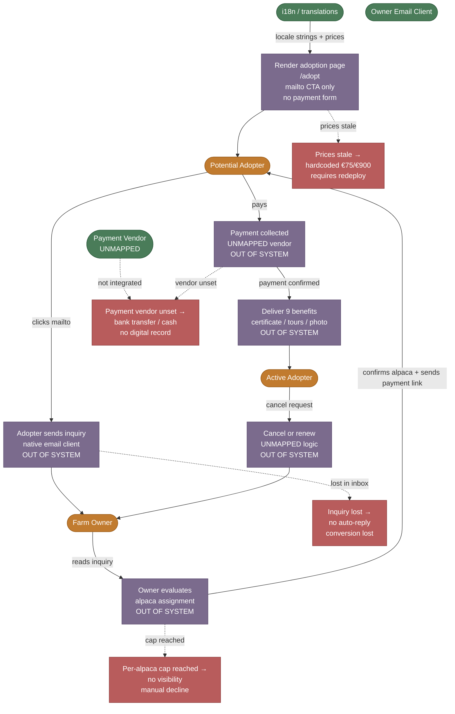

# SIPOC — Adopt-a-Paca Flow (Alpaca Adoption Subscription)

**W2.2 | Generated: 2026-05-26**

The Adopt-a-Paca flow covers a supporter discovering the adoption page, choosing a tier (€75/month or €900/year), expressing interest via email CTA, and an owner manually onboarding them. The payment vendor, per-alpaca cap, and subscription management system are all **UNMAPPED** pending owner confirmation. The CTA is a `mailto:` link — there is no embedded payment or form in the codebase.

---

## SIPOC Matrix

| # | Supplier | Input | Process Step | Transformation | Output | Handoff | Customer |
|---|----------|-------|--------------|----------------|--------|---------|----------|
| 1 | Codebase / `lib/translations` | Locale, translation keys (`adopt.*`), pricing constants (`€75/mo`, `€900/yr` — verified 2026-05-26 from live site) | **Render adoption page** — `/[locale]/adopt/page.tsx`; hero, two pricing tiers, 9-benefit grid, `mailto:info@alpacasibiza.com?subject=Adopt%20an%20Alpaca%20enquiry` CTA; JSON-LD `Product` schema with two `Offer` nodes; dev-only owner-confirm banner listing 6 open questions | Config + locale → localised adoption offer page with structured data | Rendered `/adopt` page; JSON-LD emitted for SEO | User click on email CTA → native email client opens | Potential Adopter |
| 2 | Potential Adopter | `mailto:info@alpacasibiza.com` link click | **Adopter sends inquiry email** (out-of-system) — browser opens native mail client; adopter composes message; subject pre-filled "Adopt an Alpaca enquiry" | Interest → unstructured email in owner inbox | Email in `info@alpacasibiza.com` inbox | Native email client → owner's inbox | Farm Owner |
| 3 | Farm Owner | Adopter inquiry email, available alpaca roster, subscription capacity per alpaca (UNMAPPED) | **Owner evaluates + responds** (out-of-system) — confirms tier, selects alpaca, checks per-animal cap, sends welcome details and payment instructions | Inquiry → confirmed alpaca assignment and payment request | Reply email to adopter with alpaca name, benefits bundle, payment instructions | Owner email client → adopter inbox | Potential Adopter |
| 4 | Farm Owner, Adopter | Agreed tier (monthly / yearly), payment instrument, vendor (UNMAPPED — Stripe / FareHarbor / Mollie / other) | **Payment collected** (out-of-system / UNMAPPED) — payment method and vendor not implemented in codebase; flow is entirely manual or via external tool not yet integrated | Agreement → recurring or one-time payment | Payment receipt; adopter becomes active subscriber | Payment platform → owner confirmation | Adopter |
| 5 | Farm Owner | Active subscriber record, benefit schedule | **Deliver adoption benefits** (out-of-system) — welcome certificate, farm tour access, fertilizer allocation, professional photoshoot, newsletter, naming rights (9 benefits as listed on live site, OWNER_CONFIRMED) | Subscriber record → ongoing benefit delivery per tier | Adoption certificate; scheduled farm tours; photoshoot; fertilizer; communications | Manual coordination by owner | Adopter |
| 6 | Farm Owner, Adopter | Cancellation request (monthly tier only) | **Process cancellation / renewal** (out-of-system / UNMAPPED) — monthly adopters can cancel any time; yearly is prepaid; no subscription management system exists in codebase; grandfathering policy for existing subscribers not documented | Request → subscription status update | Subscription ended or renewed; alpaca slot freed for new adopter | Owner manual action | Adopter |

### Variance Paths

| Variance | Trigger | Sub-Process | Exit |
|----------|---------|-------------|------|
| **Payment vendor not chosen** | `UNMAPPED` — no Stripe/FareHarbor/Mollie env vars or routes exist | Owner collects payment entirely outside the site (bank transfer, cash); no automated receipts or subscription tracking | Revenue captured but no digital record; churn risk undetected |
| **Adopter inquiry lost in inbox** | High email volume or spam filter | No auto-reply or confirmation email sent to adopter; no webhook or CRM entry created | Adopter waits indefinitely; conversion lost |
| **Per-alpaca cap reached** | Owner is unaware of total adopters per animal (cap UNMAPPED) | Owner cannot honour new adoption; must decline or waitlist manually | Demand unmet; reputational risk if website still accepts inquiries |
| **Dev-only banner in production** | `NODE_ENV` check at line 197 | Banner only visible in dev/staging; production visitors see no open-question warnings | Owner-confirm items are invisible to deployers who skip dev review |
| **Prices changed on live site** | Owner raises prices post-redesign | Codebase hardcodes `€75/mo` and `€900/yr` from live site verification 2026-05-26; JSON-LD and page copy would be incorrect | Requires manual code change + redeploy; no env-var override path for prices |
| **Existing subscriber migration** | Grandfathering policy UNMAPPED | No logic exists to preserve old rate; new site launch may inadvertently re-quote different terms | Legal / trust risk; owner must define policy before launch |

---

## Mermaid Flowchart

