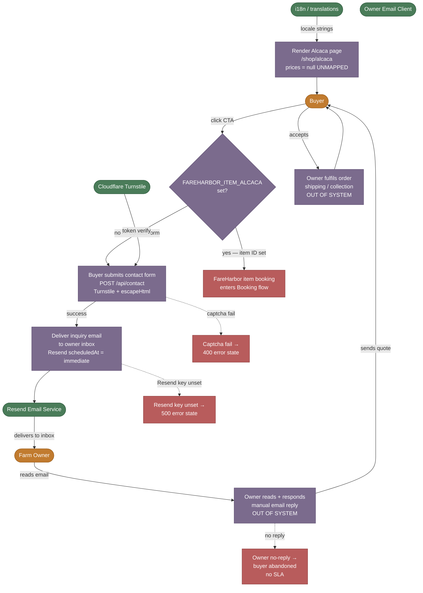

# SIPOC — Alcaca Inquiry Flow (Alpaca Fertilizer / Bulk Order)

**W2.2 | Generated: 2026-05-26**

The Alcaca flow covers a buyer discovering the Alcaca fertilizer product page, submitting an inquiry (via contact form or FareHarbor item link if `FAREHARBOR_ITEM_ALCACA` is set), and an owner manually responding. There is no cart, no automated payment, and no price listed — all three are unmapped pending owner confirmation.

---

## SIPOC Matrix

| # | Supplier | Input | Process Step | Transformation | Output | Handoff | Customer |
|---|----------|-------|--------------|----------------|--------|---------|----------|
| 1 | Site CMS / i18n (`lib/translations`) | Locale (en/nl/de/es), translation keys (`alcacaPage.*`), `FAREHARBOR_ITEM_ALCACA` env var | **Render Alcaca page** — `/[locale]/shop/alcaca/page.tsx`; 3 product tiles (Sample, Bulk, Wholesale); prices all `null` → "Contact for pricing"; CTA href = FareHarbor item URL if `FAREHARBOR_ITEM_ALCACA` set, else `/contact?subject=Alcaca%20order%20inquiry` | Config + locale → localised product listing with price-unknown state explicitly displayed | Rendered `/shop/alcaca` page with product cards and CTA buttons | User click → contact form or FareHarbor item page | Buyer |
| 2 | Buyer, Cloudflare Turnstile | Name, email, subject (`Alcaca order inquiry` pre-filled), message, Turnstile token (`cf-turnstile-response`) | **Submit contact form** — `POST /api/contact`; Turnstile verified via `verifyTurnstile(token, ip)`; fields validated (name, email, message required); `escapeHtml()` on all user inputs | Form fields → XSS-safe HTML email payload | `{ success: true }` to client; form clears | Resend `sendEmail` → `CONTACT_EMAIL` inbox | Buyer (UI success state), Farm Owner (inbox) |
| 3 | Resend, `lib/mailer` | Sanitised form fields, `RESEND_API_KEY`, `CONTACT_EMAIL`, `DEFAULT_TO` | **Deliver inquiry email to owner** — `sendEmail({ to: DEFAULT_TO, replyTo: buyerEmail, subject: "[Contact] Alcaca order inquiry", html: emailLayout(...) })`; mailer throws on error (no silent fail) | Email payload → delivered message in owner inbox with buyer's email as `Reply-To` | Email in owner inbox (`info@alpacasibiza.com` / `CONTACT_EMAIL`) | Owner reads email → manual reply via their email client | Farm Owner |
| 4 | Farm Owner | Buyer's inquiry email, product knowledge, current stock levels | **Owner evaluates + responds** (out-of-system) — Owner reads email, determines product availability, negotiates quantity and price, arranges shipping or pickup | Inquiry → bespoke quote or confirmation | Reply email to buyer; verbal/written order agreement | Owner email client → buyer's inbox | Buyer |
| 5 | Farm Owner, Buyer | Agreed quantity, price, and delivery terms | **Fulfil order** (out-of-system) — packaging, shipping or farm collection, payment collection (method unknown — UNMAPPED) | Agreement → physical product delivery | Buyer receives Alcaca fertilizer; owner receives payment | Physical handoff | Buyer |

### Variance Paths

| Variance | Trigger | Sub-Process | Exit |
|----------|---------|-------------|------|
| **`FAREHARBOR_ITEM_ALCACA` set** | Env var present at build time | CTA href = FareHarbor item URL; buyer books via FareHarbor instead of contact form; flow bypasses steps 2–3 and enters Booking flow | Alcaca purchase processed as FareHarbor booking (payment captured there) |
| **Turnstile secret key unset** | `TURNSTILE_SECRET_KEY` env unset | `verifyTurnstile` returns `{ ok: true }` (fail-open) with prod `console.warn`; form submits unverified | Inquiry delivered; spam risk elevated in production |
| **Captcha verification fails** | Bot or Turnstile network error | `/api/contact` returns 400 `{ error: 'Captcha verification failed' }`; buyer sees error state | Inquiry not delivered; buyer must retry |
| **`RESEND_API_KEY` unset** | Missing env var | `lib/mailer` throws; route catches → 500; buyer sees error state | Inquiry lost; no email delivered |
| **Owner does not reply** | Human failure | No automated follow-up exists; buyer waits indefinitely | Buyer may abandon; no SLA defined in codebase |
| **Price / stock question unanswerable** | Prices are `null` (UNMAPPED) in codebase | Owner must provide price ad hoc in reply; no price information available to buyer on site | Trust risk if buyer expects pricing upfront |

---

## Mermaid Flowchart

