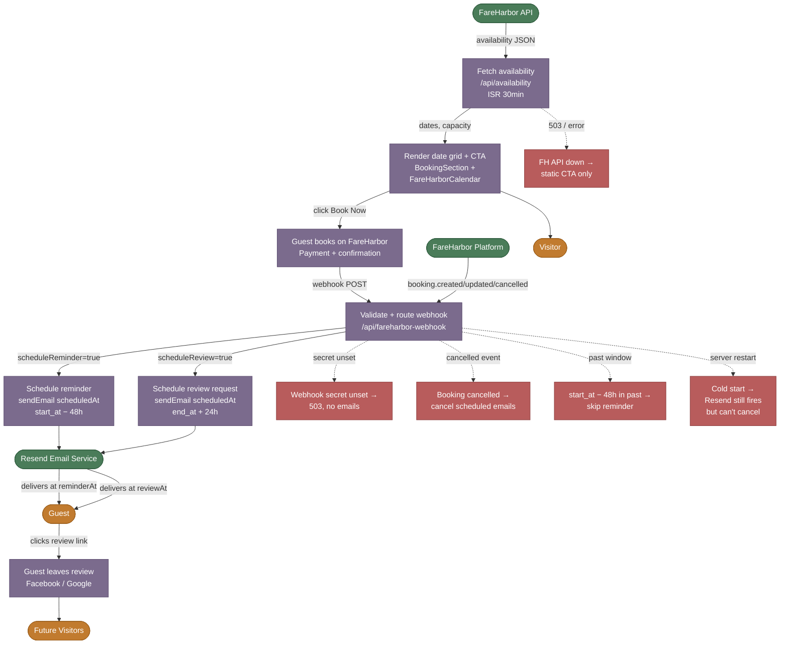

# SIPOC — Booking Flow (Tour Reservation)

**W2.2 | Generated: 2026-05-26**

The booking flow covers a visitor discovering available tour dates on the site, clicking through to FareHarbor, completing payment, and then receiving automated pre-tour reminder and post-tour review request emails.

---

## SIPOC Matrix

| # | Supplier | Input | Process Step | Transformation | Output | Handoff | Customer |
|---|----------|-------|--------------|----------------|--------|---------|----------|
| 1 | FareHarbor API (`/api/availability`) | `FAREHARBOR_APP_KEY`, `FAREHARBOR_USER_KEY`, item IDs | **Fetch availability** — `GET /api/external/v1/companies/alpacasibiza/items/{pk}/minimal/availabilities/date-range/` via `fetchWithTimeout`, `Promise.allSettled` fan-out across up to 3 items | Raw FareHarbor JSON → deduplicated, sorted `{ date, capacity, startTime }[]`, up to 8 slots; stale after 30min (ISR) | `{ dates[], lastUpdated }` JSON at 200, or `{ error }` at 503/500 | Next.js ISR cache → `useAvailability()` hook in browser | `BookingSection` component |
| 2 | `BookingSection` + `FareHarborCalendar` + `AvailabilityUrgency` | Availability JSON, `FAREHARBOR_BOOKING_URL`, locale | **Render date grid + CTA** — displays up to 8 date tiles with low-capacity warnings (≤5 spots), urgency badge, embedded FareHarbor calendar script, "Book Now" button | Available dates → visual date picker grid; capacity signal → urgency copy; no API → static CTA only | Rendered page section; `trackConversion.bookTourClick()` + `trackConversion.bookingCalendarOpen()` GA4 events | User click → external FareHarbor embed URL (`fareharbor.com/embeds/book/alpacasibiza/`) | Visitor |
| 3 | Visitor, FareHarbor | Guest details (name, email, party size, date/time), payment | **Guest completes FareHarbor booking** — FareHarbor hosted UI; payment processing entirely within FareHarbor; cancellation policy (free cancel up to 24h) displayed via `CancellationBadge` | Visitor intent → confirmed booking record in FareHarbor with booking PK, start_at, end_at | FareHarbor-issued booking confirmation email to guest; booking PK stored in FareHarbor; webhook event fired to site | FareHarbor → `POST /api/fareharbor-webhook` (HMAC-lite via `x-webhook-secret` + `safeEqual`) | Guest (FareHarbor confirmation), site backend (webhook) |
| 4 | FareHarbor webhook, `lib/webhook-router` | Webhook body (`booking.created` / `booking.updated` / `booking.cancelled`), `FAREHARBOR_WEBHOOK_SECRET` | **Validate + route webhook** — auth check via `safeEqual`, extract booking fields (`extractBooking`), validate email + start_at (`validateBookingForScheduling`), compute schedule windows (`computeScheduleWindows`): reminder at start_at − 48h, review at end_at + 24h | Raw webhook JSON → typed `WebhookBody` → schedule plan (reminderAt, reviewAt, boolean flags) | Schedule plan; or early 401/400 exit | In-memory `bookingScheduleStore` + Resend `scheduledAt` calls | Resend email scheduler |
| 5 | Resend, `lib/mailer`, `lib/email-templates` | Schedule plan, guest email, tour name, locale, `RESEND_API_KEY` | **Schedule reminder email** — `sendEmail({ scheduledAt: reminderAt })` 48h before tour; subject + HTML from `reminderEmailHtml`; `replyTo: DEFAULT_TO` (info@alpacasibiza.com) | Schedule plan → Resend queued email with future `scheduledAt`; email ID stored in `bookingScheduleStore` | Resend email ID; 48h pre-tour reminder email delivered to guest | Resend → guest inbox | Guest |
| 6 | Resend, `lib/mailer`, `lib/email-templates` | Schedule plan, guest email, tour name, `RESEND_API_KEY` | **Schedule review-request email** — `sendEmail({ scheduledAt: reviewAt })` 24h after tour ends; subject + HTML from `reviewRequestEmailHtml` | Schedule plan → Resend queued email; email ID stored in `bookingScheduleStore` | Resend email ID; post-tour review-request email delivered to guest | Resend → guest inbox | Guest / Google/Facebook review channels |
| 7 | Guest, Facebook/Google | Review text | **Guest leaves review** (out-of-system) — guest clicks review link in email, posts to Facebook or Google Places | Review intent → public review | Public review visible on Facebook / Google Places; `GoogleReviewsBadge` on site refreshes via `GET /api/google-reviews` | External platform → `GET /api/google-reviews` (GA4 Property ID required) | Future visitors |

### Variance Paths

| Variance | Trigger | Sub-Process | Exit |
|----------|---------|-------------|------|
| **FareHarbor API down** | `appKey`/`userKey` unset or network error in `/api/availability` | Route returns 503; `useAvailability` gets error; `BookingSection` hides date grid, shows static "View & Book" CTA linking to FareHarbor embed URL directly | Flow continues at step 3 (guest books on FareHarbor site without date preview) |
| **Webhook secret not configured** | `FAREHARBOR_WEBHOOK_SECRET` env unset | `/api/fareharbor-webhook` returns 503 immediately — no automated emails scheduled | No reminder or review email; booking still exists in FareHarbor |
| **Webhook auth failure** | `x-webhook-secret` header mismatch | 401 returned; event dropped | No reminder or review email |
| **Reminder already past** | `start_at − 48h` is in the past when webhook fires | `scheduleReminder = false`; reminder skipped; review still scheduled if in future | Guest receives no reminder; review email unaffected |
| **Booking cancelled** | `booking.cancelled` / `booking.deleted` event | `cancelScheduledEmail` called for both reminder + review IDs; `bookingScheduleStore.delete(pk)` | Scheduled emails cancelled; no communication to guest from site |
| **Booking updated** | `booking.updated` / `booking.modified` event | Cancel existing schedule IDs, re-run scheduling with new `start_at` / `end_at` | Rescheduled emails replace old ones |
| **Cold start / server restart** | In-memory `bookingScheduleStore` cleared | Already-queued Resend emails still fire (held by Resend); site loses ability to cancel them; at most one stale email per redeploy (ADR 001) | Resend delivers on schedule regardless |
| **Resend `scheduledAt` call fails** | Network or API error in `sendEmail` | `console.error` logged; `reminderEmailId` / `reviewEmailId` remains `null`; `bookingScheduleStore.set` still called with `null` IDs | No reminder or review email; manual fallback via `/api/reminder` + `/api/review-request` (owner-initiated, same secret header) |

---

## Mermaid Flowchart

