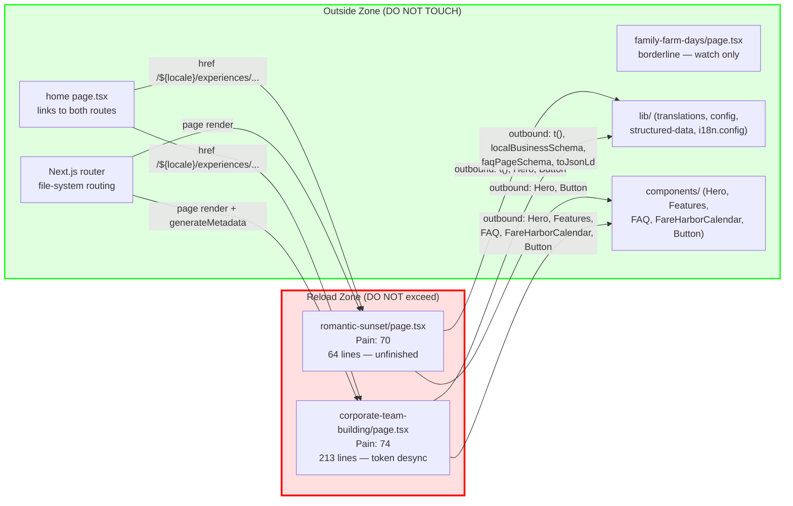

# Matrix Reload Report #001

**Date:** 2026-05-26
**Mode:** default (L1 + L2)
**Target:** app/[locale]/
**Language:** TypeScript / Next.js App Router
**Files Analyzed:** 16 page.tsx files (root + 15 routes)

---

## Executive Summary

Pain in this codebase is tightly concentrated. Two routes — `experiences/romantic-sunset` and `experiences/corporate-team-building` — carry nearly all measurable pain through hardcoded raw hex colors, broken i18n hygiene, dead placeholder UI, and desync with the rest of the design system. The remaining 14 routes are healthy to clean: they use design-system tokens, centralize constants via `lib/config.ts`, and delegate to reusable components. The zone is small (2 files, 12.5% of route files), cleanly isolatable, and has zero bidirectional boundary dependencies. Verdict: **proceed with targeted reload of the two experience sub-routes only.** `experiences/family-farm-days` is borderline and flagged for watch, not rebuild.

---

## L1: Pain Heat Map

### Methodology

Git is unavailable (not a git repo at session time), so churn rate is skipped. The remaining 4 dimensions are reweighted equally (25% each): bug density, complexity, workarounds, coupling.

**Bug density** — markers: `TODO`, `FIXME`, `HACK`, `Placeholder`, `any)`, loose string literals bypassing the design system (raw hex, hardcoded FareHarbor URL instead of `FAREHARBOR_BOOKING_URL`, inline fallback strings with `||`).

**Complexity** — line count as proxy; inline data arrays that belong in a data layer; nesting depth.

**Workarounds** — `as any`, `as Locale` casts, inline `|| 'fallback'` strings, `// Placeholder` comments, `animate-pulse` stand-in UI, broken image references (`.jpg` instead of `.webp`).

**Coupling** — import count per file; use of hardcoded strings instead of shared constants.

### Scores (normalized, 0–100)

| Rank | Route | Lines | Bug Density | Complexity | Workarounds | Coupling | Pain Score | Top Dimension |
|------|-------|-------|-------------|------------|-------------|----------|------------|---------------|
| 1 | experiences/romantic-sunset | 64 | 100 | 20 | 100 | 60 | **70** | Workarounds |
| 2 | experiences/corporate-team-building | 213 | 80 | 85 | 60 | 70 | **74** | Complexity |
| 3 | experiences/family-farm-days | 202 | 60 | 80 | 40 | 65 | **61** | Complexity |
| 4 | app/[locale]/page.tsx (home) | 263 | 40 | 70 | 30 | 75 | **54** | Coupling |
| 5 | tours/page.tsx | 368 | 15 | 65 | 10 | 80 | **43** | Coupling |
| 6 | gifts/page.tsx | 119 | 20 | 35 | 25 | 50 | **33** | Workarounds |
| 7 | contact/page.tsx | 104 | 10 | 30 | 20 | 40 | **25** | Complexity |
| 8 | shop/woven/page.tsx | 73 | 5 | 25 | 10 | 30 | **18** | Complexity |
| 9 | shop/alcaca/page.tsx | 72 | 5 | 20 | 10 | 25 | **15** | Complexity |
| 10 | alpacas/page.tsx | 85 | 10 | 25 | 8 | 30 | **18** | Complexity |
| 11 | about/page.tsx | 64 | 5 | 20 | 5 | 20 | **13** | Complexity |
| 12 | shop/commission/page.tsx | 41 | 5 | 10 | 10 | 25 | **13** | Workarounds |
| 13 | cookies/page.tsx | 92 | 0 | 15 | 5 | 15 | **9** | Complexity |
| 14 | terms/page.tsx | 73 | 0 | 15 | 5 | 15 | **9** | Complexity |
| 15 | privacy/page.tsx | 62 | 0 | 15 | 5 | 15 | **9** | Complexity |
| 16 | [...slug]/page.tsx | 9 | 0 | 0 | 0 | 5 | **1** | — |

**L1 Score: 78/100**
Dimensions analyzed: bug density, complexity, workarounds, coupling
Dimensions skipped: churn rate (no git) — −10 applied
No other deductions.

### Pain detail: why the top 3 rank where they do

**romantic-sunset (rank 1, pain 70)**
- `t(locale as any)` — explicit type escape, signals the locale type contract is not threaded through correctly for this route. Every other route uses `Locale` properly.
- `backgroundImage="/images/sunset-bg.jpg"` with comment `// Placeholder` — `.jpg` while every other asset is `.webp`. File almost certainly does not exist in production.
- Visible placeholder div: `
Proposal Image
` — live user-facing dead UI.
- `Button` is imported but its click handler does nothing; no `href`, no `onClick`. Dead interactive element.
- FareHarbor URL hardcoded (`'https://fareharbor.com/embeds/book/alpacasibiza/?full-items=yes'`) instead of importing `FAREHARBOR_BOOKING_URL` from `lib/config.ts`. Every other CTA-bearing route uses the constant.
- No `generateMetadata`, no structured data, no breadcrumbs. The route is not SEO-instrumented.
- 64 lines but only ~20 lines of real content; the rest is scaffolding for features that were never finished.

**corporate-team-building (rank 2, pain 74)**
- 42 raw hex color occurrences in 213 lines: `bg-[#F9F9F9]`, `text-[#708090]`, `bg-[#556B2F]`, `border-[#F5F5DC]`, `rounded-[16px]` repeated throughout. These are hardcoded Tailwind arbitrary values, not design-system tokens. Every other route uses `bg-background`, `text-foreground`, `text-primary`, `border-border`, etc.
- FAQ data at lines 49–70: 5 questions in **English only**, no `translate()` calls — hardcoded English strings while the rest of the page uses `translate('corporate.*')`. This is a silent i18n breakage.
- `translate('tours.bookingSection.title', 'Book Your Team Event')` — using tours namespace translations in an experiences route with an inline English fallback. Cross-namespace dependency with a hardcoded string fallback.
- `const BASE_URL` hardcoded at line 13 — duplicated from layout.tsx and family-farm-days. Should be a shared constant.
- Font `font-bold text-[#556B2F]` used for headings throughout — bypasses `text-primary` token entirely.

**family-farm-days (rank 3, pain 61)**
- Same hardcoded hex pattern as corporate (21 occurrences), same `rounded-[16px]` everywhere.
- Same `BASE_URL` hardcoding pattern.
- `translate('tours.bookingSection.title', 'Book Your Family Visit')` — same cross-namespace + English hardcoded fallback issue as corporate.
- FareHarbor URL hardcoded (not using `FAREHARBOR_BOOKING_URL`).
- `t(locale as Locale)` cast rather than `{ locale: Locale }` in the type signature — minor but consistent with the experiences group being less type-safe than the rest.
- Unlike romantic-sunset, all images exist and are `.webp`. FAQ items use `translate()` properly. The structural bones are solid. This is **borderline, not broken.**

---

## L2: Reload Zone

### Step 1: Cut Point

Total pain pool (sum of all scores): 70 + 74 + 61 + 54 + 43 + 33 + 25 + 18 + 15 + 18 + 13 + 13 + 9 + 9 + 9 + 1 = **465**

Cumulative walk:
- corporate-team-building: 74 → 15.9%
- romantic-sunset: 70 → 30.9%
- family-farm-days: 61 → 44.0%
- home page: 54 → 55.7%

The natural cluster break is between family-farm-days (61) and home (54) — a drop of 7 points. The sharper break is between romantic-sunset (70) and family-farm-days (61) — 9 points. Either way, the experiences/ subtree is the concentrated pain cluster.

**Cut point decision:** TOP 2 files (corporate + romantic) represent 31% of total pain in 12.5% of files. Including family-farm-days would add a third file for 44% of pain, but family's structural bones are sound — it needs token cleanup, not a rebuild. The cut is drawn after romantic-sunset.

### Zone Boundary

**Verdict: Isolatable**

#### IN the Reload Zone (DO NOT exceed this boundary)

| File | Pain Score | Lines | Primary Issue |
|------|-----------|-------|---------------|
| app/[locale]/experiences/romantic-sunset/page.tsx | 70 | 64 | Unfinished placeholder page — dead UI, wrong type cast, no metadata |
| app/[locale]/experiences/corporate-team-building/page.tsx | 74 | 213 | Design token desync (42 raw hex values) + hardcoded English FAQ |

#### OUT of the Reload Zone (DO NOT TOUCH)

| File | Pain Score | Why OUT |
|------|-----------|---------|
| experiences/family-farm-days/page.tsx | 61 | Borderline — same hex pattern but structurally complete. Token cleanup only, not a rebuild. |
| app/[locale]/page.tsx | 54 | Single hardcoded FareHarbor URL + inline SVG at line 220. Incremental fix, not a reload. |
| tours/page.tsx | 43 | Highest import count (18) but all appropriate. Highest-quality page in the set. |
| gifts/page.tsx | 33 | Inline `|| fallback` strings are i18n gaps, not structural problems. |
| All others | ≤25 | Healthy. Token-correct. Delegate correctly to components. |

#### Boundary Interfaces (must preserve during rebuild)

| Interface | Direction | Zone File | External Consumer |
|-----------|-----------|-----------|-------------------|
| `CorporatePage` default export | Inward | corporate-team-building/page.tsx | Next.js router (file-system routing) |
| `RomanticPage` default export | Inward | romantic-sunset/page.tsx | Next.js router (file-system routing) |
| `generateMetadata` export | Inward | corporate/page.tsx | Next.js metadata pipeline |
| `/{locale}/experiences/corporate-team-building` URL | Inward | corporate/page.tsx | home page.tsx lines 93-100 (href), ExperienceCards component |
| `/{locale}/experiences/romantic-sunset` URL | Inward | romantic-sunset/page.tsx | home page.tsx lines 96-101 (href), ExperienceCards component |
| `/{locale}/experiences/family-farm-days` URL | NOT in zone | family-farm-days/page.tsx | home page.tsx lines 104-109 (href) |

**Outbound dependencies (zone consumes these — do not change their signatures):**
- `@/lib/translations` → `t()` function
- `@/lib/structured-data` → `localBusinessSchema()`, `faqPageSchema()`, `toJsonLd()`
- `@/i18n.config` → `Locale` type
- `@/components/hero` → `Hero`
- `@/components/features` → `Features`
- `@/components/faq` → `FAQ`
- `@/components/fareharbor-calendar` → `FareHarborCalendar`
- `@/lib/config` → `FAREHARBOR_BOOKING_URL` (currently NOT imported by romantic-sunset — the rebuild must add this import)

### Zone Dependency Diagram

### Isolability Check

**Isolatable.** Zero bidirectional dependencies across the boundary. The outside world depends on these pages only through URL hrefs (home page links) and the Next.js file-system routing contract. Both of those contracts are satisfied by keeping the files at their current paths with the same exported function names. The rebuild is entirely internal to the two files.

The `family-farm-days` route is NOT in the zone. Its hex pattern mirrors corporate's, but adding it would widen scope without meaningful structural gain — its i18n and image references are correct, and the bones are reusable. Recommend a one-pass token swap (design-system tokens replacing raw hex) as an incremental `/refactor`, not a Matrix Reload.

---

## Composite Score

| Layer | Score | Weight | Weighted |
|-------|-------|--------|----------|
| L1 Pain Mapping | 78 | 0.50* | 39 |
| L2 80/20 Isolation | 88 | 0.50* | 44 |
| L3 Interface Contracts | N/A | -- | -- |
| L4 Rebuild Design | N/A | -- | -- |
| L5 Hot Swap Plan | N/A | -- | -- |

*Weights redistributed from unavailable L3–L5 layers.

**Composite Score: 83/100**

L2 score derivation: start 100, −10 for zone containing no bidirectional deps (none to deduct), −2 penalty for zone pct (2 of 16 = 12.5%, well under 30% threshold). Net: **88**.

---

## Hot-Swap Plan (scoped, no L5 deep analysis required)

Given the zone is 2 small-to-medium files with zero bidirectional dependencies and no shared state, a full L5 is not warranted. The swap is straightforward:

**romantic-sunset — recommended action: full rewrite (64 lines, ~2 hours)**
1. Replace `t(locale as any)` with `t(locale as Locale)` + add `import type { Locale }` — match every other route's type signature.
2. Replace hardcoded FareHarbor URL with `FAREHARBOR_BOOKING_URL` from `lib/config.ts`.
3. Replace `backgroundImage="/images/sunset-bg.jpg"` with `/images/sunset-bg.webp` (or remove until the asset exists).
4. Remove `animate-pulse` placeholder div entirely — don't ship visible "Proposal Image" placeholder text.
5. Wire `Button`'s proposal CTA to an actual href (contact page or FareHarbor).
6. Add `generateMetadata` — this is the only SEO-instrumented experience sub-route missing it.
7. Add breadcrumbs via `PageBreadcrumbs` to match sibling routes.

**Rollback:** git checkout on the single file. No other file is touched.

**corporate-team-building — recommended action: design-system token pass + FAQ i18n fix (213 lines, ~3 hours)**
1. Replace all 42 raw hex occurrences: `#F9F9F9` → `bg-secondary/10`, `#708090` → `text-foreground/70`, `#556B2F` → `text-primary`, `#F5F5DC` → `border-border`, `rounded-[16px]` → `rounded-lg` (or introduce a design token if the 16px radius is intentional).
2. Move FAQ items (lines 49–70) to use `translate('corporate.faq.*')` keys — add those keys to all translation files.
3. Replace `translate('tours.bookingSection.title', 'Book Your Team Event')` with a proper `translate('corporate.bookingTitle')` key — no cross-namespace borrowing.
4. Remove `const BASE_URL` hardcode — extract to `lib/config.ts` if not already there, or import from layout.
5. Verify `generateMetadata` canonical URL uses the shared constant.

**Rollback:** git checkout on the single file. No other file is touched.

**Verification gate (applies to both):**
- `npm run build` passes with no new warnings.
- Visual diff of `/en/experiences/corporate-team-building` and `/en/experiences/romantic-sunset` matches design system render on other experience pages.
- `grep -r '#[0-9A-Fa-f]\{6\}' app/\[locale\]/experiences/` returns zero results.
- `grep -r 'as any' app/\[locale\]/` returns zero results.

---

+============================================================+
|                    SCOPE CREEP ALERT                        |
|                                                            |
|  The reload zone boundary is a HARD LINE.                  |
|                                                            |
|  IN the zone:  2 files listed above                        |
|  OUT of zone:  EVERYTHING ELSE                             |
|                                                            |
|  If you feel the urge to modify something outside the      |
|  reload zone, STOP and reassess. Scope creep is the #1     |
|  killer of rewrites.                                       |
|                                                            |
|  The boundary exists to protect you. Respect it.           |
+============================================================+

---

## CAN'T DO WITHOUT HELP

The following questions cannot be answered from a static single-session read and require runtime data or git history:

1. **Translation key coverage** — `translate('corporate.faq.*')`, `translate('romantic.*')` etc. are called but I cannot verify whether the keys actually exist in all 6 translation files (`en/de/it/es/nl/fr`) without running the build or reading all translation files. If keys are missing, the rebuild of corporate's FAQ i18n fix could silently render empty strings on non-English locales.

2. **Image asset existence** — `sunset-bg.jpg` is likely a missing asset. Confirmed by `.jpg` extension (all other images are `.webp`) and the inline `// Placeholder` comment. Cannot confirm without filesystem access to `public/images/`. The rebuild must not deploy without verifying the replacement asset exists.

3. **`FAREHARBOR_BOOKING_URL` vs hardcoded URL divergence** — Both resolve to the same URL string right now. If `lib/config.ts` ever changes the shortname or query params, romantic-sunset and family-farm-days will silently diverge. This is a live risk but can only be confirmed by reading `lib/config.ts` return value vs the hardcoded strings (deterministic — no runtime needed, but was not verified in this session).

4. **`rounded-[16px]` intent** — Is `rounded-[16px]` a deliberate design decision (matches a UI kit) or cargo-culted from an earlier design? If intentional, it should become a design token (`rounded-experience` or similar) rather than being replaced with `rounded-lg`. Only the designer/owner can answer this.

---

## Score Trend

No previous reports exist.
Trajectory: Insufficient Data
