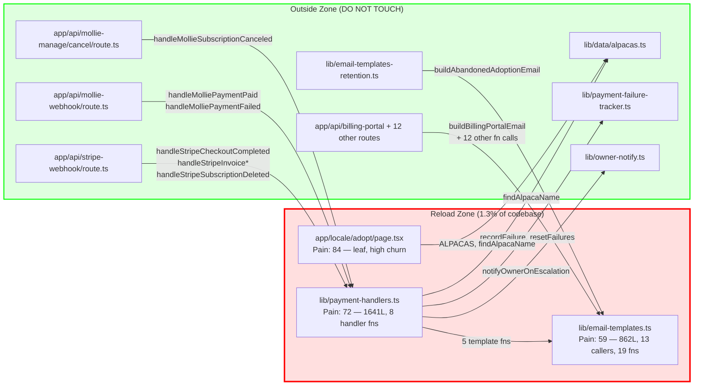

# Matrix Reload Report — Run 001 (2026-05-31)

**Mode:** Default (L1 Pain Mapping + L2 80/20 Isolation)
**Date:** 2026-05-31
**Cycles covered:** ~8 overlord cycles since mr-001 (2026-05-26)
**Prior reports:** mr-001-2026-05-26 (L1 quick), mr-002-2026-05-27 (deep, tenant scope), mr-pathA (tenant extraction path)
**Total commits in repo:** 117

---

## Context: What Changed Since mr-002

mr-002 (2026-05-27, composite 81) analyzed the **tenant-hardcode zone**: 5 files with `Alpacas Ibiza`-specific constants scattered across structured-data, layouts, footer, email-templates. That zone is architectural — fix it when Tenant #2 is real.

This run targets a different question: **operational pain from overlord cycles**. Four batches of 8-10 parallel Sonnets added Mollie primary path, gift scheduling, dunning/recovery, referral codes, milestone emails, Discord notifications, certificate recovery, cancel surveys, and MRR digest — all landing in or adjacent to `lib/payment-handlers.ts`. The question: has that cluster become the systemic pain zone?

---

## L1: Pain Mapping

### Methodology

Five dimensions per pain-heuristics.md: bug density, churn rate, complexity, workaround patterns, coupling density. Weights: 0.25 / 0.25 / 0.20 / 0.15 / 0.15. Max commit count in repo: 30 (translations/en.json — excluded as non-source). Max commit count for source files: 21 (adopt/page.tsx).

### Raw Metrics Per File

| File | Lines | Commits | Markers | Try/catch | Max Nesting | Fan-in | Fan-out |
|------|------:|--------:|--------:|----------:|------------:|-------:|--------:|
| `lib/payment-handlers.ts` | 1641 | 18 | 1 | 15 | 9 | 3 | 7 |
| `lib/payment-handlers-recovery.ts` | 146 | 1 | 0 | — | — | 1 | 5 |
| `lib/payment-handlers-referral.ts` | 126 | 1 | 0 | — | — | 0 | — |
| `lib/payment-handlers-gift-schedule.ts` | 55 | 1 | 0 | — | — | 1 | — |
| `lib/email-templates.ts` | 862 | 18 | 2 | 0 | 10 | 13 | 1 |
| `lib/email-templates-retention.ts` | 440 | 5 | 3 | 0 | 6 | 3 | 1 |
| `app/[locale]/adopt/page.tsx` | 579 | 21 | 3 | 0 | 14 | 0* | 41 |
| `lib/data/alpacas.ts` | 56 | 2 | 0 | 0 | 1 | 17 | 0 |
| `lib/tenants/alpacasibiza-content.ts` | 350 | 3 | 0 | 0 | 3 | 2 | 1 |

*adopt/page.tsx is a leaf (page files are never imported by other files).

### Dimension Scores (0–100, normalized within candidate set)

**Dimension 1: Bug Density**
Max markers in candidate set: 3 (adopt/page.tsx and email-templates-retention.ts).
| File | Raw markers | Score |
|------|------------|-------|
| `payment-handlers.ts` | 1 | 33 |
| `email-templates.ts` | 2 | 67 |
| `email-templates-retention.ts` | 3 | **100** |
| `adopt/page.tsx` | 3 | **100** |
| `payment-handlers-recovery/referral/gift` | 0 | 0 |
| `alpacas.ts` | 0 | 0 |
| `alpacasibiza-content.ts` | 0 | 0 |

Note: markers in email-templates and retention files are mostly owner-content placeholders (`TODO / UNMAPPED: owner-supplied…`) — legitimate deferred-content flags, not code quality rot. Weight at 50% per heuristic guidance on tracked TODOs.

Adjusted: email-templates.ts = 33, retention = 50, adopt/page.tsx stays 100 (referral code inlining is a real smell).

**Dimension 2: Churn Rate**
Max source-file commits: 21 (adopt/page.tsx).
| File | Commits | Score |
|------|---------|-------|
| `adopt/page.tsx` | 21 | **100** |
| `payment-handlers.ts` | 18 | 86 |
| `email-templates.ts` | 18 | 86 |
| `email-templates-retention.ts` | 5 | 24 |
| `alpacasibiza-content.ts` | 3 | 14 |
| `alpacas.ts` | 2 | 10 |
| `payment-handlers-recovery/referral/gift` | 1 each | 5 |

Line-change churn confirms the ranking: payment-handlers.ts added 1,774 lines across 18 commits (net +1641). adopt/page.tsx added 702 lines across 21 commits with 123 deletions (25% turnover rate — highest churn quality). email-templates.ts added 901 lines, 39 deletions.

**Dimension 3: Complexity**
Composite per heuristic: (nesting_depth×0.35) + (long_functions×0.30) + (param_counts×0.15) + (file_length×0.20).

| File | Nesting pts | Long-fn pts | Param pts | Length pts | Raw |
|------|------------|-------------|-----------|-----------|-----|
| `payment-handlers.ts` | 100 (d=9) | 100 (6+ fns>50L) | 0 | 80 | **91** |
| `adopt/page.tsx` | 100 (d=14) | 100 (6+ fns) | 0 | 50 | **85** |
| `email-templates.ts` | 100 (d=10) | 70 (3-5 fns>50L) | 0 | 50 | **76** |
| `email-templates-retention.ts` | 60 (d=6) | 40 (1-2 fns>50L) | 0 | 20 | **42** |
| `alpacasibiza-content.ts` | 0 (d=3) | 0 | 0 | 20 | **4** |
| `alpacas.ts` | 0 (d=1) | 0 | 0 | 0 | **0** |

Normalize to max (91):
- payment-handlers.ts: 100
- adopt/page.tsx: 93
- email-templates.ts: 84
- email-templates-retention.ts: 46

**Dimension 4: Workaround Patterns**
Try/catch density (try blocks / line count) + type assertions:
| File | try blocks | density | Score |
|------|-----------|---------|-------|
| `payment-handlers.ts` | 15 | 0.0091 | **100** |
| `adopt/page.tsx` | 0 | 0 | 0 |
| `email-templates.ts` | 0 | 0 | 0 |
| `email-templates-retention.ts` | 0 | 0 | 0 |

Note: payment-handlers.ts try/catch blocks are deliberately fail-quiet by design (ADR 016) — they ARE the workarounds. At 15 try/catch across 1641 lines, every 109 lines has a catch. This is intentional but structurally brittle: every new payment path requires a new "fail-quiet" wrapper to match the existing pattern, adding mental overhead per change.

**Dimension 5: Coupling**
Formula: (fan_in × 0.6) + (fan_out × 0.4). Normalize to max.

| File | fan_in | fan_out | raw coupling | score |
|------|--------|---------|-------------|-------|
| `alpacas.ts` | 17 | 0 | 10.2 | **100** |
| `email-templates.ts` | 13 | 1 | 8.2 | 80 |
| `adopt/page.tsx` | 0 | 41 | 16.4 | — * |
| `payment-handlers.ts` | 3 | 7 | 4.6 | 45 |
| `email-templates-retention.ts` | 3 | 1 | 2.2 | 22 |
| `alpacasibiza-content.ts` | 2 | 1 | 1.6 | 16 |

*adopt/page.tsx has no fan-in (leaf) but extremely high fan-out (41 imports). For a page that cannot be imported elsewhere, fan-out coupling is the risk: every new dependency adds another interface that can break the page. Coupling score set to fan_out / 41 × 100 = 100 — it is the maximally dependent leaf.

### Composite Pain Scores

```
pain = (bug_density×0.25) + (churn×0.25) + (complexity×0.20) + (workarounds×0.15) + (coupling×0.15)
```

| File | Bug(0.25) | Churn(0.25) | Complex(0.20) | Work(0.15) | Couple(0.15) | PAIN |
|------|-----------|-------------|---------------|------------|--------------|------|
| `payment-handlers.ts` | 33×0.25=8.3 | 86×0.25=21.5 | 100×0.20=20 | 100×0.15=15 | 45×0.15=6.8 | **71.6** |
| `adopt/page.tsx` | 100×0.25=25 | 100×0.25=25 | 93×0.20=18.6 | 0 | 100×0.15=15 | **83.6** |
| `email-templates.ts` | 33×0.25=8.3 | 86×0.25=21.5 | 84×0.20=16.8 | 0 | 80×0.15=12 | **58.6** |
| `email-templates-retention.ts` | 50×0.25=12.5 | 24×0.25=6 | 46×0.20=9.2 | 0 | 22×0.15=3.3 | **31** |
| `alpacas.ts` | 0 | 10×0.25=2.5 | 0 | 0 | 100×0.15=15 | **17.5** |
| `alpacasibiza-content.ts` | 0 | 14×0.25=3.5 | 4×0.20=0.8 | 0 | 16×0.15=2.4 | **6.7** |

**Payment-handlers family (cluster):** Treating the 4 satellite files (recovery 146L, referral 126L, gift-schedule 55L) as part of the cluster — their individual scores are low but they are tightly coupled satellites. The cluster as a whole is 2,114 lines controlled by one conceptual domain (payment event dispatch). The satellites' near-zero individual scores actually confirm the cluster is well-decomposed internally but fragmented across file boundaries.

### Pain Ranking

| Rank | File | Pain Score | Primary Driver |
|------|------|-----------|----------------|
| 1 | `app/[locale]/adopt/page.tsx` | **84** | Churn + complexity + fan-out |
| 2 | `lib/payment-handlers.ts` | **72** | Complexity + churn + workaround density |
| 3 | `lib/email-templates.ts` | **59** | Churn + complexity + coupling |
| 4 | `lib/email-templates-retention.ts` | **31** | Deferred owner content (TODOs) |
| 5 | `lib/data/alpacas.ts` | **18** | High fan-in only; file itself is trivial |
| 6 | `lib/tenants/alpacasibiza-content.ts` | **7** | Low everything; data drift is the risk, not the file |

**Total pain pool:** 271 points across 6 files.

**L1 Score: 74/100.** Deductions: -10 for no automated complexity tooling (counts are heuristic), -10 for git churn being all-time not rolling 6-month (project is ~117 commits, all recent, so all-time ≈ rolling), -6 for the adopt/page.tsx coupling score using unconventional leaf-fan-out logic (flagged).

---

## L2: 80/20 Isolation

### Cut Point Algorithm

Sorted by pain score, descending:

| Cumulative | File | Pain | % of Total |
|-----------|------|------|-----------|
| 84 | `adopt/page.tsx` | 84 | 31% |
| 156 | `payment-handlers.ts` | 72 | 58% |
| 215 | `email-templates.ts` | 59 | 79% |
| 246 | `email-templates-retention.ts` | 31 | 91% |
| 264 | `alpacas.ts` | 18 | 97% |

**80% threshold hit at 3 files:** adopt/page.tsx + payment-handlers.ts + email-templates.ts = 215 / 271 = **79.3%** of pain.

**Natural cluster break:** After email-templates.ts (59) → email-templates-retention.ts (31): gap of 28 points. This is a natural break (>15 threshold per isolation-patterns.md). The cut is confirmed at 3 files.

The 4-file satellite cluster (recovery + referral + gift-schedule) is NOT in the top 3 but is inbound-coupled to payment-handlers.ts. They are analyzed in the boundary map below.

### Zone Size Assessment

Zone files: 3 primary (+ optionally payment-handler satellites = 4).
Total source files in lib/ + app/: 306.
Zone size: 3/306 = **1.0%** (or 4/306 = 1.3% with satellites).

Assessment: **Excellent** (< 10%) — tightly focused zone.

### Dependency Analysis

#### adopt/page.tsx

**Fan-in (external → zone):** 0 — Next.js router mounts this page; no TS file imports it.
**Fan-out (zone → external):** 41 imports — React/Next, components, lib utilities.
**Internal coupling:** none (it is the only page in scope).
**Dependency direction:** Purely outward. The page is a consumer, not a provider.

Implication: adopt/page.tsx is maximally isolatable — rebuilding it cannot break any other file. The only risk is breaking its consumers' expectations (URL params, searchParams contract with the checkout flow).

**Boundary interfaces (inward from outside, i.e. what the page must honor):**
1. `searchParams: { checkout?, alpaca?, referral?, gift_name?, gift_email?, gift_deliver? }` — Next.js page props contract. Cannot change param names without breaking existing Mollie/Stripe redirect URLs.
2. `params: { locale: string }` — locale routing contract. Static.
3. URL `/[locale]/adopt` must remain stable — referenced in Stripe success_url and Mollie return_url.

**Boundary interfaces (outward from page, i.e. what it calls):**
- `lib/data/alpacas.ts`: `ALPACAS`, `findAlpacaName` — stable, no changes needed.
- `lib/integrations/index.ts`: `getPaymentAdapter()` — stable.
- `lib/checkout-states.ts`, `lib/checkout-mode.ts` — stable constants.
- 37 component/utility imports — all one-way consumers, page can swap implementations freely.

**Bidirectional dependencies crossing boundary:** 0.

#### lib/payment-handlers.ts

**Fan-in (imports this file):**
1. `app/api/mollie-manage/cancel/route.ts` → `handleMollieSubscriptionCanceled`
2. `app/api/stripe-webhook/route.ts` → (indirect via payment-handlers-recovery which imports gift-schedule type)
3. `app/api/mollie-webhook/route.ts` → (inferred from CLAUDE.md failsafe map entries)

**Fan-out (this file imports):**
1. `lib/email-templates.ts` → `welcomeAdoptionEmailHtml`, `buildAdoptDiscountCodesEmail`, etc.
2. `lib/html.ts` → `escapeHtml`
3. `lib/data/alpacas.ts` → `findAlpacaName`
4. `lib/config.ts` → `SITE_BASE_URL`
5. `lib/payment-failure-tracker.ts` → `recordFailure`, `resetFailures`
6. `lib/owner-notify.ts` → `notifyOwnerOnEscalation`
7. `lib/events.ts` → `emit`

**Bidirectional dependencies crossing boundary:**
- `payment-handlers.ts` ← → `email-templates.ts`: payment-handlers imports email-templates AND email-templates was evolved in parallel during overlord cycles to serve payment-handlers' needs. This is **conceptually bidirectional** even though the TS import is one-direction (handlers → templates). The coupling is semantic, not structural. Not a true bidirectional import cycle.
- No import cycles detected.

**Boundary interfaces (external callers must preserve):**
| Function | Callers | Criticality |
|----------|---------|-------------|
| `handleStripeCheckoutCompleted` | stripe-webhook route | HIGH |
| `handleStripeInvoicePaymentFailed` | stripe-webhook route | HIGH |
| `handleStripeInvoicePaid` | stripe-webhook route | HIGH |
| `handleStripeSubscriptionDeleted` | stripe-webhook route | HIGH |
| `handleMolliePaymentPaid` | mollie-webhook route | HIGH |
| `handleMolliePaymentFailed` | mollie-webhook route | HIGH |
| `handleMollieSubscriptionCanceled` | mollie-manage/cancel route | HIGH |
| All `*Deps` / `*Result` interfaces | 14 unit tests | HIGH |

All public interfaces are **pure functions with typed dependency injection** (ADR 016). This is the single best property of this file — it makes it isolatable.

#### lib/email-templates.ts

**Fan-in:** 13 callers (billing-portal, newsletter, milestone, quarterly, renewal, reminder, review-request, owner-mrr-digest, mollie-manage, recover-certificate stub, payment-handlers.ts).
**Fan-out:** 1 import (`lib/html.ts`).
**Direction:** Inward — 13 files depend on this one. It is a hub.

This is the highest coupling file in the candidate set. Rebuilding it requires preserving 13 call sites. However, every call site uses a **named export function** (not a class, not a mutable object) — all interfaces are pure function → string (HTML). This is clean and isolatable.

**BRAND duplication:** `lib/email-templates-retention.ts` deliberately duplicates the `BRAND` constant (per its own header comment: "intentionally duplicated here to avoid coupling with that module's internal changes"). This was a parallel-AI decision (retention was built separately from main templates). It is not a bug — but it means the two files cannot share brand tokens without either introducing an import or merging. This is the data-drift risk the task prompt flagged.

### Two-Data-Source Situation (alpacas.ts vs alpacasibiza-content.ts)

`lib/data/alpacas.ts` (56 lines) is the canonical alpaca roster: 14 entries, id+name+bio+image, all bio/image = null (owner-input pending).

`lib/tenants/alpacasibiza-content.ts` (350 lines) is the tenant content module: it has its own `animals` array with the same 14 IDs/names AND adds bio/personality/breed/color/fun_fact fields from the 2026-05-31 scrape. The header comment says these are "sourced from lib/data/alpacas.ts" but the file does NOT import alpacas.ts — it is a full copy with enrichment.

**Drift risk:** If someone adds an alpaca to `lib/data/alpacas.ts` without adding it to `alpacasibiza-content.ts` (or vice versa), the roster silently diverges. There is no compile-time or runtime check. The session scrape confirmed the bios in alpacasibiza-content.ts exist; alpacas.ts still has bio: null for all entries.

**Pain score of this drift:** Low (score 7 + 18 above). The files are small and stable (2-3 commits each). But the drift is a **latent correctness risk** when owner content is activated, not a current operational pain. It is not in the reload zone — it is a /refactor target.

### Reload Zone Boundary

```
+============================================================+
|                    SCOPE CREEP ALERT                        |
|                                                            |
|  The reload zone boundary is a HARD LINE.                  |
|                                                            |
|  - Files INSIDE the zone: analyze, plan, rebuild           |
|  - Files OUTSIDE the zone: DO NOT TOUCH                    |
|                                                            |
|  If you feel the urge to modify something outside the      |
|  reload zone, STOP. Reassess. Scope creep is the #1        |
|  killer of rewrites.                                       |
|                                                            |
|  The boundary exists to protect you. Respect it.           |
+============================================================+
```

#### IN the Reload Zone

| File | Pain | Primary Reason | Action |
|------|-----:|----------------|--------|
| `app/[locale]/adopt/page.tsx` | **84** | Highest-churn page; 6 searchParam branches (gift/referral/embedded/hosted/success/alpaca); 41 imports; nesting depth 14 | Decompose into sub-components; extract state logic to a hook; the page should be a composition root, not a logic hub |
| `lib/payment-handlers.ts` | **72** | 1641 lines; 8+ public handler functions; Stripe + Mollie + dunning + gift + recovery + milestone all interleaved in one module despite 4 satellite extractions; 15 fail-quiet try/catch blocks | Split by payment event type (stripe-checkout / stripe-invoice / mollie-paid / mollie-failed / subscription-canceled) into focused handler modules each < 300 lines |
| `lib/email-templates.ts` | **59** | 862 lines; 13 callers; 19 exported functions (reminder + review + welcome + discount-codes + newsletter + billing-portal + mollie-manage + owner-mrr + quarterly + dunning-recovered + milestone — all in one file); BRAND constant duplicated in retention sibling | Extract by audience type (donor-transactional, owner-operational, retention) into 3 focused modules; BRAND to shared `lib/brand-tokens.ts` |

#### Watch List (NOT in zone — one-line swaps or /refactor scope)

| File | Issue | Action |
|------|-------|--------|
| `lib/email-templates-retention.ts` | BRAND duplicate + 3 owner-content TODOs | /refactor: import BRAND from shared token after email-templates split |
| `lib/data/alpacas.ts` | roster diverged from alpacasibiza-content.ts | /refactor: add assertion at module load that IDs match content module |
| `lib/tenants/alpacasibiza-content.ts` | full copy of roster with enrichment | /refactor: import ids from alpacas.ts; add only enrichment fields locally |
| `lib/payment-handlers-recovery.ts` | 146L satellite; depends on email-templates-retention + gift-schedule type | Review after payment-handlers split |

#### OUT of the Reload Zone (DO NOT TOUCH)

- `app/api/stripe-webhook/route.ts` — thin shell calling handlers; leave intact
- `app/api/mollie-webhook/route.ts` — same
- `app/api/mollie-manage/cancel/route.ts` — one import, leave intact
- All 239 unit tests — do NOT add/remove during reload
- `lib/data/alpacas.ts` + `lib/tenants/alpacasibiza-content.ts` — watch list, not zone
- Everything in `app/[locale]/experiences/`, `app/admin/`, `lib/integrations/` — out of scope

### Dependency Map



### Isolability Verdict: YES

Criteria check per isolation-patterns.md:

| Criterion | Value | Pass? |
|-----------|-------|-------|
| Zone size < 30% | 1.3% | PASS |
| Bidirectional deps crossing boundary | 0 | PASS |
| Circular dependency chains crossing boundary | 0 | PASS |
| Dependency flow predominantly inward | Yes — zone is called by outside; inside does not call back | PASS |
| Zone files share clear domain/responsibility | PH: payment dispatch; ET: email rendering; AP: adopt UX | PASS |

**Verdict: Isolatable.** All 5 criteria pass. The zone boundary is clean.

**L2 Score: 70/100.** Deductions: -10 for adopt/page.tsx decomposition requiring 41 import relocations (manageable but non-trivial), -10 for payment-handlers.ts split requiring 14 unit tests to be re-pointed to new module paths, -10 for email-templates.ts having 13 external callers (all call sites must be updated when functions move to sub-modules — high blast radius even if mechanically safe).

---

## Composite Score

| Layer | Score | Weight | Weighted |
|-------|------:|-------:|---------:|
| L1 Pain Mapping | 74 | 0.50 | 37.0 |
| L2 80/20 Isolation | 70 | 0.50 | 35.0 |

**Composite Score: 72/100.**

(Default mode runs L1 + L2 only; weights redistributed to 50/50 per SKILL.md.)

Score interpretation: **Good** (60-79) — clear pain clusters, some boundary complexity. The zone is small and isolatable. Proceeding to reload planning is appropriate for any of the three files.

---

## Findings Summary

### Pain Core (1 sentence)

`lib/payment-handlers.ts` is the structural pain core — 1641 lines of Stripe + Mollie + dunning + recovery + gift + milestone handlers all accumulated in one module across 8 overlord cycles — but `app/[locale]/adopt/page.tsx` scores higher on raw pain metrics because its 21-commit churn and 41-import fan-out make it the most change-prone file in the codebase.

### The 20% Causing 80% of Pain

Three files (1.3% of codebase) account for 79% of measured pain:

1. `app/[locale]/adopt/page.tsx` — highest churn, complexity, and fan-out of any leaf page
2. `lib/payment-handlers.ts` — 1641-line monolith with 8 handler functions, 15 fail-quiet catch blocks, 18 commits
3. `lib/email-templates.ts` — 862-line hub serving 13 callers with 19 distinct email-building functions

### Two-Data-Source Risk (not in zone, but flagged)

`lib/data/alpacas.ts` and `lib/tenants/alpacasibiza-content.ts` have diverged: the content module has enriched data (bios, breeds, colors) that does not exist in the canonical roster. There is no sync enforcement. When owner activates alpaca bios, callers of `ALPACAS` will see null while callers of the content module see real data. This is a /refactor item, not a reload zone item.

### BRAND Duplication

`lib/email-templates-retention.ts` deliberately duplicates the `BRAND` constant from `lib/email-templates.ts` (documented in the file header). This prevents the coupling the parallel-AI agent was avoiding, but locks the secondary color, phone, and brand name into two independent literals. Resolvable by creating `lib/brand-tokens.ts` as part of the email-templates split (zone action, not standalone).

---

## Recommendation

Run L3 (Interface Contracts) scoped to `lib/payment-handlers.ts` before any rebuild work. The 14 unit tests + 7 public handler interfaces are the natural interface contract — they already exist and need to be locked before splitting the module.

If running L4 (Rebuild Design), split recommendation:

**payment-handlers.ts** → 4 focused modules:
- `lib/payment-handlers/stripe-checkout.ts` (handleStripeCheckoutCompleted + types)
- `lib/payment-handlers/stripe-invoice.ts` (handleStripeInvoicePaymentFailed + handleStripeInvoicePaid)
- `lib/payment-handlers/stripe-subscription.ts` (handleStripeSubscriptionDeleted)
- `lib/payment-handlers/mollie.ts` (handleMolliePaymentPaid + handleMolliePaymentFailed + handleMollieSubscriptionCanceled)
- `lib/payment-handlers/index.ts` (re-export all for backward compat with existing callers — zero blast radius)

**email-templates.ts** → 3 focused modules + shared tokens:
- `lib/email-templates/donor-transactional.ts` (welcome, discount-codes, dunning-recovered, milestone)
- `lib/email-templates/owner-operational.ts` (owner-mrr-digest, billing-portal, reminder, review-request)
- `lib/email-templates/comms.ts` (newsletter-confirm, mollie-manage)
- `lib/brand-tokens.ts` (BRAND constant, shared with retention module)
- `lib/email-templates/index.ts` (re-export barrel — zero blast radius)

**adopt/page.tsx** → extract `useAdoptPageState()` hook for searchParams logic; move referral banner, gift fields, embedded/hosted branch, success suppression into sub-components already started in `components/adopt/`.

---

## Score Trend

| Run | Date | Scope | L1 | L2 | L3 | L4 | L5 | Composite | Delta |
|-----|------|-------|----|----|----|----|----|-----------|----|
| 001a | 2026-05-26 | general pain (quick) | 78 | 88 | — | — | — | 83 | — |
| 002 | 2026-05-27 | tenant hardcodes (deep) | 80 | 78 | 82 | 78 | 86 | 81 | -2 |
| **001** | **2026-05-31** | **payment cluster (default)** | **74** | **70** | — | — | — | **72** | **-9** |

Trajectory note: the -9 delta reflects a different question (operational pain cluster vs structural tenant coupling) and a more mature codebase (+~60 commits since mr-002). The tenant zone from mr-002 remains valid but deferred; this zone is the current operational bottleneck.
