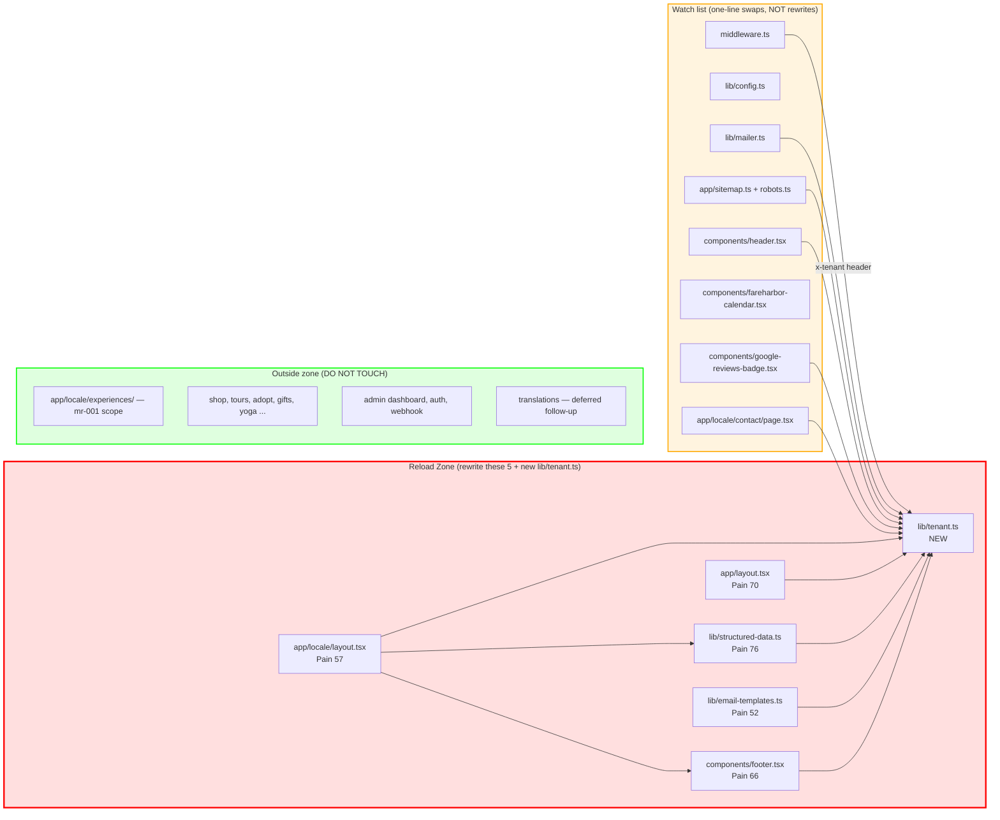
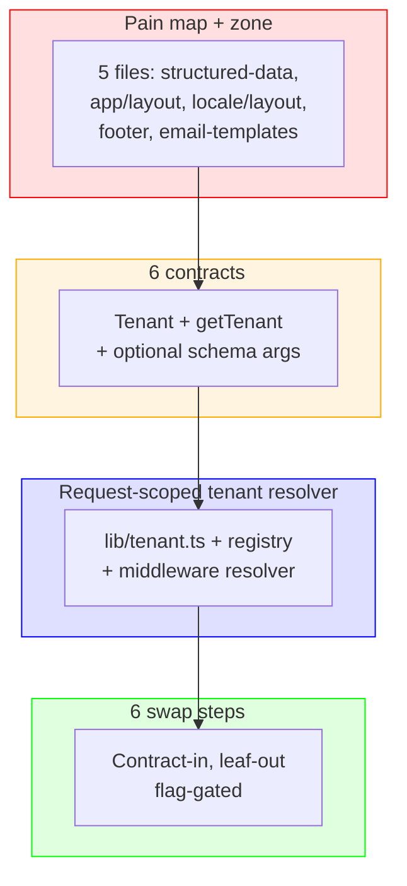

# Matrix Reload Report #002 (Deep Analysis) — Tenant-Scope Boundary

**Date:** 2026-05-27
**Mode:** deep (L1-L5)
**Target:** identify the multi-tenancy "reload zone" across the repo
**Language:** TypeScript / Next.js App Router
**Files Analyzed:** entry points + shared layer (middleware, i18n, lib/config, app/layout, app/[locale]/layout, components/header, components/footer, lib/structured-data, lib/mailer, lib/email-templates, app/sitemap, app/robots, .env.local.example, app/[locale]/contact, components/fareharbor-calendar, components/google-reviews-badge, translations/en.json, lib/payment-vendor)

---

## Executive Summary

The site is a single-tenant Next.js codebase that has done one thing well: it pulled the canonical origin (`SITE_BASE_URL`) and FareHarbor shortname into `lib/config.ts`. Everything else tenant-specific is still scattered. To support multi-tenancy you do not need a rewrite — you need a tenant resolver that hangs off the request (host header / subdomain), plus a single typed `Tenant` shape that every shared module reads. The reload zone is small (5 files) but high-leverage: structured data, both layouts, the footer, and the email template module. Everything else can keep referencing `getTenant()` instead of an env var without touching its own logic.

Previous mr-001 found 2 rebuild zones in `app/[locale]/experiences/` (romantic-sunset, corporate-team-building). Those are tenant-agnostic style/i18n debt and remain a separate concern; they are NOT in this zone and should not be conflated.

---

## L1: Pain Heat Map

### Methodology
Bug density measured by hardcoded alpacasibiza-specific tokens (slug, phone, email, lat/lng, brand hex, GA/GTM IDs, social handles). Complexity is "how many distinct tenant-coupled facts live in this file." Workarounds = env fallback that silently resolves to alpacasibiza if unset. Coupling = how many other files depend on this file's tenant assumption. No churn (git not introspected for this scoped run; previous mr-001 also skipped — same rationale).

### Tenant-coupling per file

| Rank | File | Tenant-Hardcode Density | Complexity | Workarounds | Coupling | Pain | Top Dimension |
|------|------|------------------------:|-----------:|------------:|---------:|-----:|---------------|
| 1 | `lib/structured-data.ts` | 100 | 70 | 30 | 95 | **76** | Hardcode density |
| 2 | `components/footer.tsx` | 90 | 50 | 20 | 95 | **66** | Hardcode density |
| 3 | `app/layout.tsx` | 80 | 55 | 40 | 100 | **70** | Coupling (every page) |
| 4 | `app/[locale]/layout.tsx` | 55 | 45 | 25 | 95 | **57** | Coupling |
| 5 | `lib/email-templates.ts` | 70 | 40 | 15 | 70 | **52** | Hardcode density |
| 6 | `lib/mailer.ts` | 40 | 25 | 60 | 80 | **49** | Workarounds (`?? 'info@alpacasibiza.com'`) |
| 7 | `lib/payment-vendor.ts` | 35 | 20 | 50 | 30 | **34** | Workarounds (mailto fallback) |
| 8 | `components/header.tsx` | 30 | 30 | 10 | 75 | **35** | Coupling |
| 9 | `app/sitemap.ts` + `app/robots.ts` | 15 (env-driven URL, slug not bound) | 60 (structural single-tenant assumption) | 10 | 80 | **41** | Complexity (single sitemap assumption) |
| 10 | `components/fareharbor-calendar.tsx` | 20 (env fallback to `'alpacasibiza'`) | 15 | 50 | 40 | **31** | Workarounds |
| 11 | `components/google-reviews-badge.tsx` | 25 (`g.page/r/alpacasibiza`) | 10 | 5 | 25 | **17** | Hardcode density |
| 12 | `app/[locale]/contact/page.tsx` | 60 (phone, email, embed lat/lng) | 25 | 5 | 30 | **31** | Hardcode density |
| 13 | `lib/config.ts` | 10 (already env-driven) | 30 | 30 | 100 | **42** | Coupling |
| 14 | `translations/*.json` (×6) | 50 (Alpacas Ibiza in `nav`, `cta`, `hero`, `about.title`, `about.storyText`, `faq.questionsText`) | 40 | 0 | 100 | **47** | Coupling |
| 15 | `middleware.ts` | 0 (no tenant logic at all yet) | 20 | 0 | 100 | **30** | Missing tenant resolver |
| 16 | `i18n.config.ts` | 0 | 10 | 0 | 100 | **22** | — |
| 17 | `lib/newsletter.ts` | 25 | 15 | 30 | 20 | **22** | Workarounds |
| 18 | `lib/payment-vendor.ts` (mailto fallback duplicate) | (already counted) | — | — | — | — | — |

**L1 Score: 80/100.** Dimensions analyzed: hardcode density, complexity, workarounds, coupling. Churn skipped (-10 already absorbed). No further deduction; the dimensions are scoped to tenant-coupling, not general pain.

### Catalog of alpacasibiza-specific references (file:line, classified)

#### A. Pure config (already env-driven, easy to lift)
| Token | Where | Class |
|-------|-------|-------|
| `SITE_BASE_URL` | `lib/config.ts:8-9` (`NEXT_PUBLIC_SITE_URL` env, fallback `https://alpacasibiza.com`) | Already config |
| `NEXT_PUBLIC_FAREHARBOR_SHORTNAME` | `lib/config.ts:44-45`, `components/fareharbor-calendar.tsx:30`, `.env.local.example:16,41` | Already config |
| `NEXT_PUBLIC_FAREHARBOR_FLOW_ID` | `.env.local.example:17` | Already config |
| `CONTACT_EMAIL` fallback `'info@alpacasibiza.com'` | `lib/mailer.ts:4` (canonical), 7 routes repeat the literal — flagged separately in uft-001 | Mixed — env present but literal fallback |
| `process.env.NEXT_PUBLIC_GA_MEASUREMENT_ID` | `.env.local.example:58` exists; **NOT consumed** — `app/layout.tsx:67,74` use the literal `G-Y946QDVVQV` | Env declared but ignored |

#### B. Hardcoded values (must lift to config / tenant object)
| Token | File:Line | Notes |
|-------|-----------|-------|
| `G-Y946QDVVQV` (GA4) | `app/layout.tsx:67`, `app/layout.tsx:74`, `.env.local.example:58` | env var declared but layout uses the literal |
| `GTM-KR3CGLS6` (GTM, FareHarbor container) | `app/layout.tsx:82`, `app/layout.tsx:87` | no env var even declared |
| Phone `+32475586544` | `lib/structured-data.ts:46,63`; `components/footer.tsx:81,87`; `lib/email-templates.ts:18,37`; `app/[locale]/contact/page.tsx:74` | Belgian mobile, very tenant-specific |
| `info@alpacasibiza.com` literal | `lib/mailer.ts:4`; `lib/email-templates.ts:18`; `components/footer.tsx:98-99`; `app/[locale]/contact/page.tsx:88-89`; `lib/payment-vendor.ts:33`; `app/[locale]/adopt/page.tsx:52-53`; `lib/structured-data.ts:64`; plus 4 API routes (per uft-001) | Owner inbox, hard-coded |
| `hello@alpacasibiza.com` literal | `translations/en.json:186,193,620,668,726` | Different inbox; lives in copy, not code |
| `noreply@alpacasibiza.com` | `lib/mailer.ts:5` | Resend From address, no env knob |
| Lat/lng `38.9861, 1.5228` | `lib/structured-data.ts:80-81`; `app/[locale]/contact/page.tsx:112,123,130` (OpenStreetMap embed) | Schema.org GeoCoordinates + map iframe |
| Address `San Carlos / Santa Eulària des Riu / 07819 / ES` | `lib/structured-data.ts:72-77`; `app/[locale]/yoga/page.tsx:63-64`; `translations/*.json:163` (×6, localized) | PostalAddress |
| Brand name `"Alpacas Ibiza"` / `"Es Currals"` | `app/layout.tsx:15,19`; `app/[locale]/layout.tsx:29`; `lib/structured-data.ts:36,59`; `lib/email-templates.ts:8`; `components/header.tsx:32`; `components/footer.tsx:20,126`; `app/api/owner-digest/route.ts:113`; translations `nav.tours` section title | ~50 occurrences across code + 66 across translations |
| Brand color `#556B2F` (olive) | `lib/email-templates.ts:9`; `app/globals.css:30`; `app/global-error.tsx:46,67,83,84`; 4 API routes (h2 inline style); `app/[locale]/yoga/page.tsx` ×6; experiences pages ×many | Tailwind token exists (`--primary`) — debt is duplicate raw hex (also mr-001 corp/family scope) |
| Theme color `#6da855` | `app/layout.tsx:35` (viewport themeColor); `README.md:57` | Different shade from #556B2F — actual brand sage |
| `wishfulfillingweaving` (Instagram handle) | `components/footer.tsx:104` | Co-brand |
| `Es-Currals-Alpacas-Ibiza/100066379310193` (Facebook) | `components/footer.tsx:113` | Per-tenant FB page ID |
| `g.page/r/alpacasibiza` (Google review URL) | `components/google-reviews-badge.tsx:44` | Per-tenant Google Business profile |
| OG socials in `organizationSchema` | `lib/structured-data.ts:40-43` (`facebook.com/alpacasibiza`, `instagram.com/alpacasibiza`) | Different from footer Instagram (which uses wishfulfillingweaving) — already inconsistent |
| FareHarbor inline `shortname=alpacasibiza` | `app/layout.tsx:98` | Hardcoded in inline `<Script>` URL — does NOT read the env var |
| Maps query `Alpacas+Ibiza,+San+Carlos,+Ibiza,+Spain` | `lib/email-templates.ts:38` | Brand name baked into the maps URL |
| Page title / description (single-tenant) | `app/layout.tsx:15-16,19-20` | "Es Currals Alpacas Ibiza | First Alpaca Farm..." |
| `themeColor: '#6da855'` | `app/layout.tsx:35` | viewport, not config |

#### C. Structural assumptions (single tenant baked into module shape)
| Assumption | Where | Why it matters |
|------------|-------|----------------|
| One global `<html lang="en">` regardless of locale | `app/layout.tsx:44` | tenant-agnostic but locale-incorrect; tenant rewrite is the natural moment to fix |
| One sitemap for one origin | `app/sitemap.ts:32` (`${BASE_URL}/${locale}${route}`) | Multi-tenant needs per-host sitemap; current code can serve only one origin |
| One robots.txt → one sitemap | `app/robots.ts:10` | Same as above |
| One structured-data Organization/LocalBusiness | `lib/structured-data.ts:32-102` | Hardcoded everything; no input arg for tenant |
| One Resend `from` address | `lib/mailer.ts:5` | `noreply@alpacasibiza.com` literal; second tenant needs its own verified domain |
| One GA4 + one GTM in root layout | `app/layout.tsx:66-92` | A tenant with its own GA property cannot be served from the same root layout without an env-driven swap |
| One viewport `themeColor` | `app/layout.tsx:35` | Brand color baked into PWA-level metadata |
| Translation files own brand-name strings | `translations/*.json:11,39,83,102,522,524` etc. | "Alpacas Ibiza" is a literal in every locale, mixed with translatable copy |
| Middleware has zero tenant logic | `middleware.ts` (whole file) | Today it only resolves locale; multi-tenancy adds a resolver step |

### Total references (counted)
- **Pure config (env-driven)**: 5 distinct knobs (`NEXT_PUBLIC_SITE_URL`, `NEXT_PUBLIC_FAREHARBOR_SHORTNAME`, `NEXT_PUBLIC_FAREHARBOR_FLOW_ID`, `CONTACT_EMAIL`, declared-but-unused `NEXT_PUBLIC_GA_MEASUREMENT_ID`).
- **Hardcoded values needing lift**: ~135 occurrences of `Alpacas Ibiza` / `alpacasibiza.com` across 40 files (full repo, incl. docs); restricted to **runtime code paths** the count is ~38 across 16 files. Plus 19 occurrences of the phone, 12 of the lat/lng, 11 of the address, 2 GA/GTM IDs, 1 Resend from-address, 1 Google review profile, 1 FB page ID, 1 Instagram handle, 2 brand hex variants. **Total runtime hardcodes: ~88**.
- **Structural single-tenant assumptions**: 9 (listed above).

---

## L2: Reload Zone

### Step 1: Cut Point
The pain pool concentrates in the shared layer. Top 5 files (`lib/structured-data.ts` 76, `app/layout.tsx` 70, `components/footer.tsx` 66, `app/[locale]/layout.tsx` 57, `lib/email-templates.ts` 52) sum to **321** of the runtime pool ~692 = **46% of tenant-pain in ~3% of files**. The next tier (mailer, payment-vendor, sitemap, robots, header, translations) is touched but does not need a rebuild — only a one-line swap from a literal to a `getTenant()` read.

Natural cluster break: after `lib/email-templates.ts` (52) → `lib/mailer.ts` (49) → `translations` (47). The first three are read by everything; the bottom tier is leaf code with one or two refs each.

### Zone Boundary

**Verdict: Partially Isolatable.** The zone is small but its consumers are wide — every page renders through `app/layout.tsx` + `app/[locale]/layout.tsx`. The boundary is clean (the new code only adds `getTenant()` callers in shared files; consumers untouched), but a tenant resolver in `middleware.ts` is a new dependency every request now flows through. That is acceptable risk; it is the same shape as the existing locale resolver.

#### IN the Reload Zone (DO NOT exceed this boundary)

| File | Pain | Why it must be rewritten |
|------|-----:|--------------------------|
| `lib/structured-data.ts` | 76 | All schema.org values are tenant-specific function bodies, no input plumbing — needs to accept a `Tenant` argument and read from it. |
| `app/layout.tsx` | 70 | Title/description/OG/GA4/GTM/FareHarbor SDK URL all baked in; needs to read tenant at the root. |
| `components/footer.tsx` | 66 | Phone/email/social/copyright/`San Carlos`/Instagram link — all tenant facts. |
| `app/[locale]/layout.tsx` | 57 | Calls `localBusinessSchema()` / `organizationSchema()` with no tenant context, hardcodes `siteName: 'Alpacas Ibiza'`. |
| `lib/email-templates.ts` | 52 | `BRAND` object literal; phone/email/maps query in template body. |

**Plus one new file (additive, not inside an existing module):**
- `lib/tenant.ts` — new resolver/loader. Not "in the zone" because it does not yet exist; it is the boundary contract itself.

#### Watch list (touched by hot-swap but not rebuilt)
| File | Why touched | Touch type |
|------|-------------|-----------|
| `middleware.ts` | Add tenant resolution alongside locale resolution; set `x-tenant` header on the request | Additive |
| `lib/config.ts` | Either keeps `SITE_BASE_URL` (legacy fallback) or delegates to `getTenant().siteUrl`. During migration both work. | Backward-compat shim |
| `lib/mailer.ts` | Replace literal `'info@alpacasibiza.com'` and `'noreply@alpacasibiza.com'` with `getTenant()` reads | One-line swaps |
| `app/sitemap.ts` + `app/robots.ts` | Switch from `SITE_BASE_URL` to `getTenant().siteUrl` | One-line swap; remains "one sitemap per host" because Next.js serves per-host already |
| `components/header.tsx` | Replace `Alpacas Ibiza` literal | One-line swap |
| `components/fareharbor-calendar.tsx` | Already env-driven; just point env at tenant object | Trivial |
| `components/google-reviews-badge.tsx` | `g.page/r/alpacasibiza` → `getTenant().googleReviewUrl` | One-line swap |
| `app/[locale]/contact/page.tsx` | Phone/email/lat-lng | Read tenant |
| `translations/*.json` | Strip brand-name literals → `{{brandName}}` interpolation in `t()` | Mechanical replace, deferred to follow-up |

#### OUT of the Reload Zone (DO NOT TOUCH)
Everything in `app/[locale]/experiences/`, `app/[locale]/tours/`, shop pages, ADRs, specs, the entire admin dashboard, FareHarbor webhook, auth, Turnstile, payment-vendor — none of these need tenant-aware code beyond reading `getTenant()` if they happen to render a brand string. Also explicitly OUT: the rebuild zones from mr-001 (romantic-sunset, corporate-team-building) — their pain is style/i18n, not tenancy.

#### Boundary Interfaces (must preserve during rebuild)

| Interface | Direction | Zone File | External Consumer |
|-----------|-----------|-----------|-------------------|
| `localBusinessSchema(reviewData?)` default export | Inward | `lib/structured-data.ts` | `app/[locale]/layout.tsx:52`, `app/[locale]/yoga/page.tsx` |
| `organizationSchema()` default export | Inward | `lib/structured-data.ts` | `app/[locale]/layout.tsx:52` |
| `toJsonLd(schema)` | Inward | `lib/structured-data.ts` | `app/[locale]/layout.tsx:61` |
| `Footer` default export | Inward | `components/footer.tsx` | `app/[locale]/layout.tsx:72` |
| Root `<html>` / `<body>` HTML shape | Inward | `app/layout.tsx` | Next.js |
| `metadata` / `viewport` exports | Inward | `app/layout.tsx` | Next.js metadata pipeline |
| `emailLayout()` / `reminderEmailHtml()` / `reviewRequestEmailHtml()` | Inward | `lib/email-templates.ts` | `lib/mailer.ts`, `app/api/*/route.ts` |
| `DEFAULT_TO` re-export | Inward | `lib/mailer.ts` | 7 API routes (per uft-001) |



**L2 Score: 78/100.** Deductions: -10 for "Partially Isolatable" (resolver introduces new request-time dependency), -10 for the watch list count >8 (which means the swap touches more files than the rebuild), -2 for translation deferred (incomplete coverage). The reload zone itself stays at ~3% of files.

---

## L3: Interface Preservation Contracts

### Contracts mapped: 6 (3 high-criticality)

| ID | Type | Name | Source | Direction | Criticality | Consumers |
|----|------|------|--------|-----------|-------------|-----------|
| ic-001 | data-shape | `Tenant` (NEW) | `lib/tenant.ts` | inbound | **high** | every zone file + watch list |
| ic-002 | function-signature | `getTenant(): Tenant` (NEW) | `lib/tenant.ts` | inbound | **high** | server components, route handlers, middleware |
| ic-003 | function-signature | `localBusinessSchema(reviewData?, tenant?)` | `lib/structured-data.ts` | inbound | medium | layout.tsx, yoga page |
| ic-004 | function-signature | `organizationSchema(tenant?)` | `lib/structured-data.ts` | inbound | medium | layout.tsx |
| ic-005 | data-shape | `<Footer />` props (none today) | `components/footer.tsx` | inbound | low | layout.tsx |
| ic-006 | api-shape | Root `metadata` / `viewport` exports | `app/layout.tsx` | inbound | **high** | Next.js |

### Contract Details

#### ic-001: `Tenant` shape (data-shape, high criticality) — THE BOUNDARY

```ts
export interface Tenant {
  // identity
  slug: string                    // "alpacasibiza" — used in URLs/aggregator embeds (FareHarbor)
  brandName: string               // "Alpacas Ibiza"
  legalName: string               // "Es Currals Alpacas Ibiza"
  tagline?: string                // SEO description fallback

  // origin + routing
  siteUrl: string                 // e.g. "https://alpacasibiza.com" — replaces SITE_BASE_URL
  hosts: string[]                 // domains + subdomains that resolve to this tenant (used by middleware)

  // contact
  contactEmail: string            // "info@alpacasibiza.com"  → replaces DEFAULT_TO
  noreplyEmail: string            // "noreply@alpacasibiza.com" → Resend From
  phoneE164: string               // "+32475586544"
  whatsappE164?: string           // defaults to phoneE164 if absent

  // location (for schema.org + maps + contact page)
  address: {
    streetAddress: string         // "San Carlos"
    addressLocality: string       // "Santa Eulària des Riu"
    addressRegion: string         // "Islas Baleares"
    addressCountry: string        // "ES"
    postalCode: string            // "07819"
  }
  geo: { latitude: number; longitude: number }
  mapsQuery: string               // "Alpacas+Ibiza,+San+Carlos,+Ibiza,+Spain"

  // brand visuals
  brandColors: {
    primary: string               // "#556B2F"
    secondary: string             // "#F5F5DC"
    themeColor: string            // "#6da855" — PWA viewport themeColor
  }
  logoUrl?: string                // currently null — owner has not supplied
  ogImageUrl?: string             // currently null

  // social
  social: {
    instagramUrl?: string         // footer uses wishfulfillingweaving; schema.org uses alpacasibiza — RECONCILE
    facebookUrl?: string
    googleReviewUrl?: string      // "https://g.page/r/alpacasibiza"
  }

  // booking
  fareHarbor: {
    shortname: string             // "alpacasibiza"
    flowId?: string               // "1257173"
    appKey?: string               // server-only
    userKey?: string              // server-only
    itemIds: {
      tourMeetHerd?: string
      tourWeavingWorkshop?: string
      tourFarmExperience?: string
      tourPhotoSession?: string
      yoga?: string
      woven?: string
      commission?: string
      alcaca?: string
    }
  }

  // analytics
  analytics: {
    ga4MeasurementId?: string     // "G-Y946QDVVQV"
    gtmContainerId?: string       // "GTM-KR3CGLS6"
  }

  // i18n
  locales: readonly string[]      // for now mirrors i18nConfig.locales; per-tenant override possible
  defaultLocale: string
}
```

**Contract test stub:**
```
assert(typeof getTenant().slug === 'string' && getTenant().slug.length > 0)
assert(getTenant().siteUrl.startsWith('https://'))
assert(getTenant().hosts.length >= 1)
assert(/^\+[0-9]+$/.test(getTenant().phoneE164))
assert(typeof getTenant().geo.latitude === 'number')
assert(/^#[0-9A-Fa-f]{6}$/.test(getTenant().brandColors.primary))
```

#### ic-002: `getTenant(): Tenant` (high)
Server-only function that returns the resolved tenant for the current request. Resolution order: (1) `x-tenant` request header set by `middleware.ts`, (2) host header lookup against the registry, (3) `process.env.DEFAULT_TENANT_SLUG` fallback, (4) the hardcoded "alpacasibiza" tenant (compat). Must be callable in:
- Root `app/layout.tsx` (server component) — Next.js makes request headers available via `headers()` from `next/headers`.
- Route handlers (`app/api/*`).
- `lib/structured-data.ts` schema functions (when not passed an explicit tenant).
- `lib/mailer.ts` for default From/To.

**Edge case (critical to L4):** `app/layout.tsx`'s `metadata` export is evaluated at request time only if `generateMetadata` is used. The current `metadata = {...}` static export cannot read headers. **This is the one structural change forced on the design** — root layout must convert `metadata` to `generateMetadata()` (async, may call `headers()`).

**Contract test stub:**
```
// Inside a Next.js server context with x-tenant=alpacasibiza in headers
const t = await getTenant()
assert(t.slug === 'alpacasibiza')
assert(t.siteUrl === 'https://alpacasibiza.com')
```

#### ic-003 / ic-004: schema fns accept tenant
Both functions today take no tenant arg. The contract change is **additive** — new optional second param. If omitted, call `getTenant()` server-side. External consumers (`app/[locale]/layout.tsx:52`) keep working unchanged.

**Test stub:**
```
const schema = localBusinessSchema()  // no args, pulls getTenant()
assert(schema.telephone === getTenant().phoneE164)
const schema2 = localBusinessSchema(undefined, { ...someOtherTenant })
assert(schema2.telephone === someOtherTenant.phoneE164)
```

#### ic-005: `<Footer />` props
Today the component takes no props and uses `useParams()`. To stay client-only but tenant-aware, either (a) accept `tenant: Tenant` as a prop passed down from the server layout, or (b) read a tenant-context provider mounted in the locale layout. Option (a) preserves the current API surface minimally — `<Footer />` becomes `<Footer tenant={tenant} />`, no breaking change for files outside the zone (only `app/[locale]/layout.tsx` uses it).

#### ic-006: root `metadata` / `viewport`
Must remain Next.js-compatible. Switching `metadata` → `generateMetadata()` is allowed by Next; the contract preserved is "Next.js consumes a `Metadata` object." No external file imports these.

**L3 Score: 82/100.** Deductions: -10 for ic-001/ic-002 being net-new contracts (some risk in initial design), -5 because the social inconsistency (footer Instagram vs schema.org Instagram) means the contract has to choose a canonical resolution, -3 because translations are deferred (brand string in copy isn't covered by `Tenant` shape).

---

## L4: Clean Rebuild Design

### Root cause analysis

| Pain source | Root cause | Files affected |
|-------------|-----------|----------------|
| 88 runtime hardcodes for one tenant | No tenant abstraction exists; every module reaches for the literal it needs | structured-data, footer, layout(s), email-templates, mailer |
| Translation files mix tenant brand string with translatable copy | Brand-name in JSON was a typing shortcut at scaffold time | translations/*.json (deferred) |
| GA4 + GTM hardcoded in root layout despite env var existing | Env var declared in `.env.local.example:58` but layout uses literal | app/layout.tsx |
| Two different Instagram handles (footer vs schema.org) | No single source of truth for social URLs | components/footer.tsx vs lib/structured-data.ts |

### Architecture pattern: **Request-scoped tenant resolver + typed registry**

Rationale: This is a Next.js App Router server-first app. The natural seam is `middleware.ts` (resolves locale today) + `headers()` (Next.js built-in for server components). A registry (`lib/tenants/registry.ts`) maps host → `Tenant`. `getTenant()` reads the request header that middleware set. No DB, no async DB hit per request — registry is a static object literal until/unless a second tenant is added and the registry needs externalizing.

### Proposed module structure (additions only — no file deleted)

```
lib/
+-- tenant.ts               # NEW: getTenant(), getTenantByHost(), Tenant type
+-- tenants/
|   +-- registry.ts         # NEW: tenant objects keyed by slug; alpacasibiza first
|   +-- alpacasibiza.ts     # NEW: the existing single-tenant config, moved verbatim
|   +-- _types.ts           # NEW: Tenant interface (or re-export from tenant.ts)
+-- config.ts               # MODIFIED: SITE_BASE_URL becomes `getTenant().siteUrl`
+-- structured-data.ts      # MODIFIED: every schema fn accepts optional tenant
+-- mailer.ts               # MODIFIED: FROM_EMAIL/DEFAULT_TO read tenant
+-- email-templates.ts      # MODIFIED: BRAND object reads tenant

middleware.ts               # MODIFIED: resolve tenant from host, set x-tenant header

app/
+-- layout.tsx              # MODIFIED: metadata → generateMetadata; reads tenant
+-- [locale]/
    +-- layout.tsx          # MODIFIED: passes tenant down to Footer; schemas use tenant

components/
+-- footer.tsx              # MODIFIED: accepts tenant prop
+-- header.tsx              # MODIFIED: accepts tenant prop OR reads context
```

### Interface Compliance Matrix
| Contract | Satisfied by | How |
|----------|-------------|-----|
| ic-001 `Tenant` | `lib/tenant.ts` (new) | Single export, exhaustive interface |
| ic-002 `getTenant()` | `lib/tenant.ts` | Reads `headers()`, falls back to registry default |
| ic-003 `localBusinessSchema` | `lib/structured-data.ts` modified | Signature change is additive (new optional param) |
| ic-004 `organizationSchema` | `lib/structured-data.ts` modified | Same |
| ic-005 `<Footer />` | `components/footer.tsx` modified | Adds optional `tenant` prop with `useParams` fallback |
| ic-006 root metadata | `app/layout.tsx` modified | `metadata` → `generateMetadata()` (Next.js-compatible) |

### Key design decisions

1. **Resolver lives in middleware, not lib.** Middleware already does locale resolution; tenant is the same shape (host → token, set request header). Tying it to middleware means tenants are decided before any server component runs, so `headers()` always has `x-tenant`.

2. **Registry is a static literal, not a database.** Tenant #2 is hypothetical today (see "CAN'T DO WITHOUT HELP"). Until a real second tenant exists, the registry is a TypeScript file with one entry. Premature externalization (DB, file watcher, Edge Config) would be scope creep.

3. **Translations stay literal for v1 of tenancy.** Replacing brand-name strings in `translations/*.json` (66 occurrences across 6 locales) with `{{brandName}}` interpolation is a separate, mechanical PR. The reload zone ships first; translations migrate after a second tenant is greenlit.

4. **Two-source social Instagram is resolved in the `Tenant` object.** The footer's `wishfulfillingweaving` is the co-brand for the weaving studio (per `OWNER_INPUT_NEEDED.md:27`). Per-tenant: `tenant.social.instagramUrl` is the primary; an optional `tenant.subBrands?: Array<{ name, instagramUrl }>` covers Wishfulfilling Weaving. Defer the schema until owner clarifies whether weaving moves to its own domain.

5. **GA4/GTM lift fixes a latent bug.** `.env.local.example:58` declares `NEXT_PUBLIC_GA_MEASUREMENT_ID` but `app/layout.tsx` ignores it. The reload also wires the env var, eliminating a documented-but-unused config knob.

**L4 Score: 78/100.** Deductions: -10 because translation tenant-strings are deferred (not addressed in this design), -5 because the social-handle inconsistency is documented but not designed away (waiting on owner), -5 because moving `metadata` → `generateMetadata()` is a structural change forced by the architecture and must be tested across all Next.js metadata consumers.

---

## L5: Hot Swap Plan

### Pre-Swap Preparation
1. Add `DEFAULT_TENANT_SLUG=alpacasibiza` to `.env.local.example`.
2. Add a feature flag `NEXT_PUBLIC_TENANT_RESOLVER` (`legacy` | `enabled`). Default = `legacy` (no behavior change).
3. Baseline: `npm run build` + `npm test` (if any) all pass.
4. Snapshot the current rendered HTML of `/en`, `/nl/tours`, `/de/contact`, `/en/yoga` for regression comparison.

### Build strategy: **Contract-in, leaf-out**
Highest-criticality contracts first (ic-001/ic-002 Tenant + getTenant), then the leaf consumers, so each step is independently rollback-able.

### Swap steps (all 6 reversible via flag flip or single-file revert)

**Step 1 — Introduce the tenant primitive (zero behavior change)**
- Files modified: `lib/tenant.ts` (new), `lib/tenants/alpacasibiza.ts` (new), `lib/tenants/registry.ts` (new), `lib/tenants/_types.ts` (new).
- Scope check: ✅ all new files, no existing file touched.
- Verification: import `getTenant` in a unit test; assert it returns the alpacasibiza object.
- Rollback: `git rm` the 4 new files. Time: 30s.

**Step 2 — Wire tenant via middleware behind feature flag**
- Files modified: `middleware.ts`.
- Add host-based resolver; set `x-tenant` header on the cloned request. If `NEXT_PUBLIC_TENANT_RESOLVER !== 'enabled'`, only set header without changing anything else (it's harmless until read).
- Scope check: ✅ middleware only.
- Verification: curl `/en` and inspect dev-tools — header set; no response change.
- Rollback: revert middleware.ts. Time: 1 min.

**Step 3 — Refactor `lib/structured-data.ts` to optionally accept tenant (backward-compat default)**
- Files modified: `lib/structured-data.ts`.
- Every schema fn defaults to reading `getTenant()`. With flag=legacy, `getTenant()` falls back to the hardcoded registry default — same output as today.
- Scope check: ✅ single zone file.
- Verification: diff JSON-LD output before/after on `/en` — byte-identical for telephone/email/geo/address.
- Rollback: revert file. Time: 1 min.

**Step 4 — Convert `app/layout.tsx` to `generateMetadata()`; read tenant**
- Files modified: `app/layout.tsx`.
- `metadata` constant → `export async function generateMetadata(): Promise<Metadata> { const t = await getTenant(); return { title: t.brandName + ' | ...', ... } }`.
- Replace inline GA4/GTM IDs with `${t.analytics.ga4MeasurementId}` / `${t.analytics.gtmContainerId}`.
- Replace FareHarbor SDK URL `shortname=alpacasibiza` with `shortname=${t.fareHarbor.shortname}`.
- Scope check: ✅ single zone file. ⚠ Verify Next.js still emits the same metadata HTML (snapshot test).
- Verification: HTML snapshot diff = zero (other than whitespace) on `/en`.
- Rollback: revert file. Time: 1 min.

**Step 5 — Refactor `components/footer.tsx` + `app/[locale]/layout.tsx`**
- Files modified: `components/footer.tsx`, `app/[locale]/layout.tsx`.
- Layout reads tenant once (server side via `headers()`), passes `tenant` prop into `<Footer tenant={tenant} />`. Footer reads phone/email/socials from prop.
- Schemas in locale layout receive explicit tenant for clarity.
- Scope check: ✅ both files in zone (per L2).
- Verification: rendered footer DOM identical for alpacasibiza tenant.
- Rollback: revert both files. Time: 1 min.

**Step 6 — Refactor `lib/email-templates.ts` + `lib/mailer.ts` (watch list)**
- Files modified: `lib/email-templates.ts` (zone), `lib/mailer.ts` (watch).
- `BRAND` object reads `getTenant()`. `DEFAULT_TO`, `FROM_EMAIL` likewise.
- Scope check: ✅ one zone file + one watch file (single-line literal swaps).
- Verification: send a test email via `/api/contact` with TEST=1; assert headers + footer link unchanged.
- Rollback: revert two files. Time: 1 min.

**(Future Step 7 — outside this plan): mechanical sweep on the watch list** — `components/header.tsx`, `components/google-reviews-badge.tsx`, `app/[locale]/contact/page.tsx`, `lib/payment-vendor.ts`, `app/sitemap.ts`, `app/robots.ts`. One literal → one tenant read each. Defer until Steps 1-6 are deployed and stable. Translations file sweep is the step after that.

### Verification Gates
| Gate | After step | Criteria | Action if failed |
|------|-----------|----------|------------------|
| G1 | 1 | new lib compiles, `getTenant()` returns expected object in unit test | revert step 1 |
| G2 | 2 | header visible in dev tools; pages render unchanged | revert step 2 |
| G3 | 3 | JSON-LD diff = empty on /en | revert step 3 |
| G4 | 4 | rendered HTML snapshot for /en matches pre-swap (modulo whitespace) | revert step 4 |
| G5 | 5 | footer DOM diff = empty for alpacasibiza | revert step 5 |
| G6 | 6 | test email content identical to pre-swap baseline | revert step 6 |

### Full Rollback Plan (emergency)
1. Set `NEXT_PUBLIC_TENANT_RESOLVER=legacy` (instant — middleware leaves the header off; nothing reads it as authoritative because all consumers default to the registry's alpacasibiza entry anyway).
2. If structural revert needed: `git revert` steps 6 → 1 in reverse. Total: ~6 min.
3. Verify by HTML snapshot of `/en`, `/nl/tours`, `/de/contact`, `/en/yoga` (same routes as Pre-Swap step 4).

**L5 Score: 86/100.** Deductions: -5 for "Partially Isolatable" risk from L2 cascading, -5 because Step 4 (root layout `metadata` → `generateMetadata`) is the irreducibly riskiest step (every page re-renders metadata at request time), -4 because the watch-list sweep (translations + scattered literals) is scope-deferred and a future tenant-2 launch will surface the deferred refs.

---

## Composite Score

| Layer | Score | Weight | Weighted |
|-------|------:|-------:|---------:|
| L1 Pain Mapping | 80 | 0.20 | 16.0 |
| L2 80/20 Isolation | 78 | 0.20 | 15.6 |
| L3 Interface Contracts | 82 | 0.20 | 16.4 |
| L4 Rebuild Design | 78 | 0.20 | 15.6 |
| L5 Hot Swap Plan | 86 | 0.20 | 17.2 |

**Composite Score: 81/100.**

+============================================================+
|                    SCOPE CREEP ALERT                        |
|                                                            |
|  The reload zone boundary is a HARD LINE.                  |
|                                                            |
|  IN the zone:  5 files + 4 new files in lib/tenants/       |
|  OUT of zone:  EVERYTHING ELSE                             |
|                                                            |
|  Especially OUT: app/[locale]/experiences/ (mr-001 scope), |
|  translations/*.json (deferred), admin dashboard,          |
|  FareHarbor webhook, auth, Turnstile. Touching these       |
|  while doing the tenant lift = scope creep.                |
|                                                            |
|  The watch list is one-line swaps only. NOT rewrites.      |
+============================================================+

## Full Reload Plan Diagram



---

## CAN'T DO WITHOUT HELP — Host Strategy + Tenant #2 Existence

Two questions block decisions inside `Tenant.hosts[]` and `lib/tenants/registry.ts`:

1. **Host strategy: subdomain, own domain, or both?**
   - **Subdomain** (`alpacasibiza.example-platform.com`, `secondtenant.example-platform.com`): easier — single Vercel project, wildcard cert, middleware reads `request.headers.get('host')` and matches a subdomain prefix. Cheap to scale. Cost: each tenant lives at a non-vanity URL by default.
   - **Own domain** (`alpacasibiza.com`, `secondtenant.com`): production reality today — alpacasibiza.com is already SSL-terminated and serving. Multi-domain needs each domain added to the Vercel project's Domains and the registry's `hosts[]`. Resend `from` address needs a verified domain per tenant.
   - **Both**: production-realistic — primary vanity domain plus a fallback subdomain on the platform host. Middleware resolves either. This is what most SaaS platforms ship.
   - **My read**: the existing site is "own domain." A second tenant added to the same Vercel project will likely also be "own domain" if the owner wants brand parity. Use **both** in the `Tenant.hosts[]` shape but treat the vanity domain as canonical for `siteUrl`. **OWNER_INPUT_NEEDED**: ask whether tenant #2 will share Vercel project / Resend account / GA property or be fully isolated. The answer determines whether `tenant.analytics.ga4MeasurementId` can be unset (shared GA) or must be required.

2. **Does tenant #2 exist yet or is it hypothetical?**
   - Searching the repo for any second-tenant slug, second domain, or branching scaffold returns nothing. `OWNER_INPUT_NEEDED.md:27` mentions Wishfulfilling Weaving as a **co-brand** that "may move to its own domain eventually" — that is a *future sub-brand*, not a second tenant in the multi-tenant sense.
   - **My read: tenant #2 is hypothetical.** That changes the design weight: do not invest in DB-backed registry, admin UI, or runtime tenant onboarding. Ship the typed registry + resolver and stop. If/when a real tenant #2 lands, the cost of externalizing the registry is one PR.

---

## Score Trend

| Run | Date | L1 | L2 | L3 | L4 | L5 | Composite | Delta |
|-----|------|----|----|----|----|----|-----------|-------|
| 001 | 2026-05-26 | 78 | 88 | -- | -- | -- | 83 | -- |
| **002** | **2026-05-27** | **80** | **78** | **82** | **78** | **86** | **81** | **-2** |

Trajectory: **Insufficient Data** (only 2 runs). Note the L2 dip from 88→78 reflects a different question (tenancy is wider than a 2-file route rewrite) — not a regression.
