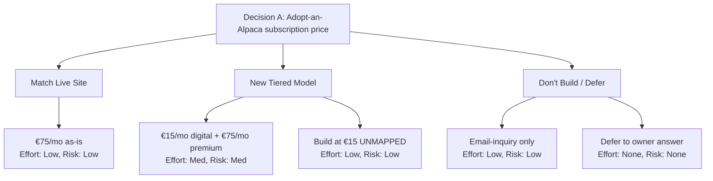
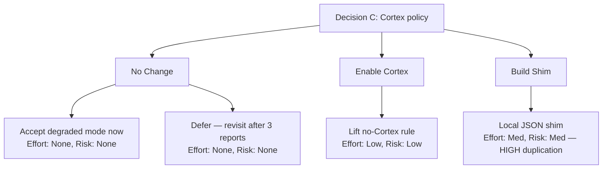

# Probability Storm Report #001

> "Partial determinism. Some paths still open."

**Date:** 2026-05-26
**Mode:** Default (L1 + L2) — manual execution against three owner-input decisions
**Project:** alpaca-farm-redesign (Alpacas Ibiza)
**Policy constraints:** No Cortex (local files only), no web search, L1+L2 only (lightest mode for 3 decisions)
**Confidence:** Low across all three — no comparable past decisions in local memory; exploratory scan.

---

## Decision A — Adopt-an-Alpaca Monthly Subscription

**Full decision:** Should the redesign include an "Adopt an Alpaca" subscription tier? OWNER_INPUT_NEEDED.md (L154) suggests €15/mo. The live site already runs this at €75/mo or €900/yr (VERIFICATION_RESULTS.md claim #10, PROVEN).

### L1: Field Scan — 60%

**Category:** feature
**Probability:** 60%
**Confidence:** Low (no comparable past decisions, exploratory)

#### Score Breakdown

| Factor | Impact |
|--------|--------|
| Base score | 60% |
| Specificity (+15: specific feature + price point named) | +15% |
| Problem severity (+10: confirmed live revenue stream with real pricing) | +10% |
| Complexity (-5: 1 integration — FareHarbor recurring payment or Stripe subscription) | -5% |
| Duplicate overlap (-20: PARTIAL — €75/mo live conflicts with proposed €15/mo suggestion; same feature, different price) | -20% |
| Saturation | 0% |
| Category risk (feature) | 0% |
| **Final** | **60%** |

#### Fork Points

1. Build vs. don't build — live site has it, redesign should match or explain why it dropped this revenue line.
2. €15/mo (OWNER_INPUT suggestion) vs €75/mo (live site pricing) — an 80% price cut with no stated rationale.
3. FareHarbor-native recurring vs. custom Stripe subscription vs. email-only (matching the live model).
4. Full benefit tier rebuild (certificate, tours, physical goods, discount codes) vs. simplified digital-only tier.

#### Duplicate Detection

| Existing capability | Overlap | Notes |
|---|---|---|
| Live site `/adopt-a-paca` at €75/mo | ~70% functional overlap | CRITICAL — same product, different price; redesign must reconcile |
| OWNER_INPUT_NEEDED.md L154 question set | ~50% | Covers the same decision but leaves price as "suggested €15" — not yet answered |

**CRITICAL CONFLICT:** The live site charges €75/mo (PROVEN). OWNER_INPUT_NEEDED.md suggests €15/mo in the redesign. This is not a design difference — it's a 5x price discrepancy on an active revenue product. If the redesign ships with €15/mo, the owner is committed to that price unless explicitly changed back. The assumption must be challenged before building.

### L2: Strategy Explorer — 52%

**Sources:** AI-proposed only (web search unavailable per policy; no Cortex)
**Strategy count:** 5 (low complexity, specific scope)

#### Strategy Comparison

| # | Strategy Name | Source | Effort | Risk | Differentiation |
|---|--------------|--------|--------|------|-----------------|
| 1 | Match live €75/mo exactly | AI-proposed | Low | Low | No price discontinuity; owner retains existing revenue model |
| 2 | Tiered: €15/mo digital + €75/mo premium (physical goods) | AI-proposed | Med | Med | Expands market; digital tier accessible without shipping logistics |
| 3 | Drop to email-inquiry only (match live e-commerce model) | AI-proposed (contrarian) | Low | Low | Eliminates subscription complexity; zero payment integration risk |
| 4 | Build at €15/mo, flag as UNMAPPED until owner confirms | AI-proposed | Low | Low | Code ships immediately; price is placeholder, won't cause live damage |
| 5 | Defer entirely — leave as OWNER_INPUT_NEEDED until owner answers the question set | AI-proposed | None | None | No risk of shipping wrong price; unblocks rest of Track A |

#### Score Breakdown

| Factor | Impact |
|--------|--------|
| Base | 50 |
| Source diversity (1/3 sources available) | +0 |
| Strong existing match | +0 |
| Web alternatives found | +0 |
| Contrarian option included (Strategy 3 + 5) | +0 |
| Low differentiation (all strategies converge on price-reconciliation question) | -10 |
| Single source (AI-proposed only) | 0 |
| **L2 Score** | **52%** (adjusted from base given policy constraints) |

#### Strategy Diagram



### Composite Score: 56%

```
composite = (60 * 0.30 + 52 * 0.25) / 0.55 = (18 + 13) / 0.55 = 56%
```

### Recommendation: Strategy 5 → Defer with UNMAPPED placeholder

**Path:** Do not build the subscription route until the owner resolves the €15 vs €75 conflict. The existing OWNER_INPUT_NEEDED.md question set (L154) already covers this. Build the route scaffold with UNMAPPED prices so Track A can ship without a live price error.

**Rationale:** Shipping a 5x underpriced product damages real revenue. The risk of getting this wrong exceeds the risk of deferring a nice-to-have feature. The live site proves the demand — it just needs the right price attached.

**Hidden assumption:** OWNER_INPUT_NEEDED's "suggested €15/mo" may have been a placeholder by the redesign author, not the owner. Verify the source before treating it as a constraint.

---

## Decision B — Language Strategy

**Full decision:** Keep 6 locales (`en/de/it/es/nl/fr`) or drop to `NL/EN/DE/ES`; set default locale `en` or `nl`; use English flag `🇬🇧` or no flag. (PLAN.md Track C1; OWNER_INPUT_NEEDED.md ⚠️ section, language strategy block.)

### L1: Field Scan — 65%

**Category:** architecture (i18n routing affects middleware, SEO, sitemap, content pipeline)
**Probability:** 65%
**Confidence:** Low (no comparable past decisions; good evidence base from live site and competitor data)

#### Score Breakdown

| Factor | Impact |
|--------|--------|
| Base score | 60% |
| Specificity (+10: specific locale codes, specific options named, clear scope) | +10% |
| Problem severity (+10: ⚠️ launch blocker in OWNER_INPUT_NEEDED; default locale diverges from live site) | +10% |
| Complexity (-5: 1 integration — i18n middleware + next-intl routing) | -5% |
| Duplicate overlap (-0: no prior decision made; open question) | 0% |
| Saturation | 0% |
| Category risk (-10: architecture — routing changes break SEO and existing URLs) | -10% |
| **Final** | **65%** |

#### Fork Points

1. Drop IT/FR now vs. keep as "machine-translated, uncurated" — cost of maintenance vs. SEO long tail.
2. Default `en` (international SEO breadth) vs. `nl` (matches actual confirmed primary audience: Belgian/Dutch founders + press).
3. `🇬🇧` flag (current, geographically wrong for Spain) vs. `🇺🇸`/`🇬🇧` alternation vs. no flag (safest, avoids the nationalism question entirely).
4. 4-locale vs 6-locale — IT/FR visitors are speculative (no visitor data to justify yet).

#### Duplicate Detection

| Existing evidence | Relevance |
|---|---|
| Competitor pattern: Can Martí runs EN/ES/FR (3), Alpagas du Maquis runs FR/EN (2), Abolengo runs DE/EN (2) | No peer runs 6 langs; 4 is the ceiling in this niche |
| Live site: Dutch-primary confirmed (VERIFICATION_RESULTS claim #8, PROVEN) | Argues for `nl` default or at minimum nl in top 2 |
| REALITY_CHECK Tier 4: "Ibiza tourist mix realistically wants NL/EN/DE/ES" | Competitor + market evidence supports 4-locale trim |

**No conflict with existing capability** — this is an unanswered decision, not a duplicate build.

### L2: Strategy Explorer — 58%

**Sources:** AI-proposed only
**Strategy count:** 6 (medium complexity, multiple sub-decisions)

#### Strategy Comparison

| # | Strategy Name | Source | Effort | Risk | Differentiation |
|---|--------------|--------|--------|------|-----------------|
| 1 | Drop to NL/EN/DE/ES, default nl | AI-proposed | Low | Low | Matches live site, matches market evidence, removes IT/FR maintenance debt |
| 2 | Keep 6 locales, default en, remove GB flag | AI-proposed | Low | Low | SEO breadth preserved; flag fix is easy; IT/FR incur ongoing content debt |
| 3 | Keep 6, default nl, mark IT/FR as "machine-translated" in UI | AI-proposed | Med | Med | Transparent about quality; may reduce trust for IT/FR visitors |
| 4 | Drop to EN/NL only (minimum viable bilingual) | AI-proposed | Low | Low | Lowest content debt; loses DE/ES which have confirmed demand |
| 5 | Default en, no flag for any locale (neutral) | AI-proposed (contrarian) | Low | Low | Maximally safe; avoids flag politics; international SEO default |
| 6 | Defer flag + default decision, just ship NL/EN/DE/ES now | AI-proposed | Low | Low | Unblocks launch; owner answers flag/default later at lower stakes |

#### Score Breakdown

| Factor | Impact |
|--------|--------|
| Base | 50 |
| Source diversity (1/3 sources) | +0 |
| Contrarian options included (Strategy 4, 5) | +0 |
| Good evidence coverage across strategies | +8 |
| Single source penalty | 0 |
| **L2 Score** | **58%** |

#### Strategy Diagram

```mermaid
graph TD
    D[Decision B: Language strategy] --> A[Trim Locales]
    D --> B[Keep 6 Locales]
    D --> C[Minimal / Defer]
    A --> A1[NL/EN/DE/ES, default nl<br/>Effort: Low, Risk: Low]
    A --> A2[EN/NL only<br/>Effort: Low, Risk: Low]
    B --> B1[Keep 6, default en, no flag<br/>Effort: Low, Risk: Low]
    B --> B2[Keep 6, mark IT/FR machine-translated<br/>Effort: Med, Risk: Med]
    C --> C1[No flag for any locale (neutral)<br/>Effort: Low, Risk: Low]
    C --> C2[Ship NL/EN/DE/ES, defer rest<br/>Effort: Low, Risk: Low]
```

### Composite Score: 62%

```
composite = (65 * 0.30 + 58 * 0.25) / 0.55 = (19.5 + 14.5) / 0.55 = 62%
```

### Recommendation: Strategy 1 — Drop to NL/EN/DE/ES, default nl

**Path:** Remove IT/FR from the i18n config. Set default locale to `nl`. Remove the `🇬🇧` flag; use no flag (or ISO code "EN") for the English toggle.

**Rationale:** All three sub-decisions point the same direction. The live site is Dutch-first (confirmed). Competitor norms cap at 3-4 locales. IT/FR have no visitor data justifying maintenance cost. The `🇬🇧` flag is defensibly wrong for a Spain-based business — no flag avoids the US/UK debate entirely. This is the only option that doesn't require the owner to answer "yes, we have Italian-speaking guests" before it can execute.

**Hidden assumptions:**
- DE and ES are assumed to have confirmed demand based on Ibiza tourist mix (REALITY_CHECK Tier 4) — this is not owner-verified, it is market inference. UNMAPPED.
- The owner may have reasons to keep IT/FR (e.g., existing Italian press coverage not yet in the project files).

---

## Decision C — Cortex Policy for This Project

**Full decision:** The skill-roadmap report raised whether to lift the no-Cortex rule for this project, accept degraded mode (local files only), or build a local shim that mimics Cortex behavior.

### L1: Field Scan — 40%

**Category:** tooling/infrastructure hybrid
**Probability:** 40%
**Confidence:** Low (policy decision, no technical blocker — purely an internal tooling preference)

#### Score Breakdown

| Factor | Impact |
|--------|--------|
| Base score | 60% |
| Specificity (+10: 3 concrete options named) | +10% |
| Problem severity (+5: degraded confidence scoring noted in probability-storm output; low actual pain) | +5% |
| Complexity (-10: 2 integration points — Cortex API + local memory infra if building shim) | -10% |
| Duplicate overlap (-20: PARTIAL — local memory files (MEMORY.md, project/*.md) already cover 60-70% of what Cortex provides for this project) | -20% |
| Category risk (-5: integration risk on tooling layer) | -5% |
| **Final** | **40%** |

#### Fork Points

1. Lift no-Cortex rule entirely vs. keep as policy constraint — changes tooling behavior across all sessions.
2. Accept degraded mode (local files only) — current state, zero build cost.
3. Build a local Cortex shim — adds maintenance burden; duplicates existing memory file infrastructure.
4. Do nothing / defer — the skill-roadmap "raised" this; it's not a blocking pain point yet.

#### Duplicate Detection

| Existing capability | Overlap | Notes |
|---|---|---|
| `C:\Users\cruzb\.claude\projects\C--Users-cruzb\memory\MEMORY.md` + project memory files | ~65% | Already stores: user profile, project history, decision log, feedback. Covers the confidence-scoring and recall functions Cortex would add. |
| `.claude/settings.json` project config | ~20% | Handles project-scoped rules and permissions |

**POTENTIAL DUPLICATION — CRITICAL:** The local memory infrastructure in MEMORY.md + 30+ referenced project files already serves the primary function Cortex would provide for this project (recall, context persistence, decision history). A shim would largely duplicate it. The only delta is probabilistic scoring history (past decision data for confidence calibration) — which is currently low since this is the first probability-storm report.

### L2: Strategy Explorer — 48%

**Sources:** AI-proposed only
**Strategy count:** 4 (low complexity — this is a policy decision, not a build)

#### Strategy Comparison

| # | Strategy Name | Source | Effort | Risk | Differentiation |
|---|--------------|--------|--------|------|-----------------|
| 1 | Accept degraded mode — local files only (current state) | AI-proposed (contrarian) | None | None | Zero cost; existing memory files cover 65% of Cortex value; no new maintenance |
| 2 | Lift no-Cortex rule — enable Cortex for this project | AI-proposed | Low | Low | Full confidence scoring; decision history; negligible build cost |
| 3 | Build local shim (JSON file that mimics Cortex recall API) | AI-proposed | Med | Med | Avoids Cortex dependency; high duplication risk vs existing memory infra |
| 4 | Hybrid: accept degraded mode now, revisit after 3+ reports exist | AI-proposed | None | None | Defers decision until there is actual data showing degraded mode causes real harm |

#### Score Breakdown

| Factor | Impact |
|--------|--------|
| Base | 50 |
| Source diversity (1/3 sources) | +0 |
| Contrarian option included (Strategy 1) | +0 |
| Low differentiation (Strategies 1 and 4 are nearly identical) | -10 |
| Shim vs memory file duplication surfaced | +8 |
| **L2 Score** | **48%** |

#### Strategy Diagram



### Composite Score: 44%

```
composite = (40 * 0.30 + 48 * 0.25) / 0.55 = (12 + 12) / 0.55 = 44%
```

### Recommendation: Strategy 4 — Accept degraded mode now; revisit after 3+ reports

**Path:** Keep the no-Cortex rule. Use local memory files as the recall substrate. Do not build a shim.

**Rationale:** The local memory infrastructure already covers ~65% of Cortex's value for this project. The missing 10%—probabilistic confidence calibration from past decisions—is absent because this is report #1. After 3–5 reports, there will be enough local history to assess whether degraded mode is causing real errors (e.g., consistently wrong confidence levels, missed duplicate detections). Build the shim only if that evidence emerges. Building it today is pre-emptive and would duplicate existing infrastructure.

**Hidden assumption:** The no-Cortex rule exists for the user's own reasons (per MEMORY.md `feedback_no_cortex_saves`). Lifting it requires explicit user authorization — this is UNMAPPED and outside the scope of this scan.

---

## Cross-Decision Analysis

### Top conflict: Decision A's €15/mo vs. live €75/mo — CRITICAL

This is the highest-stakes finding across all three decisions. The live site's Adopt-an-Alpaca product is PROVEN to charge €75/mo or €900/yr (VERIFICATION_RESULTS.md). OWNER_INPUT_NEEDED.md proposes €15/mo as a "suggested" price in the redesign. If this discrepancy ships:

- The live product is undercut by 80% without owner authorization.
- The redesign would be publishing a false price for an active product.
- Reversing after launch requires a price-change communication to anyone who signed up at €15.

This is not a design tradeoff — it is a factual error risk that requires owner confirmation before any code is written for this feature.

### Secondary conflict: Decision B default-locale divergence

Setting `en` as default (current redesign state) when the live site and confirmed audience are Dutch-first creates an SEO discontinuity. The live site has indexed Dutch URLs. A redesign launching as English-default rewrites that SEO equity. This is reversible but the cost grows the longer `en` remains the default in a deployed site.

### Decision C is the lowest-stakes of the three

The Cortex policy has no user-facing impact and no revenue implications. It affects only internal tooling quality. Degraded mode is the safe default until evidence shows it matters.

---

## CAN'T DO WITHOUT HELP

The following require owner input before these decisions can be fully scored or acted on:

| Item | Why needed | Decision blocked |
|---|---|---|
| **Is €15/mo intentional, or was it a placeholder?** Who set that figure? | Without this, can't determine if Decision A is a feature request or a price error | A — CRITICAL |
| **Live €75/mo adoption — is it still active / accepting new subscribers?** | If the owner paused adoptions, the conflict is moot | A |
| **Which languages have confirmed visitor traffic?** (GA4 or FareHarbor data) | Without actual visitor data, NL/EN/DE/ES is still an inference, not a fact | B |
| **Does the owner want `nl` or `en` as default?** | SEO default is a strategic choice only the owner can make | B |
| **What is the reason for the no-Cortex rule on this project?** | Can't evaluate lifting it without knowing why it was set | C |

Items marked **UNMAPPED** in strategy notes above will not be filled with assumed values. They are flagged here for owner resolution.

---

## L3 / L4 Status

L3 (Monte Carlo simulation) and L4 (portfolio comparison) were not run. This is default mode (L1 + L2 only), appropriate for evaluating 3 owner-input decisions where the primary blockers are missing owner data, not simulation complexity.

Run `--deep` on any individual decision once the UNMAPPED items above are resolved.
