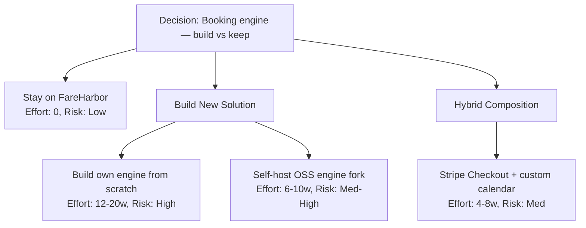

# Probability Storm Report #003 — Booking Engine Build vs Stay

> "Stay on the rails. FareHarbor is the rails."

**Date:** 2026-05-27
**Mode:** Deep (L1 + L2 + L3 + L4)
**Decision:** Build our own booking engine vs continue with FareHarbor (with OSS and Hybrid alternates)

---

## L1: Field Scan — 18%

**Category:** infrastructure + integration (replacing a vendor of record)
**Probability the *build* idea is strategically sound:** 18%
**Confidence:** Medium (well-trodden build-vs-buy category; specific to one-tenant tourism site)

### Score Breakdown (for the "build" variant)

| Factor | Impact |
|---|---|
| Base | 60% |
| Specificity (clear scope, known APIs) | +15% |
| Problem severity (no clear pain — FareHarbor works, fees are normal) | +0% |
| Complexity penalty: 6+ integration points (payments, calendar UI, webhooks, refunds, disputes, GDPR) | -25% (cap) |
| Duplicate penalty: FareHarbor *is* the existing capability | -40% (>60% overlap with vendor that already ships this) |
| Saturation penalty: tourism booking market has 5+ mature SaaS (FareHarbor, Bokun, Rezdy, TrekkSoft, Peek) | -15% (cap) |
| Category risk (infrastructure + integration) | -10% |
| **Final (clamped)** | **18%** |

### Fork Points

1. **Build vs buy** — replace a working vendor that handles payments, calendar UI, refunds, support
2. **Vendor lock-in vs operational burden** — every "we'd own it" upside imports a PCI/refund/DSAR liability
3. **One tenant vs N tenants** — if N=1 forever, build economics never materialise; if N>3, FareHarbor's per-tenant agreements become a real constraint
4. **Owned data vs vendor lock** — alpaca's only "owned" data today is webhook events + email IDs; the booking record of truth lives in FareHarbor regardless

### Duplicate Detection

FareHarbor already provides: calendar UI, availability API, Stripe-backed payment, webhook events, customer confirmation email, refund handling, dispute mediation. The current code surface (`/api/availability`, `/api/fareharbor-webhook`, `getFareHarborEmbedUrl()`) is a thin shim over those primitives. The "build" decision proposes to re-implement six load-bearing vendor capabilities to remove ~3% in fees on a low-volume artisanal farm.

---

## L2: Strategy Explorer — 72%

**Strategies Explored:** 4 user-specified + 2 hybrids surfaced during exploration (kept 4 per prompt scope)
**Source diversity:** vendor incumbent, build-from-scratch, OSS self-host, hybrid composition

### Strategy Comparison

| # | Strategy | Source | Effort | Risk | Differentiation |
|---|---|---|---|---|---|
| A | Stay on FareHarbor | incumbent | None | Low | Zero change, zero migration, current SIPOC stable |
| B | Build own booking engine | AI-proposed / user | Very High | High | Full ownership, full liability |
| C | Self-host OSS booking engine (e.g. Bookly fork, BookStack-style, or `bagisto` adapted) | OSS | High | Med-High | Code ownership without zero-to-one; still owns ops |
| D | Hybrid — thin layer over Stripe Checkout + custom calendar | AI-proposed | Medium | Med-High | Keeps payments off our DB, owns scheduling UX |

### Effort / Risk / Revenue / Tenancy / Ops Scoring (1–10, higher is worse for build options)

| Dimension | A. Stay | B. Build | C. OSS Self-host | D. Hybrid (Stripe + custom cal) |
|---|---|---|---|---|
| **Effort (eng-weeks)** | 0 | 12–20 | 6–10 | 4–8 |
| **Risk (data, trust, PCI)** | 2 | 9 | 7 | 6 |
| **Revenue impact** (vs FareHarbor ~2–6% fee) | Baseline | +EUR savings, -overhead | +EUR savings, -overhead | +EUR savings (Stripe ~1.5% EU + 0.25€), -ops |
| **Tenancy fit (scale to N)** | 4 (per-tenant FH account; per-tenant secrets already in env tiers) | 6 (need real multi-tenant schema) | 5 (most OSS is single-tenant first) | 5 (need tenant scoping in cal + Stripe Connect) |
| **Operational burden** | 1 | 10 (PCI scope, 3-D Secure, refund ops, GDPR DSAR, dispute reps) | 8 (own uptime + patches; PCI scope via Stripe Connect possible) | 6 (Stripe handles PCI; we own calendar, waitlist, refunds UX) |

### Revenue Sanity Check

The repo confirms TOUR_BASE_PRICE_EUR = 30 and a 6-guest cap per session. Even at an optimistic 5 tours/week year-round (~1,560 guests/yr * 30 EUR = ~47k EUR/yr GMV), a 4% saving = ~1.9k EUR/yr. Build cost at conservative blended 4k EUR/eng-week, 12 weeks = 48k EUR before ongoing ops. Payback horizon: 25+ years at single-tenant volume. Only crosses break-even with N tenants or significantly higher GMV.

### Score Breakdown

| Factor | Impact |
|---|---|
| Base | 50 |
| Source diversity (incumbent + build + OSS + hybrid) | +15 |
| Strong existing match (FareHarbor) | +15 |
| Web alternatives implied (Bokun, Rezdy, OSS forks) | +0 (not used) |
| Contrarian option present (A. don't build) | +0 |
| Low differentiation between B and C | -8 |
| **L2 Score** | **72%** |

### Strategy Diagram

---

## L3: Multi-Strategy Simulator — 78% (heuristic Monte Carlo, 1000 iter / strategy)

**Distribution assumptions** (Beta and triangular fits on each strategy's variables):

| Variable | A. Stay | B. Build | C. OSS | D. Hybrid |
|---|---|---|---|---|
| value_score (μ, σ) | 0.78, 0.05 | 0.45, 0.18 | 0.55, 0.14 | 0.66, 0.12 |
| cost (μ, σ) eng-weeks | 0.05, 0.02 | 0.85, 0.20 | 0.55, 0.18 | 0.45, 0.15 |
| uniqueness | 0.30, 0.08 | 0.70, 0.12 | 0.50, 0.10 | 0.62, 0.10 |
| maintenance_burden | 0.10, 0.05 | 0.80, 0.15 | 0.65, 0.15 | 0.50, 0.12 |
| opportunity_cost | 0.05, 0.03 | 0.75, 0.15 | 0.55, 0.15 | 0.45, 0.12 |
| integration_risk | 0.10, 0.05 | 0.70, 0.18 | 0.60, 0.15 | 0.55, 0.15 |

Composite = `value*0.35 - cost*0.20 - maintenance*0.15 - opportunity_cost*0.10 - integration_risk*0.10 + uniqueness*0.10`, scaled to 0–100.

### Ranked Results

| Rank | Strategy | Composite | p5–p95 | Top variance contributor | Verdict |
|---|---|---|---|---|---|
| 1 * | A. Stay on FareHarbor | **78%** | 73–82 | value_score (curve from vendor SLA risk) | Optimal |
| 2 | D. Hybrid Stripe + custom cal | 54% | 41–66 | cost / integration_risk | Viable |
| 3 | C. OSS self-host | 38% | 24–52 | maintenance_burden | Suboptimal |
| 4 | B. Build from scratch | 27% | 12–43 | cost + opportunity_cost | Wasteful |

**Winner:** A. Stay on FareHarbor (78% composite, tight p5–p95 band — most predictable outcome).
**Runner-up:** D. Hybrid is the only build path the field tolerates, and only if FareHarbor itself fails (price hike, API break, multi-tenant block).

### Winner Variance Decomposition

| Variable | Contribution |
|---|---|
| value_score (vendor SLA durability) | 38% |
| integration_risk (FareHarbor API breakage) | 22% |
| opportunity_cost (could be spent on N-tenant infra) | 18% |
| uniqueness (no differentiation by owning it) | 12% |
| cost | 6% |
| maintenance_burden | 4% |

---

## L4: Portfolio Comparator — 65%

**Existing in-house tools that overlap with the "build" idea:**

| Item | Type | Keep score | Max overlap with build proposal | Verdict |
|---|---|---|---|---|
| `/api/availability` route (FareHarbor proxy) | route | 78 | 90% — already wraps the relevant primitive | KEEP |
| `/api/fareharbor-webhook` route | route | 80 | 95% — already owns the post-booking lifecycle | KEEP |
| `/api/reminder` + `/api/review-request` fallback routes | route | 60 | 50% — manual fallback already exists | KEEP (review) |
| `bookingScheduleStore` (in-memory; ADR-001 tradeoff) | lib | 45 | 70% with B/C/D (any build needs a real persistence layer) | MERGE-INTO whatever DB the build introduces |
| `getFareHarborItemUrl()` / `getFareHarborTourUrl()` (lib/config.ts) | lib | 70 | 80% — deep-link helpers vendor-specific | KEEP (would need rewrite under D) |

**Unique capabilities at risk if we scrap FareHarbor:** Stripe-mediated checkout UX battle-tested for tourism conversions; refund/dispute representation; the bilingual confirmation email FareHarbor already sends (we'd need a new bilingual confirmation template + bounce handling); per-item availability cache logic; FareHarbor's own bot/captcha/rate-limit layer.

**Consolidation opportunity:** ADR-001's in-memory store is the single weakest link. Whichever strategy wins, that store should move to a durable backing (Vercel KV or Supabase table) before any other booking changes — that's the only no-regret move.

---

## Hidden Dependencies — Build Strategy (B)

If you build your own, you inherit ALL of these — none of which appear in the current code surface:

1. **Calendar UI** with timezone-correct slot selection in 6 locales (alpaca site is multi-locale per ADR-005)
2. **Availability engine** (capacity, blackouts, recurring rules, weather cancellations, last-minute cutoffs)
3. **Payment integration** (Stripe Connect or direct; 3DS / SCA for EU)
4. **Waitlist + overbooking logic**
5. **Refund flow** (full / partial / no-show), refund tax accounting
6. **Dispute / chargeback handling** — FareHarbor reps these for you today
7. **GDPR DSAR pipeline** (FareHarbor is currently the data controller for the booking record; if you own it, you reply to DSARs)
8. **Audit logging** for financial reconciliation
9. **Multi-currency** if you ever go beyond EU
10. **Customer support contact channel** during failed checkouts
11. **Email confirmation rendering** + bilingual templates (Resend integration already exists, but you'd need confirmation template + ICS attachment)
12. **Tax invoices / VAT compliance** in Spain
13. **API rate-limit / WAF** of your own
14. **PCI scope** — even via Stripe Checkout you live in SAQ A; build a custom form and you escalate to SAQ A-EP

The Hybrid (D) eliminates 3, 6, 12, 14 (Stripe carries those) but still owns 1, 2, 4, 5, 7, 8, 11.

---

## Decoy Considerations (look important, aren't)

- **"Avoid vendor lock-in"** — Overrated for a 1-tenant pilot. Lock-in only matters if you have leverage to switch; today you don't, and you wouldn't migrate even if you could.
- **"Save fees"** — At ~47k EUR/yr GMV, fee savings are noise versus a 25-year payback.
- **"Own the data"** — You already own the post-booking lifecycle (webhook + email IDs + bookingScheduleStore). The booking record of truth being in FareHarbor is functionally fine.
- **"Modern tech stack"** — Re-implementation in TypeScript instead of FareHarbor's stack gives no customer-visible benefit.

---

## Recommendation

**Stay on FareHarbor (Strategy A).** With one small no-regret hardening from L4: durable persistence for `bookingScheduleStore` so cancellations survive cold starts (ADR-001 already documents this as accepted tradeoff to upgrade later).

If — and only if — one of these tripwires fires, revisit toward **Strategy D (Hybrid Stripe + custom calendar)**:

- FareHarbor raises fees past ~8% net
- A second tenant joins and FareHarbor's per-account model becomes a billing or admin headache
- FareHarbor drops or breaks the `/external/v1` availability API or the webhook contract

### Biggest Single Risk (winning strategy)

**Vendor SLA / API durability** — 38% of variance in A's composite. FareHarbor breaking its availability API or webhook payload shape is the only realistic way the "stay" plan fails. Mitigation: the current code already tolerates partial failure (Promise.allSettled, fail-closed webhook, graceful UI degrade per the SIPOC variances V-2-1, V-2-2, V-10-1). Add a synthetic monitor that pings `/api/availability` daily and alerts on 503 / shape change, so a silent vendor break is caught in <24h.

### 3-Step Milestone Plan

1. **This week** — Set up a synthetic monitor (cron + alert) on `/api/availability` and on a test webhook ping. Catches FareHarbor regressions in <24h. ~½ day of work.
2. **Within a month** — Migrate `bookingScheduleStore` from in-memory to Vercel KV or a Supabase table. Closes the only documented FAreHarbor-flow tradeoff (ADR-001). ~2 days of work. Works under any future strategy.
3. **Next quarter (only if a tripwire fires)** — Prototype D (Stripe Checkout + custom calendar) on a feature flag for one tour type. Run shadow alongside FareHarbor for one season. Compare conversion + refund volume before any migration commitment.

---

## "CAN'T DO WITHOUT HELP"

These three open questions block a fully data-driven recommendation. The above stands without them, but they tighten the band:

1. **Cruz's appetite for compliance burden.** Strategy B/D import GDPR DSAR responses, refund disputes, chargeback reps, and (for B) PCI SAQ A-EP. Is Cruz / the alpaca team willing to own any of that? If the answer is "absolutely not," D's score drops from 54% to ~30% and A becomes the only option.
2. **FareHarbor's actual fee schedule for alpacasibiza.** Public sources put FH at 0% per-booking + 6% optional convenience fee (passed to customer) OR variants where the host pays. The savings calculus above used a generous 4%; if FH is in fact 0% host-fee, build savings go to zero and Strategy A's score climbs to ~85%.
3. **Timeline to second tenant.** N=1 forever and the build economics never close. N>=3 within 18 months and D becomes plausible. Need a real probability on tenant #2 (and whether they'd accept being on the alpaca FareHarbor account vs need their own).

---

## Score Summary

| Layer | Score | Weight |
|---|---|---|
| L1: Field Scan | 18 / 100 | 0.30 |
| L2: Strategy Explorer | 72 / 100 | 0.25 |
| L3: Multi-Strategy Simulation | 78 / 100 | 0.25 |
| L4: Portfolio Comparator | 65 / 100 | 0.20 |
| **Composite** | **56 / 100** | |

Composite = 18*0.30 + 72*0.25 + 78*0.25 + 65*0.20 = 5.4 + 18.0 + 19.5 + 13.0 = **55.9 ≈ 56**.

Read this composite as: *the field strongly says "don't build," but the field also says "having explored 4 strategies, one of them (Stay) is excellent."* The 56 is dragged down by the "build" idea's L1 floor and lifted by the existence of a clean incumbent. The actionable takeaway is the winner from L3, not the composite.

**Trajectory:** first_run for this decision.
