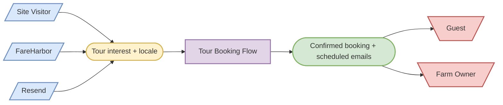
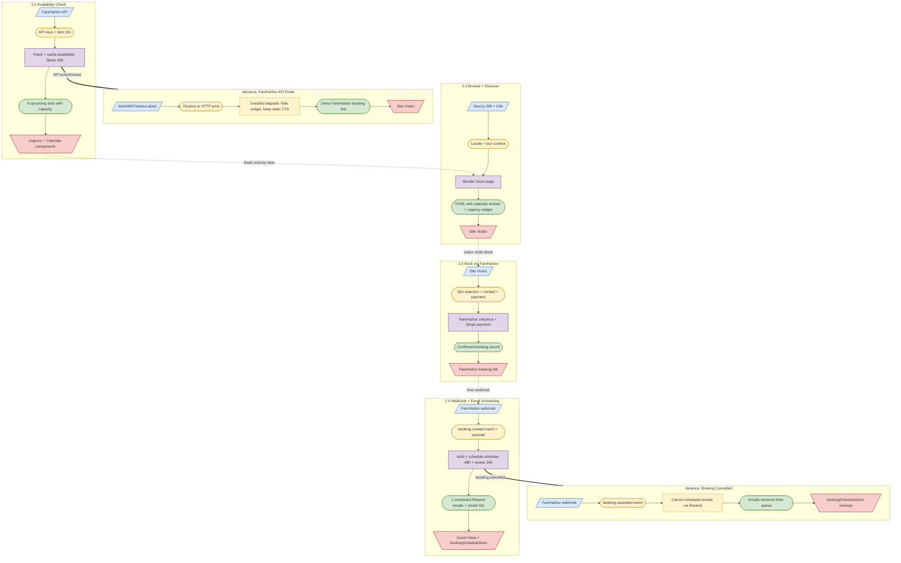

# SIPOC Analysis: Tour Booking Flow (End-to-End)

## Process Scope

| Attribute | Value |
|-----------|-------|
| Process Name | Tour Booking Flow |
| Trigger | User lands on /tours page |
| End Condition | Review-request email delivered 24h post-tour |
| Boundary Start | Page render with tour info + FareHarbor calendar embed |
| Boundary End | Resend delivers review-request email |
| Inclusions | Page browse, calendar embed, FareHarbor checkout, webhook receipt, reminder email (48h pre), review-request email (24h post), cancellation/update handling |
| Exclusions | Alpaca inquiry/adoption flow, contact form, admin dashboard, SendGrid list management |

---

## SIPOC Matrix

| # | Suppliers | Inputs | Process Step | Transformation | Outputs | Customers | Handoff |
|---|-----------|--------|-------------|---------------|---------|-----------|---------|
| 1 | Next.js ISR + i18n (`lib/translations`) | Locale param, tour content strings | Render /tours page | FMT: Server-render locale-specific tour info + JSON-LD structured data | HTML page with tour types, timeline, FAQ, booking section | Site Visitor | DIR: SSR HTML streamed to browser |
| 2 | FareHarbor API (`/api/availability`) | `FAREHARBOR_APP_KEY`, `FAREHARBOR_USER_KEY`, item IDs | Fetch availability (ISR 30min) | AGG: Fan-out `Promise.allSettled` across up to 3 items, dedup by date, cap at 8 slots | `{dates[], lastUpdated}` JSON | `AvailabilityUrgency` + `BookingSection` components | SYS: ISR-cached GET route, client `useAvailability()` hook |
| 3 | FareHarbor embed script (`fareharbor-calendar.tsx`) | Shortname `alpacasibiza`, flow ID, item ID | Load FareHarbor calendar widget | FMT: Inject `<script>` tag that replaces container `<div>` with FareHarbor's iframe calendar UI | Interactive booking calendar in page | Site Visitor | SYS: FareHarbor script embed replaces DOM node |
| 4 | `AvailabilityUrgency` component | Availability dates from step 2 | Display scarcity signal | ENR: Next-available date + "Only N spots left" badge when capacity <= 5 | Urgency nudge UI element | Site Visitor | DIR: React render within booking section |
| 5 | Site Visitor | Tour date selection, guest count | Select slot in FareHarbor calendar | DEC: User narrows from all available dates to one specific slot + party size | Selected availability slot | FareHarbor checkout flow | SYS: FareHarbor iframe internal navigation |
| 6 | Site Visitor + FareHarbor checkout | Contact details (name, email), payment card | Enter details + payment | VAL: FareHarbor validates email format, card via Stripe, guest count against capacity | Confirmed booking record (pk, contact, availability) | FareHarbor system | SYS: FareHarbor Stripe integration, internal booking DB |
| 7 | FareHarbor system | Confirmed booking object | Send `booking.created` webhook | NTF: FareHarbor fires POST to `/api/fareharbor-webhook` with booking payload | Webhook HTTP request with `x-webhook-secret` header | Webhook route handler | CBK: HTTP POST with shared-secret auth |
| 8 | Webhook route (`/api/fareharbor-webhook`) | Webhook body (booking pk, contact, availability, event type) | Authenticate + extract booking | VAL: `safeEqual()` timing-safe secret check + `extractBooking()` normalizes Shape A/B payloads | Validated, normalized booking object | Schedule logic | DIR: In-process function call |
| 9 | Webhook route + `computeScheduleWindows()` | Booking `start_at`, `end_at`, current timestamp | Compute reminder + review schedule | CAL: reminder = `start_at - 48h`, review = `end_at + 24h`; skip if already past | `{reminderAt, reviewAt, scheduleReminder, scheduleReview}` | Resend API | DIR: Pure function output |
| 10 | Resend API (`lib/mailer.ts`) | Reminder HTML (`email-templates.ts`), `scheduledAt` ISO timestamp, customer email | Schedule reminder email via Resend `scheduledAt` | STS: Email created with `scheduled` status in Resend queue | Resend email ID (for later cancel) | Guest inbox (48h before tour) | SYS: Resend `emails.send({scheduledAt})` API call |
| 11 | Resend API (`lib/mailer.ts`) | Review-request HTML, `scheduledAt` ISO timestamp, customer email | Schedule review-request email via Resend `scheduledAt` | STS: Email created with `scheduled` status in Resend queue | Resend email ID (for later cancel) | Guest inbox (24h after tour) | SYS: Resend `emails.send({scheduledAt})` API call |
| 12 | `bookingScheduleStore` (in-memory) | Booking pk, reminder email ID, review email ID | Persist email IDs for cancel/reschedule | AGG: Map `booking_pk -> {reminderEmailId, reviewEmailId, startAt, customerEmail}` | In-memory record | Webhook update/cancel handler | REP: Process-memory `Map<string, ScheduledBookingEmails>` |

---

## Transformation Chain

```
Locale + Tour Content
  -> [Step 1: FMT] -> Rendered /tours HTML page
  -> [Step 2: AGG] -> Availability JSON (8 slots, 30min ISR cache)
  -> [Step 3: FMT] -> FareHarbor calendar widget (interactive)
  -> [Step 4: ENR] -> Scarcity-signaled booking section
  -> [Step 5: DEC] -> Selected tour slot
  -> [Step 6: VAL] -> Confirmed booking (pk + contact + availability)
  -> [Step 7: NTF] -> Webhook POST to our endpoint
  -> [Step 8: VAL] -> Authenticated, normalized booking object
  -> [Step 9: CAL] -> Schedule windows (reminder 48h pre, review 24h post)
  -> [Step 10: STS] -> Scheduled reminder email (Resend queue)
  -> [Step 11: STS] -> Scheduled review-request email (Resend queue)
  -> [Step 12: AGG] -> Persisted email IDs for lifecycle management
```

---

## Handoff Map

| # | From Step | From Role | To Step | To Role | Type | Mechanism | SLA | Failure Mode |
|---|-----------|-----------|---------|---------|------|-----------|-----|-------------|
| 1 | 1 (Render page) | Next.js server | 2 (Fetch availability) | ISR route handler | SYS | `useAvailability()` hook -> `/api/availability` GET | 30min ISR stale-while-revalidate | 503 if keys unset; UI hides date grid, keeps static CTA |
| 2 | 2 (Availability JSON) | API route | 3+4 (Calendar + Urgency) | Client components | SYS | JSON response consumed by React hooks | Immediate (client-side) | Components render `null` or fallback link |
| 3 | 3 (FareHarbor calendar) | FareHarbor embed | 5 (Slot selection) | Site Visitor | SYS | FareHarbor iframe internal state | Real-time | `script.onerror` -> fallback "Book Now" link to FareHarbor |
| 4 | 5 (Slot selection) | Site Visitor | 6 (Payment) | FareHarbor checkout | SYS | FareHarbor iframe internal flow | Real-time | FareHarbor handles payment errors internally |
| 5 | 6 (Booking confirmed) | FareHarbor | 7 (Webhook fire) | FareHarbor webhook system | CBK | HTTP POST to configured webhook URL | [ASSUMED: seconds after booking] | If webhook delivery fails, FareHarbor retries (their SLA) |
| 6 | 7 (Webhook received) | HTTP layer | 8 (Auth + extract) | Webhook route handler | DIR | In-process `POST()` function | Immediate | 401 if secret mismatch; 400 if malformed JSON |
| 7 | 8 (Validated booking) | Webhook route | 9 (Schedule compute) | `computeScheduleWindows()` | DIR | Pure function call | Immediate | Returns `scheduleReminder: false` if already past |
| 8 | 9 (Schedule windows) | Webhook route | 10+11 (Resend sends) | Resend API | SYS | `resend.emails.send({scheduledAt})` | [ASSUMED: <2s API response] | Error caught; logged; email ID stays null |
| 9 | 10+11 (Email IDs) | Resend API | 12 (Store) | `bookingScheduleStore` | REP | In-memory Map.set() | Immediate | Lost on cold start/redeploy (ADR-001 documented tradeoff) |

---

## Variances

### Variance: Booking Cancelled (V-7-1)

| Attribute | Value |
|-----------|-------|
| Variance ID | V-7-1 |
| Parent Step | 7 — Webhook receives `booking.cancelled` event |
| Category | CAN |
| Trigger | Guest cancels booking in FareHarbor (free cancellation up to 24h before) |
| Rejoin Point | Terminal (no further emails sent) |
| Frequency | [ASSUMED: ~10-15% of bookings based on tourism industry norms] |
| Impact | Medium |

**Sub-SIPOC Chain:**

| Supplier | Input | Process | Transformation | Output | Customer |
|----------|-------|---------|---------------|--------|----------|
| FareHarbor webhook | `booking.cancelled` event + booking pk | Look up stored email IDs | RTE: Route to cancellation handler | Stored `{reminderEmailId, reviewEmailId}` | Cancel logic |
| `bookingScheduleStore` | Stored email IDs | Call `resend.emails.cancel(id)` for both | STS: Emails transition from `scheduled` to `cancelled` in Resend | Cancel confirmation | Resend queue (emails removed) |
| Cancel logic | Booking pk | Delete store record | STS: Remove entry from in-memory map | `{ok: true, action: 'cancelled'}` response | FareHarbor (HTTP 200 ACK) |

---

### Variance: Sold-Out Slot Shown (V-2-1)

| Attribute | Value |
|-----------|-------|
| Variance ID | V-2-1 |
| Parent Step | 2 — Availability fetch returns ISR-cached stale data |
| Category | EXC |
| Trigger | Slot sells out within 30min ISR cache window (ADR-008) |
| Rejoin Point | Step 5 — FareHarbor calendar rejects selection at checkout time |
| Frequency | Low (small farm, max ~6 guests/session; ADR-008 explicitly assessed) |
| Impact | Low (disappointment, not double-booking; FareHarbor is source of truth) |

**Sub-SIPOC Chain:**

| Supplier | Input | Process | Transformation | Output | Customer |
|----------|-------|---------|---------------|--------|----------|
| ISR cache | Stale availability (shows capacity > 0) | Visitor clicks sold-out date | FMT: Calendar loads for that date | FareHarbor calendar for that date | Site Visitor |
| FareHarbor checkout | Real-time capacity check | FareHarbor rejects booking (no availability) | VAL: FareHarbor's own real-time validation | Error message in FareHarbor UI | Site Visitor (must pick different date) |

---

### Variance: FareHarbor API Down (V-2-2)

| Attribute | Value |
|-----------|-------|
| Variance ID | V-2-2 |
| Parent Step | 2 — FareHarbor API returns error or times out |
| Category | EXC |
| Trigger | FareHarbor API outage, rate limit exceeded, or `fetchWithTimeout()` 5-6s abort |
| Rejoin Point | Step 3 — Calendar embed still works (separate from API); static CTA link remains |
| Frequency | [ASSUMED: rare — rate limits mitigated by 30min ISR cache] |
| Impact | Low (graceful degradation: urgency widget hides, calendar still embeds, direct booking link works) |

**Sub-SIPOC Chain:**

| Supplier | Input | Process | Transformation | Output | Customer |
|----------|-------|---------|---------------|--------|----------|
| FareHarbor API | Timeout or HTTP error | `/api/availability` catches error | FLT: `Promise.allSettled` tolerates per-item failures | 500 JSON response OR partial results | `useAvailability()` hook |
| `AvailabilityUrgency` + `BookingSection` | Error/empty response | Components check `data.error` | RTE: Conditional render — hide urgency, show fallback CTA | Static "Book Now" link to FareHarbor | Site Visitor (can still book directly) |

---

### Variance: Email Send Failure (V-10-1)

| Attribute | Value |
|-----------|-------|
| Variance ID | V-10-1 |
| Parent Step | 10/11 — Resend API rejects email send |
| Category | EXC |
| Trigger | Invalid email, Resend API outage, rate limit, or `scheduledAt` > 30 days |
| Rejoin Point | Step 12 — Store persists with `null` email IDs; webhook returns 200 with null IDs |
| Frequency | [ASSUMED: <1% — Resend handles retries natively] |
| Impact | Medium (guest misses reminder or review request; no operational impact) |

**Sub-SIPOC Chain:**

| Supplier | Input | Process | Transformation | Output | Customer |
|----------|-------|---------|---------------|--------|----------|
| Resend API | Error response | `try/catch` in webhook handler | STS: Error logged via `console.error` | `null` email ID | Webhook response |
| Webhook handler | `null` email ID | Store record with null ID | AGG: `bookingScheduleStore.set({reminderEmailId: null, ...})` | Partial record (cancel will no-op) | Webhook response (200 OK despite failure) |
| Fallback: `/api/reminder` or `/api/review-request` | Manual trigger by owner | Owner sends ad-hoc email | NTF: Direct Resend send (no `scheduledAt`) | Email delivered | Guest inbox |

---

## Hierarchy SIPOC Diagram

### L1: High-Level Flow



### L2: Booking Detail



---

## Gaps & Assumptions

- [ASSUMED: FareHarbor webhook delivery latency is seconds, not minutes — no SLA documented in codebase]
- [ASSUMED: Booking cancellation rate ~10-15% based on tourism norms — no telemetry exists]
- [ASSUMED: Resend API response time <2s — no timeout configured on the `resend.emails.send()` call itself (though `fetchWithTimeout` covers external HTTP)]
- [NEEDED: No monitoring/alerting for failed webhook deliveries — if FareHarbor silently stops calling, no emails get scheduled and nobody knows]
- [NEEDED: `bookingScheduleStore` is in-memory only — cold start/redeploy loses all pending email IDs, making cancel/reschedule impossible for in-flight bookings (ADR-001 documents this as accepted tradeoff)]
- [NEEDED: No dead-letter or retry mechanism if Resend `scheduledAt` send ultimately fails at delivery time — Resend handles retries internally but no app-level visibility]

---

## Score Summary

| Layer | Score | Weight |
|-------|-------|--------|
| L1: Extract & Map | 88/100 | 0.53 (redistributed) |
| L2: Visualize & Connect | 85/100 | 0.47 (redistributed) |
| L3: Publish & Persist | N/A | 0 (skipped — default mode) |
| **Composite** | **87/100** | |

**Deductions:**
- L1: -5 for 3 `[ASSUMED]` flags on FareHarbor/Resend SLAs; -7 for no in-code telemetry to validate frequency estimates
- L2: -5 for Mermaid not preview-validated (no MCP available); -10 for 3 `[NEEDED]` monitoring gaps

## Score Trend

| Run | Date | L1 | L2 | L3 | Composite | Delta |
|-----|------|----|----|----|-----------|-------|
| **001** | **2026-05-26** | **88** | **85** | **N/A** | **87** | **-** |

Trajectory: first_run
